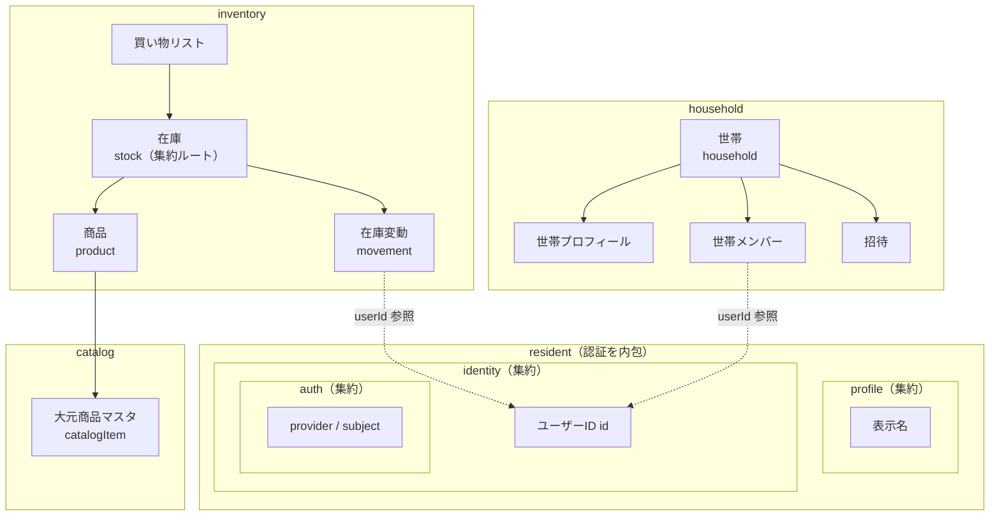
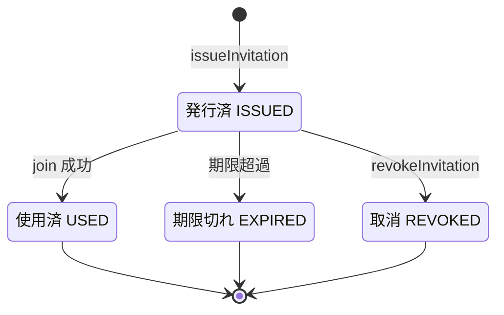
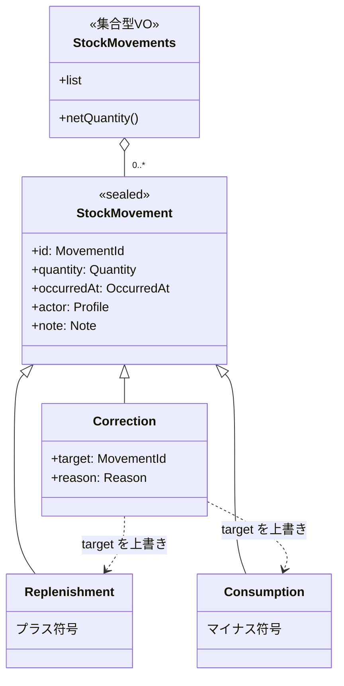
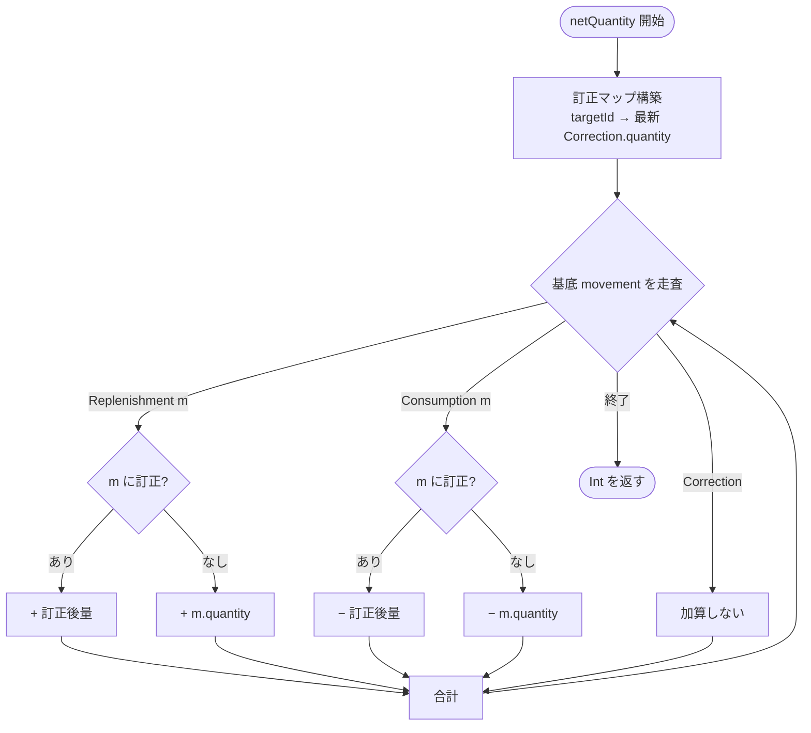
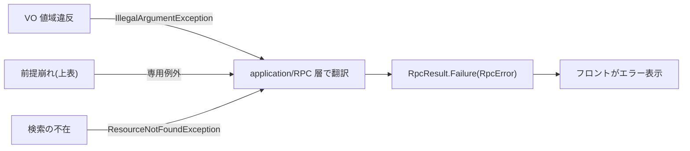

# 03. 詳細ドメインモデル

01 の概念モデル(A-3)と 02 のクラス図(B-4)を実装直前レベルまで詰める。**既存ドメインの確立済みパターンと記録された方針([[domain-refactor-policy-2026-05]])を踏襲**し、設計(最終 landed 状態)に向けて拡張する。

## 確立済み方針(踏襲する)

- **`User` クラスは作らない**。`UserId` が本人鍵の主役。利用者 =「**住人(resident コンテキスト)**」。公開アグリゲートは `Profile(userId, displayName)`、本人鍵は `identity` の `UserId`、認証は `auth` の `AuthIdentity`。パッケージは resident に内包・集約は分離(profile に認証を埋め込まない)。
- **`DomainException` の sealed 階層は作らない**。VO の値域違反は `IllegalArgumentException`(IAE)。「ドメイン操作の前提が壊れる系」(在庫ありアーカイブ、最後の OWNER 除外 等)のみ専用例外を定義し、application/RPC 層で RPC 例外(`InventoryException` 等)に翻訳。
- **集合型 VO は `val list: List<T>` を公開**。ドメイン固有操作(`owner()` / `activeOnly()` / `netQuantity()`)のみメソッド。
- **`@JvmInline value class` を sealed の variant にしない**(polymorphic deserialize 破壊の gotcha 回避)。
- domain = wire-format(`@Serializable`)前提。VO の `init` は `require(...)`。

---

## 主要モデルの分解(全体像)

境界付けられたコンテキスト([01 の A-3](01-sudo-modeling.md))で束ねたパッケージ関連図。属性は各節で詳述する。



> 認証(identity/auth)は resident に**内包するが集約は分離**。`profile`(表示名)は `userId` で identity を参照するだけで `AuthIdentity` を埋め込まない。世帯メンバー・在庫変動が参照するのは `profile` のみ(脱退後も履歴解決でき、OIDC sub は漏れない)。

---

## 住人(resident)コンテキスト — 認証を内包しつつ集約は分離

`User` 集約は作らない。**住人(resident)** を最上位コンテキストとし、その内部に `profile` / `identity`(さらに内側に `auth`)を入れ子パッケージで置く。**パッケージは内包・集約は分離**(互いに `userId` 参照のみ。`profile` に `identity`/`auth` を埋め込まない=漏洩防止)。

| パッケージ | 集約 | 実体 | 制約 |
|---|---|---|---|
| `resident/profile` | `Profile` | data class(`userId: UserId`, `displayName: DisplayName`) | 住人の表示情報。世帯メンバー/履歴の操作者として公開されるのはこれだけ |
| `resident/profile` | `DisplayName` | value class(String) | trim 後 非空・**最大 100 文字**(既存踏襲) |
| `resident/identity` | `Identity` | `UserId` を本人鍵に持つ | mindstock を使う人の同一性 |
| `resident/identity/auth` | `AuthIdentity` | data class(`AuthProvider` + `AuthSubject`) | OIDC。認証時のみ参照。メンバー/履歴 API に漏らさない |
| `resident/identity` | `UserId` | value class(`Uuid` v7) | 本人鍵・主役 |

> 投資サービスの「投資家」、受験システムの「受験者」にあたる主役名が **住人(Resident コンテキスト)**。公開アグリゲートは `Profile`。世帯に参加すると役割を持つ `HouseholdMember` になる。

---

## Household 集約

```
Household(id: HouseholdId, profile: HouseholdProfile, members: HouseholdMembers, invitation: Invitation?)
    rename(name: HouseholdName, by: UserId): Household        // OWNER 以外 → OwnerRequiredException
    issueInvitation(role, by, now): Invitation               // OWNER のみ。expiresAt = now + 7日。既存は置換
    revokeInvitation(by): Household                          // OWNER のみ
    join(userId, displayName, code, now): Household
        // 招待なし/コード不一致 → InvitationInvalidException、期限切れ/使用済 → InvitationUnusableException
        // 成功時: invitation を Used(usedBy, usedAt) にし、HouseholdMember を追加
    changeRole(target, role, by): Household                   // OWNER のみ。最後の OWNER 降格 → LastOwnerException
    removeMember(target, by): Household                       // OWNER のみ。最後の OWNER 除外 → LastOwnerException
    leave(member): Household                                  // 本人。最後の OWNER のみ残存 → LastOwnerException
```

- `HouseholdProfile(householdId, name: HouseholdName)` — 世帯の表示文脈(将来のアイコン等もここ)。住人の `Profile.displayName` と対称。
- `HouseholdName` — value class(String)、trim 後 非空・最大 30 文字。
- `HouseholdMember(profile: Profile, role: HouseholdMemberRole)` — **active のみ**。`HouseholdMember` を持つ = active。住人は `Profile` として参照(認証情報は付かない)。
- `HouseholdMembers(val list)` — `owner(): Profile?` / `activeMembers(): List<Profile>` / `contains(UserId): Boolean`。不変条件: **OWNER を 1 人以上含む**。
- **脱退/除外の表現**: 退会は append-only な revocation fact として永続化(`household_membership_revocations`)。domain は active のみ読み込む(Repository が revoked を除外)。

### HouseholdMemberRole(VIEWER 追加)

```
enum HouseholdMemberRole { OWNER, MEMBER, VIEWER
    canEditInventory(): Boolean    // OWNER, MEMBER  (補充/消費/採用/訂正/手動買い物)
    canManageMaster(): Boolean     // OWNER          (単位/画像/最低在庫/アーカイブ)
    canManageHousehold(): Boolean  // OWNER          (世帯名/招待/メンバー)
}
```

### Invitation(単回使用・参加で消費)



```
Invitation(code: InvitationCode, grantedRole: HouseholdMemberRole,
           issuedAt: OccurredAt, expiresAt: OccurredAt, status: InvitationStatus)

sealed interface InvitationStatus {
    object Issued
    data class Used(usedBy: UserId, usedAt: OccurredAt)   // 「使用済」を明示
    object Expired
    object Revoked
}
```

- `InvitationCode` — value class(String)、6 文字・英数字(曖昧字 `0/O/1/I` 除外)。
- 1 コード → 1 参加(単回使用)。再度招待するには新規発行(置換)。`expiresAt` は発行 + 7 日。

---

## 商品定義 / 在庫の分解(#5「Product が大きい」への答え)

責務を 3 つに分ける(既存の Product/Stock 分割を踏襲し拡張):

### CatalogItem(商品の素性・全世帯共有)

```
CatalogItem(id: CatalogItemId, name: CatalogItemName,
            defaultUnit: CatalogItemUnit, barcode: Barcode, origin: CatalogOrigin)

enum CatalogOrigin { CURATED, EXTERNAL, CUSTOM }
// CURATED = 大元マスタ / EXTERNAL = 楽天・Yahoo 取得をキャッシュ / CUSTOM = 世帯が独自追加

sealed interface Barcode {            // 任意 JAN(nullable を使わない)
    object Unlinked
    data class Linked(val jan: Jan)
}
```

- `CatalogItemName` — 非空・最大 60 文字。`CatalogItemUnit` — 非空・最大 10 文字(既存踏襲)。`defaultUnit` は採用画面の**推奨単位**。
- `Jan` — value class(String)、13 桁数字 + EAN-13 チェックディジット検証。
- 名前/単位は現在値。リビジョン履歴は Repository が hydrate(`catalog_item_revisions` 継続)。
- 外部 API 取得結果は `origin=EXTERNAL` の CatalogItem として保存(2 回目以降は再利用)。

### Product(世帯の採用)

```
Product(id: ProductId, catalogItem: CatalogItem, unit: ProductUnit,
        minimumStock: MinimumStock, image: ProductImage, archived: Boolean)

sealed interface ProductImage { object None; data class Stored(val ref: ImageRef) }
```

- `ProductUnit` — 世帯固有の数える単位(非空・最大 10 文字)。採用時に選択、`CatalogItem.defaultUnit` がデフォルト。プリセット(個・本・袋・パック・箱・ロール・缶・枚・セット)は**フロントの選択肢**で、ドメインは自由文字列 VO。
- `MinimumStock` — `>= 0`。`isBelow(qty)` / `shortage(qty)` を持つ(既存踏襲)。
- 画像・単位・最低在庫の編集は OWNER(認可は application 層)。

### Stock 集約(在庫操作のルート)

```
Stock(product: Product, movements: StockMovements, manualWanted: Boolean)
    currentQuantity(): Int           // = movements.netQuantity()
    status(): StockStatus            // OUT(<=0) / LOW(<=min) / OK
    needsReplenishment(): Boolean    // minimumStock.isBelow(currentQuantity())
    onShoppingList(): Boolean        // needsReplenishment() || manualWanted
    shortage(): Int

    replenish(qty, at, actor, note): Stock     // manualWanted=false に戻す
    consume(qty, at, actor, note): Stock        // currentQuantity()-qty < 0 → InsufficientStockException
    correct(target, correctedQty, reason, actor, at): Stock   // append-only 訂正(下記)
    want(): Stock / unwant(): Stock
    archive(): Stock                            // currentQuantity()!=0 → CannotArchiveWithStockException
    unarchive(): Stock

enum StockStatus { OUT, LOW, OK }
```

- `manualWanted` = 手動で買い物リストに入れた状態(在庫が十分でも)。補充/アーカイブで false。
- 重複採用防止(JAN): application の採用サービスが `catalogItem.barcode` が `Linked(jan)` のとき、同一世帯に同一 JAN の Product が無いか検査(あれば `DuplicateJanException`)。`Unlinked` は対象外。同名アーカイブ品は複製せず復元。

---

## StockMovement と数量畳み込み

`StockMovement` は append-only な在庫変動の事実。**訂正を record 単位で行うため identity(`MovementId`)を持つ**(従来は不要だったが訂正機能の追加で必要)。



### 畳み込み規則(`netQuantity`)

1. 基底 movement の符号: `Replenishment=+quantity`, `Consumption=-quantity`。
2. `Correction(target=T, quantity=c)` は **基底 movement T の量を c に差し替える**(符号は T の種別を継承)。同一 T への訂正が複数なら最新(`occurredAt` 最大)を採用。
3. `netQuantity = Σ_{基底 m} signed(m, 補正後quantity(m))`。Correction 自身は直接加算しない。
4. 訂正で総量が負になる場合は `correct(...)` 時に `InsufficientStockException` で拒否。



> 例(パターン4): 補充2 +(消費1→訂正で2)= +2 − 2 = 0。元の Consumption movement は残し、訂正で量だけ差し替える。

---

## ドメイン例外(IAE 原則・専用例外は前提崩れ系のみ)

- **VO 値域違反 → `IllegalArgumentException`**(`require(...)`)。sealed 階層は作らない。
- **ドメイン操作の前提崩れ → 専用例外**(意味が IAE で歪む箇所のみ):

| 例外 | 発生 |
|---|---|
| `ResourceNotFoundException` | 検索の不在(既存) |
| `InsufficientStockException` | 消費/訂正で在庫が負 |
| `CannotArchiveWithStockException` | 在庫 != 0 でアーカイブ |
| `DuplicateJanException` | 同一世帯に同一 JAN を再採用 |
| `InvitationInvalidException` / `InvitationUnusableException` | 招待コード不一致 / 期限切れ・使用済 |
| `OwnerRequiredException` | OWNER 限定操作を非 OWNER が実行 |
| `LastOwnerException` | 最後の OWNER を降格/除外/退出 |



---

## CatalogItem(大元マスタ)の外部取得連携

- `CatalogLookupService.lookup(jan)`(application): `CatalogItemRepository.findByJan` →(不在なら)`ExternalProductGateway.fetch(jan)` → 取得できれば `origin=EXTERNAL` の `CatalogItem` を生成・保存 → 返す。どこにも無ければ「不在」(手入力フォールバック)。
- `ExternalProductGateway`(infrastructure): 楽天 → Yahoo の順に試行。結果 `ExternalProductInfo(name, defaultUnit, source)`。
- 採用時、外部/マスタの `defaultUnit` を推奨単位として初期表示。世帯側 `Product.unit` で上書き可。
