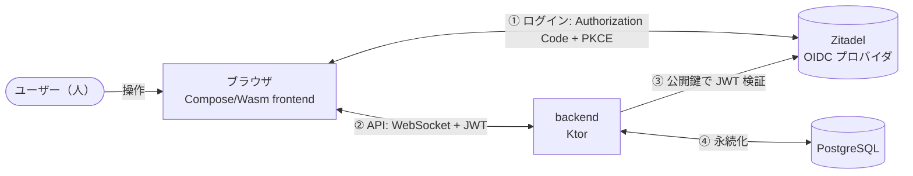
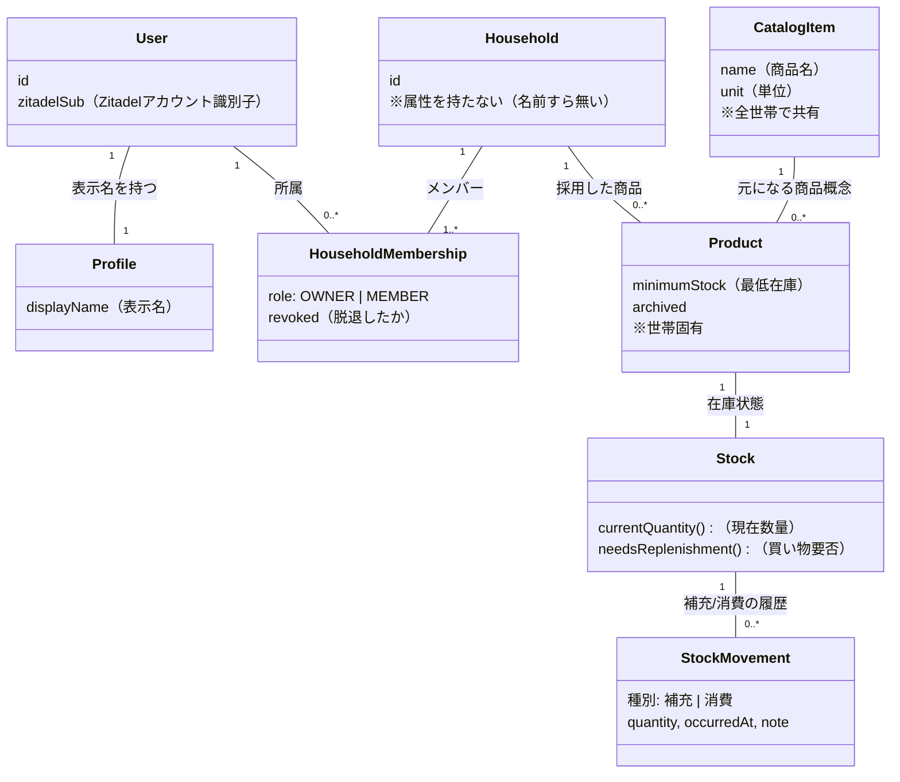
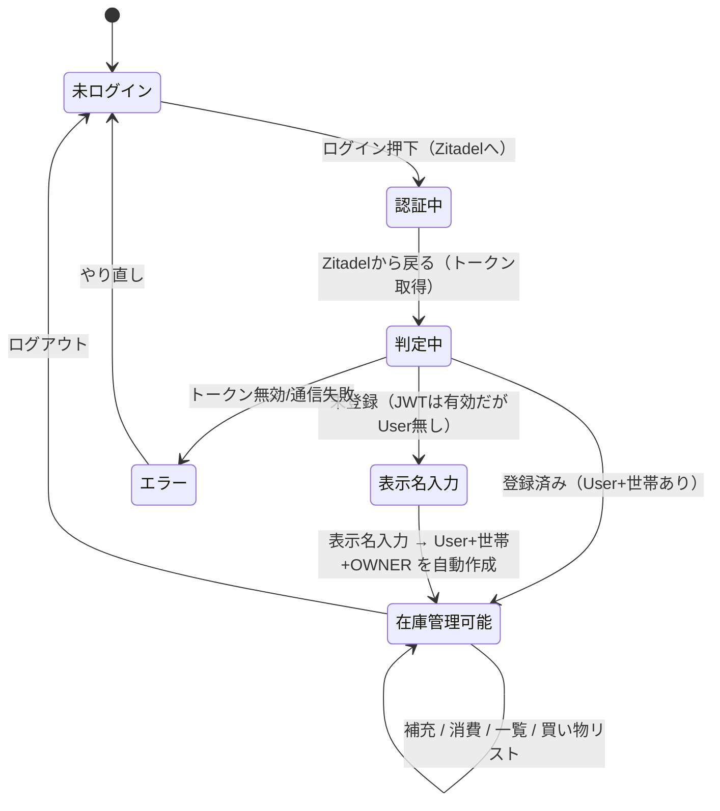
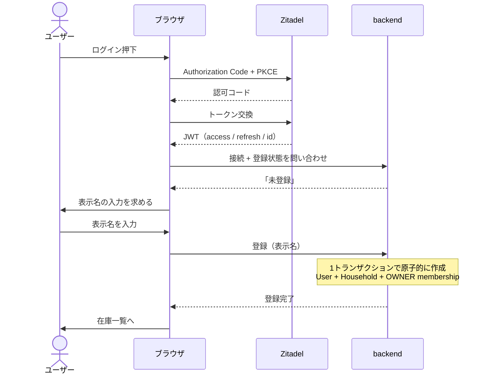
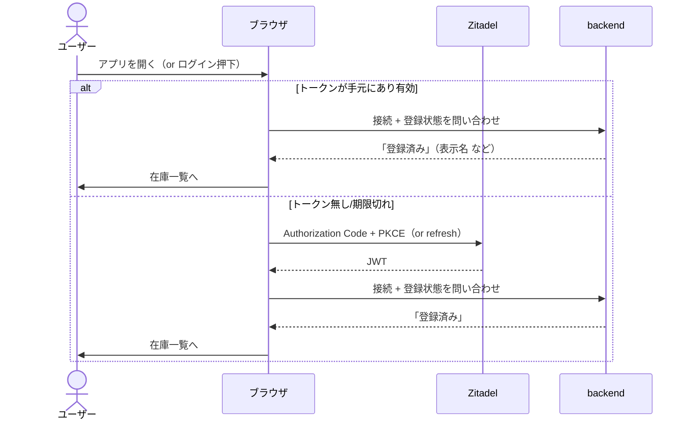
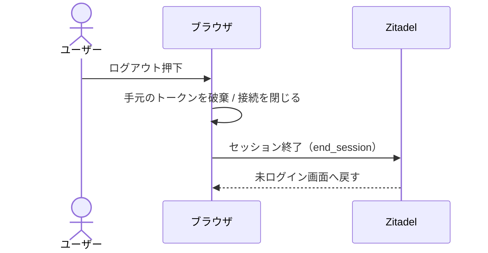
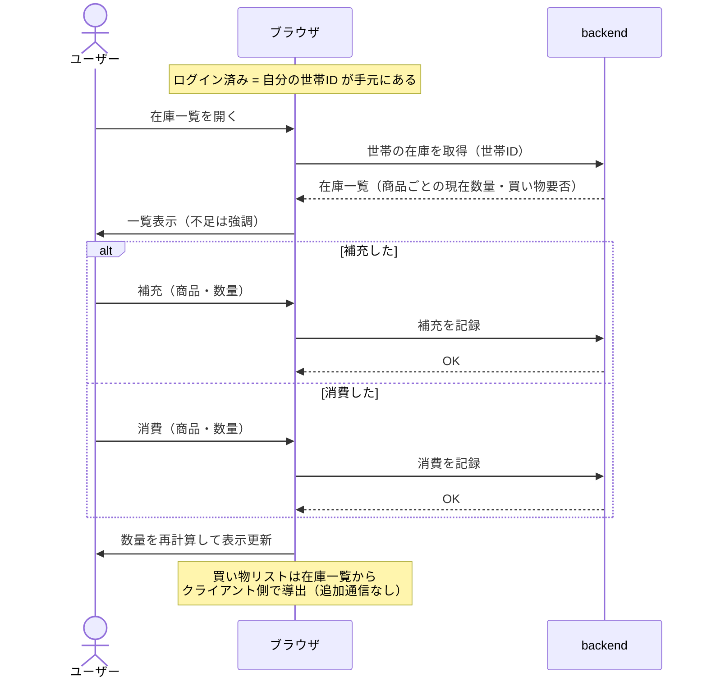
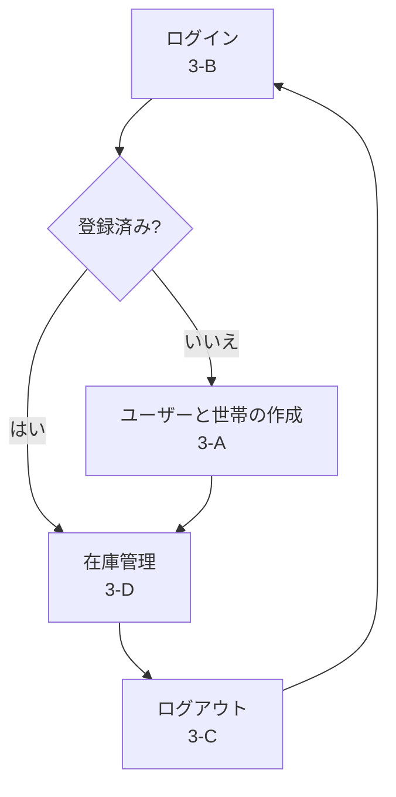

# mindstock ドメイン & 主要フロー整理

> 作成日: 2026-05-30
> 目的: 「ユーザーと世帯の作成 / ログイン / ログアウト / 在庫管理」の4フローと、その背後のドメイン構造を人間が一望できるよう整理する。頭の整理用。
> 手法: **sudoモデリング**(ドメインモデル図 + ユースケース)を軸に、**状態遷移図**(RDRA 簡略版)と **シーケンス図**(ICONIX 的)を組み合わせ。

---

## 0. 登場人物(システムコンテキスト)

- **ログインする場所(Zitadel)** と **API を使う場所(backend)** は別。backend は発券にノータッチで、Zitadel の公開鍵で入場券(JWT)を検証するだけ。
- ブラウザ ↔ backend は WebSocket 一本。JWT は接続を開く瞬間に `Sec-WebSocket-Protocol` で同送する(ブラウザがその経路でしかヘッダを付けられないため)。

---

## 1. ドメインモデル(sudoモデリング: ドメインモデル図)

### 読みどころ

- **User と Household は多対多**(`HouseholdMembership` で繋ぐ)。役割(OWNER/MEMBER)と脱退(revoked)を持つ。
  - MVP は **1 User = 1 世帯**に倒すが、データ構造は将来の「1 世帯 = 複数ユーザー」をそのまま許す形。
- **Household は属性を持たない**(`id` だけ)。だから「世帯を作る」画面でユーザーに尋ねることが何も無い。
- **CatalogItem は全世帯共有**、**Product は世帯固有**(CatalogItem を「採用」したもの + 最低在庫)。
- **在庫数は持たず、Stock が Movement(補充/消費)から計算する**(append-only)。

---

## 2. 状態遷移(RDRA 簡略版: ユーザーから見たアプリの状態)

「ログイン / 作成 / ログアウト」は、この1枚で繋がっている。

- **「表示名入力 → 在庫管理可能」の矢印が "ユーザーと世帯の作成"**(＝あなたの言う「アカウント作成フロー」)。User と世帯を**同時に**作る。
- **「未登録」状態は一瞬しか存在しない**(表示名を入れたら即・世帯持ちになる)。「登録済みだが世帯なし」という宙ぶらりんは設計上発生しない。

---

## 3. 各フローのシーケンス

### 3-A. ユーザーと世帯の作成(＝オンボーディング / 初回サインアップ)

> ポイント: 「登録」の一撃で **User と世帯と OWNER 資格** が揃う。世帯に入力項目が無いので、世帯作成は専用画面ではなく登録に同梱される。

### 3-B. ログイン(2回目以降 / 既存ユーザー)

> ポイント: ログインは「トークンを得て、登録状態を問い合わせ、登録済みなら在庫へ」。未登録だった場合は 3-A(表示名入力)へ分岐する。

### 3-C. ログアウト

> ポイント: backend 側に状態は持たない(ステートレス)。トークンを捨てて Zitadel のセッションを終わらせるだけ。

### 3-D. 在庫管理(その世帯の在庫を使う)

> ポイント: 在庫操作はすべて「自分の世帯ID」を前提に動く。世帯ID はログイン直後に確定済み(3-A / 3-B)。買い物リストは在庫から計算で出すので別取得は不要。

---

## 4. 4フローの関係まとめ

- **入口は常にログイン**。その結果で「在庫管理(既存)」か「作成(初回)」に分岐。
- **作成は初回だけ**通る特別な分岐。2回目以降は素通りして在庫管理へ。
- ログアウトすると入口に戻る。

---

## 5. この整理で擦り合わせたい点

1. 「**ユーザーと世帯の作成 = 3-A(登録の一撃で User+世帯+OWNER を同時作成)**」という理解で合っているか。
2. 「**未登録だが世帯なし、という中間状態を作らない**(登録 = 即・世帯持ち)」で良いか。
3. 「**1 User = 1 世帯(MVP)/ 構造は将来の複数ユーザー世帯を許す**」で良いか。
4. 在庫管理が常に「自分の世帯」前提で動くこと(世帯の切替は将来)で良いか。
