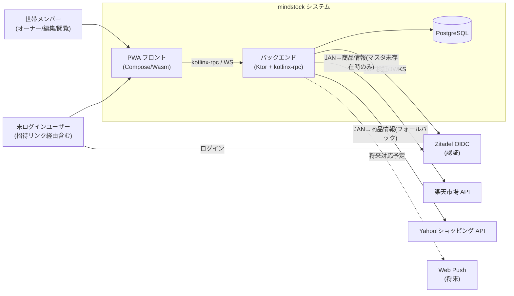
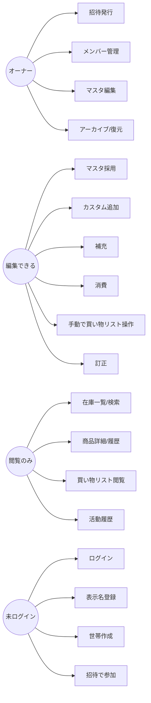
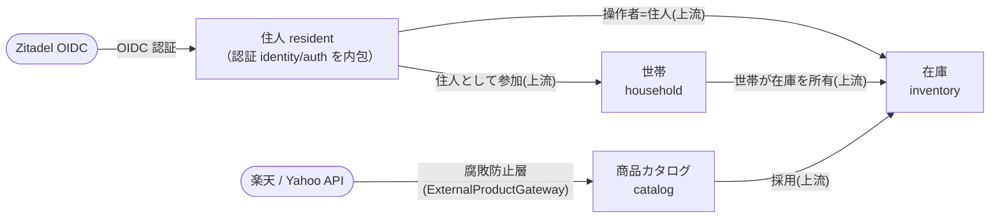
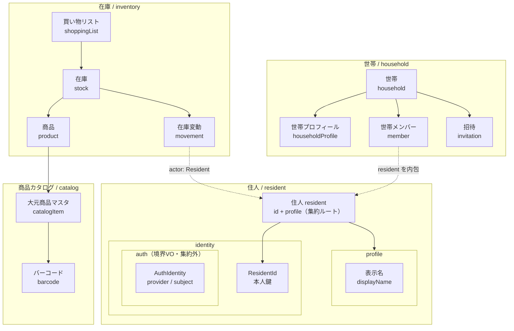
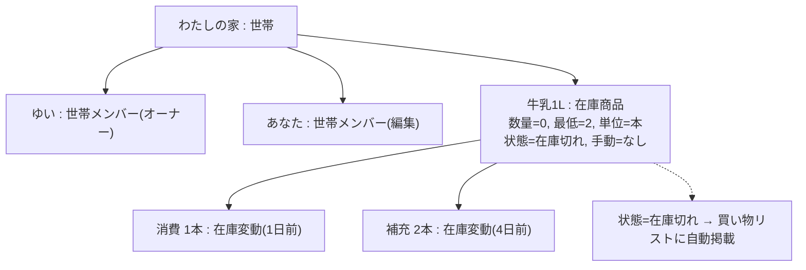
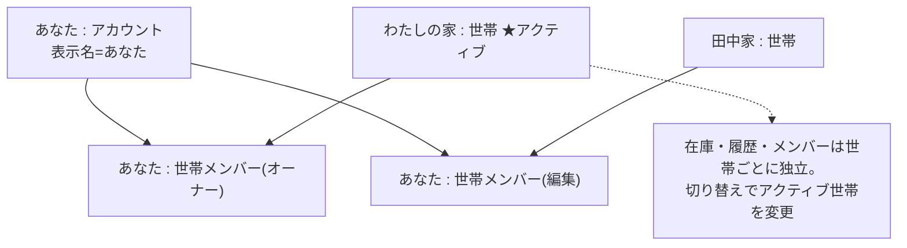
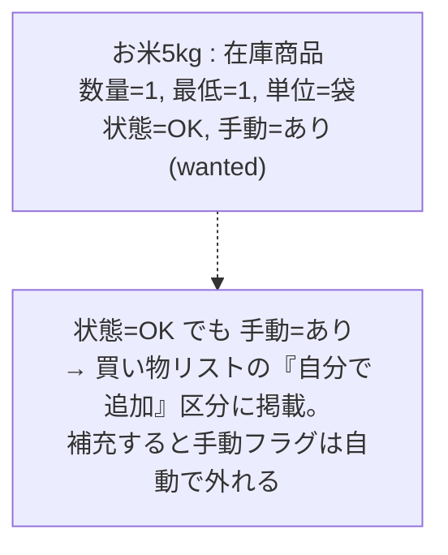
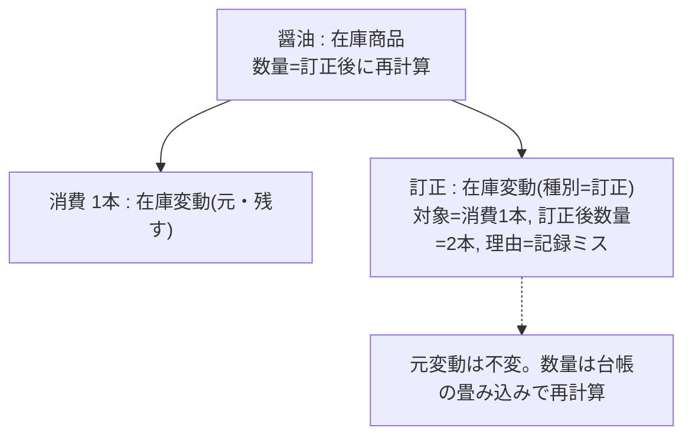
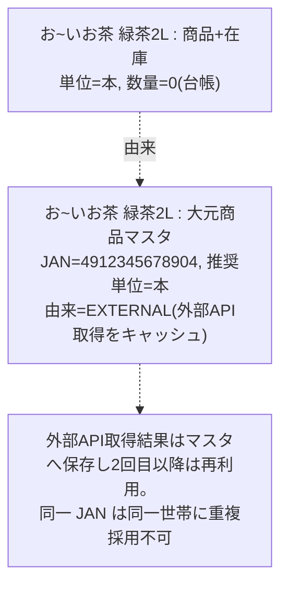

# 01. sudoモデリング(仕様検討)

sudoモデリング = **S**ystem関連図 → **U**secase → **D**omainモデル図 → **O**bject図 を反復し、要求とドメインの共通理解を作る。

---

## A-1. システム関連図(System Context)

**外部商品情報の方針(バックエンド構想):** 商品追加時に `JAN` を受け取ったら **①自前DB(大元マスタ)照合 → ②無ければ楽天/Yahoo API取得 → ③DBへ保存 → 以降は②をスキップ**。レートリミット回避とキャッシュ目的。マスタには**デフォルト(推奨)単位**を持たせ、採用時の初期値に使う。

---

## A-2. ユースケース一覧

ロール: **オーナー(owner) / 編集できる(member) / 閲覧のみ(viewer)**。`◎/○=可 −=不可`

| # | ユースケース | owner | member | viewer | グループ |
|---|---|:-:|:-:|:-:|---|
| 1 | ログインする(OIDC) | ◎ | ◎ | ◎ | 認証 |
| 2 | 初回:表示名を登録する | ◎ | ◎ | ◎ | オンボーディング |
| 3 | 世帯を作成する(任意・スキップ可) | ◎ | ◎ | ◎ | オンボーディング |
| 4 | 招待リンク/コードで世帯に参加する | ◎ | ◎ | ◎ | 参加 |
| 5 | 世帯を切り替える | ◎ | ◎ | ◎ | 世帯 |
| 6 | 世帯名を変更する | ◎ | − | − | 世帯 |
| 7 | 世帯から退出する | ◎ | ◎ | ◎ | 世帯 |
| 8 | 招待を発行/再発行/失効する(role指定・7日) | ◎ | − | − | 招待 |
| 9 | メンバーの権限変更/除外 | ◎ | − | − | メンバー |
| 10 | マスタから商品を採用する(単位・最低在庫) | ◎ | ◎ | − | 商品追加 |
| 11 | JANで商品を検索する(マスタ→外部API→手入力) | ◎ | ◎ | − | 商品追加 |
| 12 | バーコードをスキャンして追加 | ◎ | ◎ | − | 商品追加 |
| 13 | マスタに無い商品をその場で追加(JAN任意) | ◎ | ◎ | − | 商品追加 |
| 14 | 在庫を補充する | ◎ | ◎ | − | 在庫 |
| 15 | 在庫を消費する | ◎ | ◎ | − | 在庫 |
| 16 | 在庫一覧を見る/検索する | ◎ | ◎ | ◎ | 在庫 |
| 17 | 商品詳細・履歴を見る | ◎ | ◎ | ◎ | 在庫/履歴 |
| 18 | 買い物リストを見る(自動+手動の2区分) | ◎ | ◎ | ◎ | 買い物 |
| 19 | 商品を手動で買い物リストに入れる/外す | ◎ | ◎ | − | 買い物 |
| 20 | 在庫から探して買い物リストに追加 | ◎ | ◎ | − | 買い物 |
| 21 | 記録を訂正する(数量+理由) | ◎ | ◎ | − | 履歴 |
| 22 | 商品マスタを編集(単位/画像/最低在庫) | ◎ | − | − | マスタ編集 |
| 23 | 商品をアーカイブ/復元(在庫0時のみ) | ◎ | − | − | マスタ編集 |
| 24 | 全体の活動履歴を見る | ◎ | ◎ | ◎ | 履歴 |

**将来対応予定(モデルには載せるが実装は後回し・UIは無効/OFF固定):** 消費予測「あと約N日」、在庫減少のお知らせ(Push)、オフライン閲覧。

### ユースケース図(主要アクター視点)

(member は viewer の権限を内包、owner は member の権限を内包する。図は差分のみ記載。)

---

## A-3. 境界付けられたコンテキスト(sudoのD = ICONIXの起点)

ドメインを 4 つの境界付けられたコンテキストに分ける: **住人(resident)** / **世帯(household)** / **商品カタログ(catalog)** / **在庫(inventory)**。認証(identity / auth)は「住人」寄りの関心なので、**resident コンテキストに内包**(パッケージとして入れ子)する。クラス図ではなく、**コンテキストマップ**(文脈間の関係)と **パッケージ関連図**(各モデルの依存)で表現する。属性の詳細は [03-domain-detail.md](03-domain-detail.md)。

> **ユビキタス言語: 利用者 =「住人 (Resident)」**。投資サービスの「投資家」、受験システムの「受験者」に相当する、このドメインの主役名。家(世帯)に暮らし、その在庫を管理する人。
>
> ただし集約ルート `Resident`(`id` + `profile`)に **認証(`auth`)を埋め込まない**。OIDC sub などがダダ漏れするため、`AuthIdentity` は登録/認証の**境界 VO** に留める(パッケージは内包・集約は持たない)。

### コンテキストマップ

> 上流(U)= 提供側。`resident`/`catalog`/`household` が上流、`inventory` が下流。外部 API はコンテキスト外で、`catalog` が腐敗防止層(ACL)を介して取り込む。

### パッケージ関連図(モデルと依存)

`resident` コンテキストの集約ルートは `Resident`(`id` + `profile`)。`identity` / `profile` / `auth` の入れ子パッケージに分けるが、**認証(`auth`)は集約に持たず境界 VO**(`AuthIdentity`)として置く。

> `auth` は `identity` の内側に**型として**置くが集約は持たない(境界 VO)。**パッケージは内包するが集約は分離**: `Resident`(id + 表示)を読んでも `auth`(OIDC sub)は付いてこない。世帯メンバー・在庫変動の操作者が参照するのは `Resident` のみ。

> 実装上の型名: resident コンテキスト=集約ルート `Resident`(= `ResidentId` + `Profile`)/`profile`(`Profile` = `DisplayName`)/`identity`(`ResidentId`)/`auth` 境界VO(`AuthIdentity` = `AuthProvider` + `AuthSubject`)、世帯=`Household`/`HouseholdId`、世帯プロフィール=`HouseholdProfile`/`HouseholdName`、世帯メンバー=`HouseholdMember`/`HouseholdMemberRole`、招待=`HouseholdInvitation`(None/Outstanding)/`InvitationCode`、大元商品マスタ=`CatalogItem`/`CatalogItemId`/`CatalogItemName`/`CatalogItemUnit`/`Barcode`/`Jan`/`CatalogOrigin`、商品=`Product`/`ProductId`/`ProductUnit`/`MinimumStock`/`ProductImage`、在庫=`Stock`、在庫変動=`StockMovement`/`MovementId`/`Quantity`/`Note`/`OccurredAt`/`Reason`。詳細は [03-domain-detail.md](03-domain-detail.md)。

### 集約と不変条件

- **住人(resident)コンテキスト**: `User` クラスは作らない。集約ルートは `Resident`(`id: ResidentId` + `profile: Profile`)。認証は集約に持たない(=漏洩防止):
  - `Profile`(`displayName`)— `Resident` 内の表示情報(id 不要)。世帯メンバー・履歴の操作者として公開されるのは `Resident`(id + 表示)。
  - `ResidentId` — 本人鍵(`identity` パッケージ)。`AuthIdentity`(`provider`, `subject`)は OIDC 資格情報の**境界 VO**(`auth` パッケージ。登録/認証時のみ、集約外)。
  - append-only 前提。表示名変更は新規 Insert(最新が現在状態)で表し、可変メソッドは持たない。
  - 1 住人は 0..N 世帯に所属。世帯参加で役割を持つ **世帯メンバー** になる。
- **Household 集約**: `HouseholdProfile`(世帯名)+ メンバー(1 以上・必ず 1 人の OWNER)+ 有効な招待 0..1。脱退/除外は append-only な revocation として残し、domain は active のみ読み込む。
- **Stock 集約(在庫操作のルート)**: `Product`(採用) + `StockMovements`(台帳) + 手動買い物フラグ。
  - 派生: `currentQuantity = movements.netQuantity()`、`status = OUT(<=0)/LOW(<=min)/OK`、`onShoppingList = needsReplenishment() ∪ manualWanted`。
  - 不変条件: 数量は負にしない(消費/訂正で負 → 例外)。`archive` は数量 0 のときのみ。`manualWanted` は補充/アーカイブで false。
  - 重複防止: 同一世帯で同一 JAN(`Barcode.Linked`)の Product は採用不可。
- **CatalogItem(商品の素性・全世帯共有)**: 名前・推奨単位・`Barcode`・`origin`(CURATED=大元マスタ / EXTERNAL=API取得キャッシュ / CUSTOM=世帯独自)。マスタ未存在 JAN は外部 API 取得を `EXTERNAL` として保存。

### 値オブジェクト(VO)

`ResidentId` / `DisplayName`(<=100) / `AuthIdentity`(`AuthProvider`/`AuthSubject`) / `HouseholdId` / `HouseholdName`(<=30) / `ProductId` / `ProductUnit`(<=10、プリセットは UI 側) / `MinimumStock`(>=0) / `ProductImage`(None/Stored) / `CatalogItemId` / `CatalogItemName`(<=60) / `CatalogItemUnit`(<=10) / `Barcode`(Unlinked/Linked) / `Jan`(13桁 EAN-13) / `CatalogOrigin` / `MovementId` / `Quantity`(>0) / `Note` / `Reason` / `OccurredAt` / `InvitationCode`(6桁) / `HouseholdInvitation`(None/Outstanding) / `HouseholdMemberRole`(OWNER/MEMBER/VIEWER)。詳細・制約は [03-domain-detail.md](03-domain-detail.md)。

---

## A-4. オブジェクト図(代表シナリオ)

ドメインモデルの妥当性を確認するため、代表的な 5 シナリオのスナップショットを示す。図中「在庫商品」は概念表現で、実装では数量・手動フラグは `Stock`、商品定義は `CatalogItem`、世帯固有設定は `Product` に分かれる(A-3 参照)。

### パターン1: 招待参加 + 在庫切れの自動掲載

「ゆいがオーナーの『わたしの家』に、あなたが編集メンバーとして参加し、牛乳(在庫0/最低2)が買い物リストに自動掲載」:

### パターン2: 1 ユーザーが複数世帯を持ち切り替える

「あなたは『わたしの家』(オーナー)と『田中家』(編集メンバー)に所属し、アクティブは『わたしの家』」:

### パターン3: 在庫はあるが手動で買い物リストに追加(wanted)

「米(在庫1袋/最低1=状態OK)を、まとめ買いしたいので手動で買い物リストに追加」:

### パターン4: 訂正は append-only(上書きしない)

「『消費 1本』を実は 2本だったと訂正 → 元の変動は残し、訂正変動を追記」:

### パターン5: マスタに無い JAN を外部 API 取得 → カスタム採用

「JAN 照会で自社マスタに無く、楽天 API で『お~いお茶』を取得 → マスタへキャッシュ保存し、世帯にカスタム採用」:

