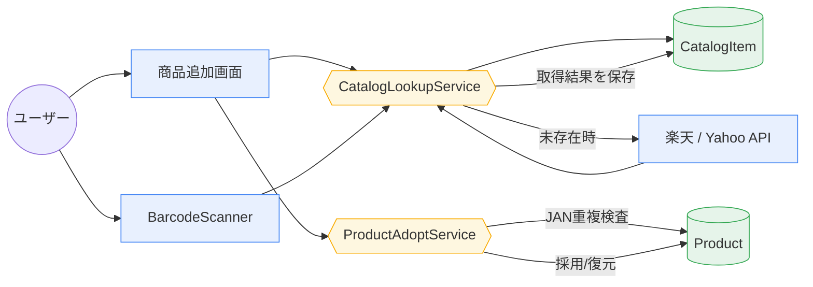
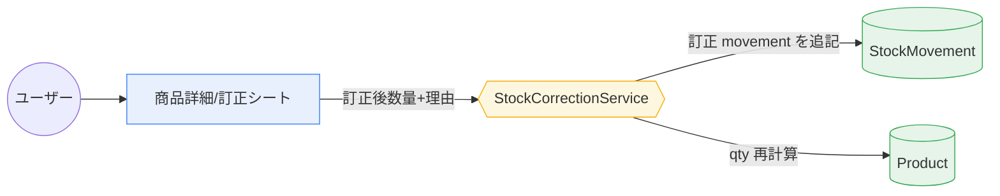
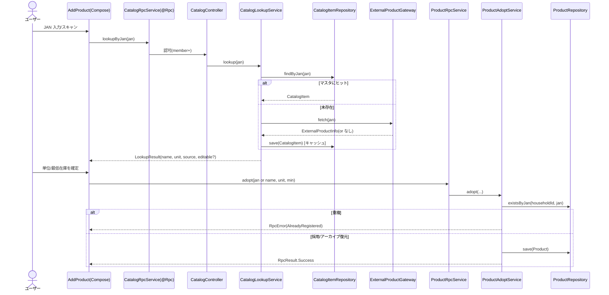
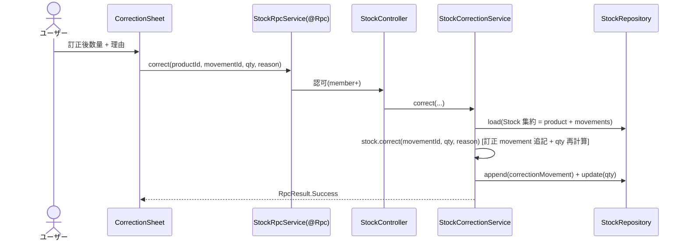
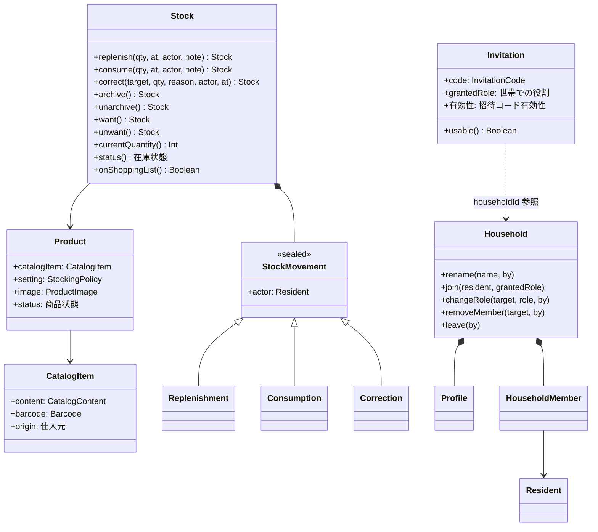

# 02. ICONIX(システム設計)

ICONIX: ドメインモデル(01 の A-3)→ ユースケース記述 → ロバストネス図(boundary/control/entity)→ シーケンス図 → 詳細クラス図。

**boundary/control/entity を本プロジェクトの層へ対応付ける(CLAUDE.md 原則 #1):**

| ICONIX | 本プロジェクトの層 / モジュール |
|---|---|
| **boundary** | フロント画面(`:frontend` Compose)+ RPC エンドポイント(`:rpc` の `@Rpc` interface / `:backend:api` presentation Controller) |
| **control** | application 層 Service(`:backend:core` の Service interface + orchestration) |
| **entity** | domain 集約/VO(`:domain`)+ infrastructure DataSource(`:backend:core`、Exposed) |

訂正は **append-only**(元 movement を残し訂正 movement を追記)、訂正は **member も可** とする(確定事項)。

---

## B-1. ユースケース記述(代表 5 件)

### UC11+13: JAN で商品を追加する(マスタ→外部API→手入力)
**主アクター:** member / owner
**事前条件:** 世帯がアクティブ。
**基本フロー:**
1. ユーザーが商品追加画面で JAN を入力 or バーコードをスキャン。
2. システムが大元マスタ(CatalogItem)を JAN 照合。**ヒット**→ 商品名・推奨単位を確定表示(名前は編集不可)。
3. マスタ未存在 → 外部 API(楽天/Yahoo)を JAN 照会。**ヒット**→ 取得名・単位を取得し DB(マスタ)へ保存、確定表示(名前は編集不可)。
4. どこにも無い → 「商品情報なし」。ユーザーが**商品名を手入力**(編集可)。
5. ユーザーが単位(推奨をデフォルト)・最低在庫を決めて確定。
6. システムが世帯に Product を採用(qty=0)。JAN を保持。
**代替/例外:**
- 2/3 で同一 JAN の Product が既に世帯にある → 「すでに世帯に登録されています」で**登録不可**。
- 外部 API がレートリミット/失敗 → 手入力フォールバック(4 へ)。

### UC14/15: 在庫を補充/消費する
1. ユーザーが商品で補充(or 消費)を選び、数量・発生日時・メモを入力。
2. システムが `qty ± n`(消費は `qty>=0` を保証)、StockMovement(replenish/consume)を**追記**。
3. 補充時は `wanted=false` に戻す。

### UC21: 記録を訂正する(append-only)
1. ユーザーが履歴の movement を選び、訂正後数量・理由を入力。
2. システムが元 movement を残したまま **訂正 movement(kind=correction, targetId, reason)を追記**。
3. Product.qty を movement 畳み込みで再計算。

### UC4: 招待リンク/コードで世帯に参加する
1. 招待リンク(`mindstock.app/join/CODE`)を開く → 参加ランディング(誰が・どの世帯に・付与権限)。
2. ログイン(未ログイン時)→ 表示名(初回のみ)→ 参加確認。
3. システムが InviteCode を検証(有効)し、付与 role で HouseholdMember を追加(1 コードで複数人が参加可)。
**例外:** コードが無効(取消/再発行で失効)→ エラー画面。

### UC8: 招待を発行する(owner)
1. owner が付与 role(編集/閲覧)を選び発行。
2. システムが 6 桁コード・リンクを生成(**有効期限なし・1 コードで複数参加可**)。世帯の有効招待は 0..1(再発行で旧コードを無効化)。

---

## B-2. ロバストネス図

### UC11+13(JAN 追加)



### UC21(訂正・append-only)



---

## B-3. シーケンス図

### UC11+13: JAN 追加(フロント → RPC → application → infra/domain → 外部)



### UC21: 訂正(append-only)



---

## B-4. 詳細クラス図(domain + 公開 API)



ビジネスロジックは domain に置き(リッチドメイン)、Service は薄い orchestration。在庫操作(`currentQuantity()`/`status()`/`onShoppingList()`/補充・消費・訂正・アーカイブ)は **`Stock` 集約**のメソッド、世帯固有設定(単位/最低在庫/画像)は `Product`。VO 違反は IAE、前提崩れは専用例外で表す(`DomainException` の sealed 階層は作らない)。

---

## B-5. モジュール / レイヤマッピング

```
:domain     resident{Resident(id+profile), profile(Profile/DisplayName), identity(ResidentId), identity/auth(AuthIdentity=境界VO)}・household・catalog・inventory(Stock/Product/StockMovement/ShoppingList) 各コンテキスト + VO + 専用例外
:rpc        @Rpc service interface, RpcResult, RpcError, DTO
:shared     既存維持(KrpcJson, datetime/serialization 拡張)
:backend:core
  application/   Service interface + Repository interface(control)
  infrastructure/ Exposed DataSource, ExternalProductGateway(楽天/Yahoo)(entity I/O)
:backend:api    Ktor 起動 + presentation/rpc Controller(@Rpc 実装) + auth(Zitadel)
:backend:schedules バッチ(将来・通知等。招待は無期限のため期限掃除は不要)
:frontend   Compose 画面 + per-screen 状態 + RpcClient
```

### RPC サービス分割(`:rpc`、すべて `@Rpc` 必須)

| サービス | 主メソッド | 対応 UC |
|---|---|---|
| `ResidentRpcService` | `registerDisplayName`, `me` | 2 |
| `HouseholdRpcService` | `create`, `rename`, `leave`, `list`, `changeRole`, `removeMember`, `createInvite`, `revokeInvite`, `join`, `previewInvite` | 3,5–9 |
| `CatalogRpcService` | `search`, `lookupByJan` | 11,12 |
| `ProductRpcService` | `adopt`, `addCustom`, `list`, `listArchived`, `changeUnit/Image/Minimum`, `archive`, `unarchive`, `setWanted` | 10,13,16,19,20,22,23 |
| `StockRpcService` | `replenish`, `consume`, `correct`, `history`, `activity` | 14,15,17,21,24 |

戻り値は `RpcResult<T>`(エラーは `RpcError`)で表現し、**nullable 戻り値は使わない**。「不在」は例外/`RpcError` で表す。

### 認可

`@Rpc` Controller 層で role を検査(viewer=読取専用 / member=日々の在庫操作・訂正・採用 / owner=世帯/メンバー/マスタ編集)。Zitadel OIDC の JWT を WS ハンドシェイクで検証(既存 `:backend:api/configuration/auth` の方式を踏襲)。

---

## B-6. 将来対応予定(モデル化のみ・実装後回し)

- **消費予測「あと約 N 日」**: StockMovement(consume)から消費ペースを導出。現状 UI は表示のみ想定。
- **在庫減少のお知らせ(Web Push)**: `:backend:schedules` で閾値割れを検知し通知。UI トグルは OFF 固定・操作不可。
- **オフライン閲覧**: PWA キャッシュ。UI トグルは OFF 固定・操作不可。
