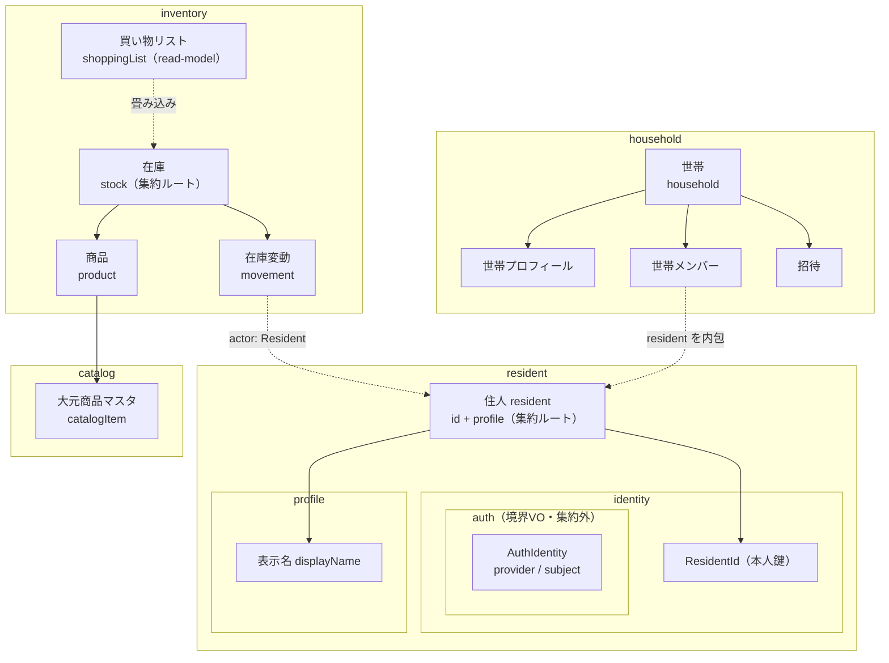
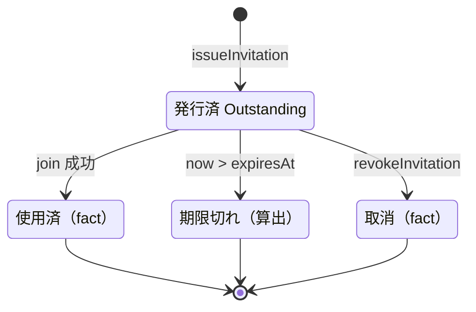
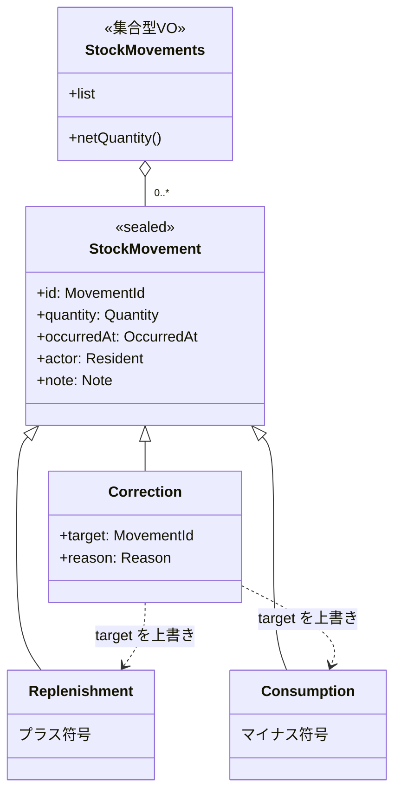
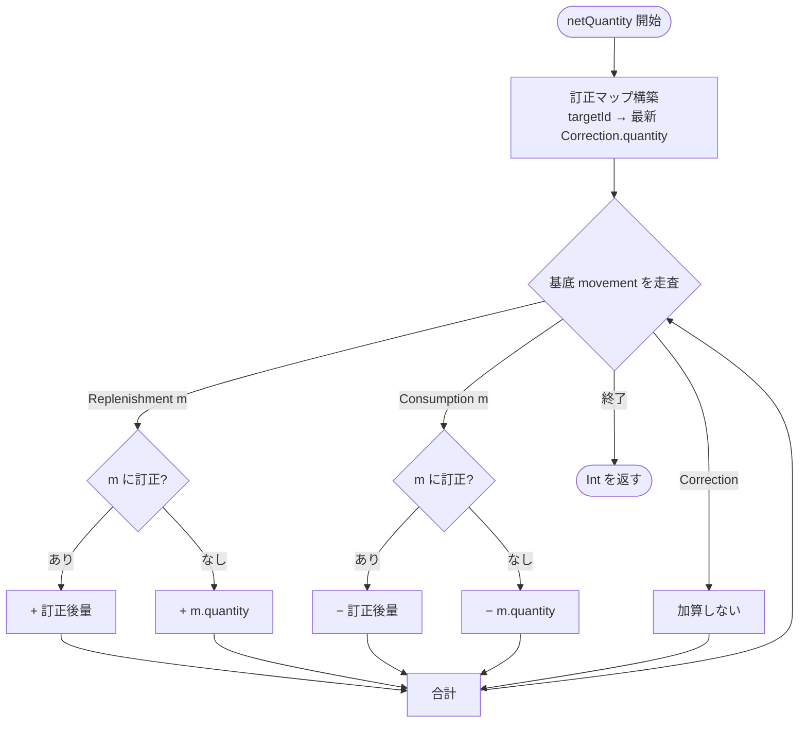
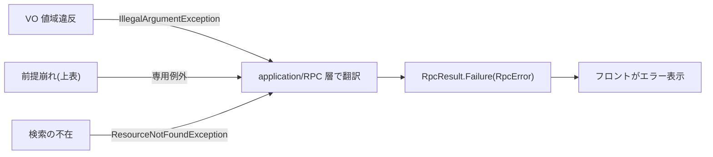

# 03. 詳細ドメインモデル

01 の概念モデル(A-3)と 02 のクラス図(B-4)を実装直前レベルまで詰める。**既存ドメインの確立済みパターンと記録された方針([[domain-refactor-policy-2026-05]] / `.claude/rules/domain-guideline.md`)を踏襲**し、設計(最終 landed 状態)に向けて拡張する。

## 確立済み方針(踏襲する)

- **`User` クラスは作らない**。利用者 =「**住人(resident コンテキスト)**」。集約ルートは `Resident(id: ResidentId, profile: Profile)`。本人鍵は `ResidentId`。
- **認証(`AuthIdentity`)はドメイン集約にしない**。認証バインディングに対して動くビジネスルールは無く、やることは「資格情報 → `Resident` を解決」の lookup のみ。これは Repository(`findByAuth`)の責務。`AuthIdentity` は登録/認証の**境界でのみ使う VO**として `resident/identity/auth` に置く(パッケージは内包・集約は持たない)。`Resident` は auth を一切保持しないので OIDC sub は外に漏れない。
- **append-only が前提**。表示名変更のような「更新」はドメイン操作ではなく新規 Insert(最新が現在状態)。`Resident`/`Profile` に `rename` 等の可変メソッドは持たせない。業務ルール(値域)は VO の `init { require(...) }` が持つ。
- **`DomainException` の sealed 階層は作らない**。VO の値域違反は `IllegalArgumentException`(IAE)。「ドメイン操作の前提が壊れる系」(在庫ありアーカイブ、最後の OWNER 除外 等)のみ専用例外を定義し、application/RPC 層で RPC 例外に翻訳。
- **集合型 VO(ファーストクラスコレクション)は `val list: List<T>` を公開**。件数は `fun size()`。ドメイン固有操作(`owner()` / `activeMembers()` / `netQuantity()`)のみメソッド。
- **`@JvmInline value class` を sealed の variant にしない**(polymorphic deserialize 破壊の gotcha 回避)。
- domain = wire-format(`@Serializable`)前提。**値は原則 NotNull**(不在は例外 or sealed 型で表現、nullable 戻り値/フィールドは作らない)。
- **「画面で要る」「DB 永続化で要る」でモデルしない**。画面都合は presentation の Request/Response(腐敗防止層)で吸収し以降の層へは多値引数で渡す。DB とドメインがずれるなら infrastructure に entity を用意して集約へマッピングする。`id` も「DB で要る」ではなく**ビジネスロジック上必要か**で判断する。

---

## 主要モデルの分解(全体像)

境界付けられたコンテキスト([01 の A-3](01-sudo-modeling.md))で束ねたパッケージ関連図。属性は各節で詳述する。



> 認証(`AuthIdentity`)は `resident/identity/auth` に **型として置く**が集約は持たない(境界 VO)。`Resident` は `id` と `profile`(表示名)だけ。世帯メンバー・在庫変動が参照するのは `Resident`(= id + 表示)のみで、認証は載らない(脱退後も履歴解決でき、OIDC sub は漏れない)。

---

## 住人(resident)コンテキスト

`User` 集約は作らない。**住人(resident)** を最上位コンテキストとし、集約ルート `Resident` は `id` と `profile` のみを持つ意図的に薄い集約(同一性 + 表示が責務。リッチさは Household/Stock 側)。認証は集約に入れない。

```kotlin
// resident/identity
@Serializable @JvmInline
value class ResidentId(private val value: Uuid) {
    internal operator fun invoke(): Uuid = value
    override fun toString(): String = value.toString()
    companion object { fun create(): ResidentId = ResidentId(Uuid.uuidv7()) }
}

// resident/identity/auth — 登録/認証の境界専用 VO。集約は持たない
@Serializable
enum class AuthProvider { ZITADEL }

@Serializable @JvmInline
value class AuthSubject(private val value: String) {
    init { require(value.isNotBlank()) { "AuthSubject must not be blank" } }
    internal operator fun invoke(): String = value
    override fun toString(): String = value
}

@Serializable
data class AuthIdentity(val provider: AuthProvider, val subject: AuthSubject)

// resident/profile — 表示属性の塊(将来アイコン等もここ)。id は持たない
@Serializable @JvmInline
value class DisplayName(private val value: String) {
    init {
        val trimmed = value.trim()
        require(trimmed.isNotEmpty() && trimmed.length <= 100) {
            "DisplayName must be 1..100 chars after trim: $value"
        }
    }
    internal operator fun invoke(): String = value.trim()
    override fun toString(): String = value.trim()
}

@Serializable
data class Profile(val displayName: DisplayName)

// resident — 集約ルート
@Serializable
data class Resident(val id: ResidentId, val profile: Profile)
```

| パッケージ | 型 | 役割 / 制約 |
|---|---|---|
| `resident` | `Resident` | 集約ルート。`id: ResidentId` + `profile: Profile`。世帯メンバー/履歴の操作者として公開されるのはこれ(認証なし) |
| `resident/profile` | `Profile` | 表示属性の塊。`displayName` のみ(id 不要) |
| `resident/profile` | `DisplayName` | value class(String)、trim 後 非空・**最大 100 文字**(既存踏襲) |
| `resident/identity` | `ResidentId` | value class(`Uuid` v7)。本人鍵。`create()` で採番 |
| `resident/identity/auth` | `AuthIdentity` | data class(`AuthProvider` + `AuthSubject`)。OIDC 資格情報。**境界 VO**(登録/認証時のみ)、集約に保持しない |
| `resident/identity/auth` | `AuthProvider` / `AuthSubject` | enum(現状 `ZITADEL`)/ value class(非空) |

> **登録(UC2)・表示名変更**: いずれも append-only Insert。presentation が多値引数で application に渡し Insert するだけ(リネーム前後の遷移はドメインで気にしない=最新 Insert が現在状態)。初回登録時は `ResidentId.create()` で採番、以降の表示名変更は確立済みの `ResidentId` に対し新しい `Profile` を Insert(認可済み session の `ResidentId` を使う)。
> **認証(P5)**: `residentRepository.findByAuth(authIdentity): Resident`。infra が「`AuthIdentity` → `ResidentId`」のバインディングを entity で持ち、`Resident` にマッピングして返す。初回ログイン(未登録 sub)は不在 → 表示名登録フローへ。

---

## 共通 VO

複数コンテキストで使う VO。値域は既存スケール(`DisplayName`=100 / `HouseholdName`=30 / `CatalogItemName`=60)に合わせる。ID 型規約([domain-guideline](../../../../.claude/rules/domain-guideline.md))に従い、集約ルートの ID は `Uuid`(検証なし)、履歴 fact の ID は `Long`(非負)。

| VO | 型 / 値域 | 用途 |
|---|---|---|
| `ResidentId` / `HouseholdId` / `ProductId` / `CatalogItemId` / `StockId` | `value class(Uuid)`、`create()`=uuidv7、検証なし | 集約ルートの本人鍵 |
| `MovementId` | `value class(Long)`、`init` で非負強制 | 在庫変動 fact の identity(訂正の `target` 用) |
| `OccurredAt` | `value class(Instant)`、`now()` ファクトリ(`Clock.System.now()`) | 発生時刻(招待 `issuedAt`/`expiresAt`、movement `occurredAt`) |
| `Quantity` | `value class(Int)`、`> 0` | 補充/消費/訂正の数量(符号は movement 種別が持つ) |
| `Note` | `value class(String)`、trim 後 最大 255(空許容=メモ無し) | 在庫変動メモ |
| `Reason` | `value class(String)`、trim 後 非空・最大 255 | 訂正理由(必須) |
| `ImageRef` | `value class(String)`、非空 | 画像ストレージキー |

> `id` を集約に持たせるのは「ビジネスロジック上の同一性が必要だから」。`Resident`/`Household`/`Stock`/`Product`/`CatalogItem` は世帯横断で参照・突合される実体なので ID を持つ。`Profile` は `Resident` 内の表示属性に過ぎないため ID を持たない。

---

## Household 集約

```kotlin
Household(id: HouseholdId, profile: HouseholdProfile,
          members: HouseholdMembers, invitation: HouseholdInvitation)

    companion object {
        create(name: HouseholdName, owner: Resident): Household
            // 創設 OWNER 1 名で初期化。invitation = None
    }

    rename(name: HouseholdName, by: ResidentId): Household    // OWNER 以外 → OwnerRequiredException
    issueInvitation(role, by, now): Household                 // OWNER のみ。expiresAt = now + 7日。既存は置換
    revokeInvitation(by): Household                           // OWNER のみ。invitation = None(取消は fact)
    join(resident: Resident, code: InvitationCode, now): Household
        // None/コード不一致 → InvitationInvalidException、期限切れ → InvitationUnusableException
        // 成功時: HouseholdMember を追加し invitation = None(使用は fact)
    changeRole(target: ResidentId, role, by: ResidentId): Household   // OWNER のみ。最後の OWNER 降格 → LastOwnerException
    removeMember(target: ResidentId, by: ResidentId): Household       // OWNER のみ。最後の OWNER 除外 → LastOwnerException
    leave(by: ResidentId): Household                                  // 本人。最後の OWNER のみ残存 → LastOwnerException
```

- `HouseholdProfile(name: HouseholdName)` — 世帯の表示文脈(将来のアイコン等もここ)。住人の `Profile` と対称(id 不要)。
- `HouseholdName` — value class(String)、trim 後 非空・最大 30 文字。
- `HouseholdMember(resident: Resident, role: HouseholdMemberRole)` — **active のみ**。`HouseholdMember` を持つ = active。`Resident`(id + 表示)を内包(認証は載らない)。
- `HouseholdMembers(val list)` — `owner(): Resident` / `activeMembers(): List<Resident>` / `contains(ResidentId): Boolean` / `size(): Int`。不変条件: **OWNER を 1 人以上含む**ため `owner()` は **非 null**(原則: nullable 戻り禁止)。
- `rename/issueInvitation/changeRole/removeMember/leave` の actor/target は `ResidentId`(状態として保持はせず、コマンド引数として「誰が/誰を」を指定)。
- **脱退/除外の表現**: 退会は append-only な revocation fact として永続化(`household_membership_revocations`)。domain は active のみ読み込む(Repository が revoked を除外)。

### HouseholdMemberRole(VIEWER 追加)

```kotlin
enum HouseholdMemberRole { OWNER, MEMBER, VIEWER
    canEditInventory(): Boolean    // OWNER, MEMBER  (補充/消費/採用/訂正/手動買い物)
    canManageMaster(): Boolean     // OWNER          (単位/画像/最低在庫/アーカイブ)
    canManageHousehold(): Boolean  // OWNER          (世帯名/招待/メンバー)
}
```

### Invitation(単回使用・参加で消費)

ライフサイクル(概念):



**live な集約が持つのは `None | Outstanding` の 2 状態だけ**。使用済/取消は append-only な fact として永続化(membership revocation と同じ思想=原則7)。期限切れは保存状態ではなく `expiresAt` と `now` の比較で**算出**する。

```kotlin
// household — nullable を使わず sealed で 0..1 を表現
@Serializable
sealed interface HouseholdInvitation {
    @Serializable object None : HouseholdInvitation
    @Serializable
    data class Outstanding(
        val code: InvitationCode,
        val grantedRole: HouseholdMemberRole,
        val issuedAt: OccurredAt,
        val expiresAt: OccurredAt,
    ) : HouseholdInvitation {
        fun isExpired(now: OccurredAt): Boolean   // now > expiresAt(コード一致は code の値等価で判定)
    }
}
```

- `InvitationCode` — value class(String)、6 文字・英数字(曖昧字 `0/O/1/I` 除外)。
- 1 コード → 1 参加(単回使用)。再度招待するには新規発行(`Outstanding` を置換)。`expiresAt` は発行 + 7 日。

---

## 商品定義 / 在庫の分解(#5「Product が大きい」への答え)

責務を 3 つに分ける(既存の Product/Stock 分割を踏襲し拡張):

### CatalogItem(商品の素性・全世帯共有)

```kotlin
CatalogItem(id: CatalogItemId, name: CatalogItemName,
            defaultUnit: CatalogItemUnit, barcode: Barcode, origin: CatalogOrigin)

enum CatalogOrigin { CURATED, EXTERNAL, CUSTOM }
// CURATED = 大元マスタ / EXTERNAL = 楽天・Yahoo 取得をキャッシュ / CUSTOM = 世帯が独自追加

sealed interface Barcode {            // 任意 JAN(nullable を使わない)
    object Unlinked
    data class Linked(val jan: Jan)
}
```

- `CatalogItemName` — 非空・最大 60 文字。`CatalogItemUnit` — 非空・最大 10 文字(既存踏襲)。`defaultUnit` は採用画面の**推奨単位**。
- `Jan` — value class(String)、13 桁数字 + EAN-13 チェックディジット検証。
- 名前/単位は現在値。リビジョン履歴は Repository が hydrate(`catalog_item_revisions` 継続)。
- 外部 API 取得結果は `origin=EXTERNAL` の CatalogItem として保存(2 回目以降は再利用)。

### Product(世帯の採用)

```kotlin
Product(id: ProductId, catalogItem: CatalogItem, unit: ProductUnit,
        minimumStock: MinimumStock, image: ProductImage, archived: Boolean)

sealed interface ProductImage { object None; data class Stored(val ref: ImageRef) }
```

- `ProductUnit` — 世帯固有の数える単位(非空・最大 10 文字)。採用時に選択、`CatalogItem.defaultUnit` がデフォルト。プリセット(個・本・袋・パック・箱・ロール・缶・枚・セット)は**フロントの選択肢**で、ドメインは自由文字列 VO。
- `MinimumStock` — `>= 0`。`isBelow(qty)` / `shortage(qty)` を持つ(既存踏襲)。
- 画像・単位・最低在庫の編集は OWNER(認可は application 層)。

### Stock 集約(在庫操作のルート)

```kotlin
Stock(product: Product, movements: StockMovements, manualWanted: Boolean)
    currentQuantity(): Int           // = movements.netQuantity()
    status(): StockStatus            // OUT(<=0) / LOW(<=min) / OK
    needsReplenishment(): Boolean    // minimumStock.isBelow(currentQuantity())
    onShoppingList(): Boolean        // needsReplenishment() || manualWanted
    shortage(): Int

    replenish(qty, at, actor: Resident, note): Stock   // manualWanted=false に戻す
    consume(qty, at, actor: Resident, note): Stock       // currentQuantity()-qty < 0 → InsufficientStockException
    correct(target: MovementId, correctedQty, reason, actor: Resident, at): Stock   // append-only 訂正(下記)
    want(): Stock / unwant(): Stock
    archive(): Stock                            // currentQuantity()!=0 → CannotArchiveWithStockException
    unarchive(): Stock

enum StockStatus { OUT, LOW, OK }
```

- `manualWanted` = 手動で買い物リストに入れた状態(在庫が十分でも)。補充/アーカイブで false。
  - > **append-only 整合の注記(P2 で詰める)**: 厳密には `manualWanted` も want/unwant の fact の畳み込みであるべき(boolean を上書きしない)。本節は read-model 定義に集中し、fact 化の詳細は P2(inventory)で確定する。
- 重複採用防止(JAN): application の採用サービスが `catalogItem.barcode` が `Linked(jan)` のとき、同一世帯に同一 JAN の Product が無いか検査(あれば `DuplicateJanException`)。`Unlinked` は対象外。同名アーカイブ品は複製せず復元。

---

## StockMovement と数量畳み込み

`StockMovement` は append-only な在庫変動の事実。**訂正を record 単位で行うため identity(`MovementId`)を持つ**(従来は不要だったが訂正機能の追加で必要)。`actor` は住人の集約 `Resident`(id + 表示)を埋め込み、脱退後も履歴解決でき認証は漏れない。

> 原則7「fact クラスは domain から消える」との関係: `StockMovement` は **訂正が過去 record を `target` 参照する behavior** を持つため、例外的に `Stock` 集約が `StockMovements` を保持して `netQuantity()` を畳み込む(domain-guideline の `Stock` 実例どおり)。単なる履歴閲覧は別 read model。



### 畳み込み規則(`netQuantity`)

1. 基底 movement の符号: `Replenishment=+quantity`, `Consumption=-quantity`。
2. `Correction(target=T, quantity=c)` は **基底 movement T の量を c に差し替える**(符号は T の種別を継承)。同一 T への訂正が複数なら最新(`occurredAt` 最大)を採用。
3. `netQuantity = Σ_{基底 m} signed(m, 補正後quantity(m))`。Correction 自身は直接加算しない。
4. 訂正で総量が負になる場合は `correct(...)` 時に `InsufficientStockException` で拒否。



> 例(パターン4): 補充2 +(消費1→訂正で2)= +2 − 2 = 0。元の Consumption movement は残し、訂正で量だけ差し替える。

---

## ShoppingList(買い物リスト)— 派生 read-model

**買い物リストは永続集約を持たない派生ビュー**。DB は append-only で、買い物リストは在庫(movement の畳み込み)から**算出**される(`software-architecture.md` のパッケージ例 `stock/` = `Stock` 集約 / `StockMovement` fact / `ShoppingList` read-model の 3 概念)。

```kotlin
// inventory/stock/shopping — 永続化しない read-model
@Serializable
data class ShoppingList(val list: List<Stock>) {
    fun size(): Int = list.size
    fun autoItems(): ShoppingList    // = list.filter { it.needsReplenishment() }
    fun manualItems(): ShoppingList  // = list.filter { it.manualWanted }
}
```

- メンバーシップは `Stock.onShoppingList()`(`needsReplenishment() || manualWanted`)の純粋関数。Repository が世帯の `Stocks` から `onShoppingList()` で絞って hydrate する。
- 永続「買い物リスト」テーブルは作らない。手動追加品は `Stock.manualWanted`(将来 fact 化)で表現。

---

## ドメイン例外(IAE 原則・専用例外は前提崩れ系のみ)

- **VO 値域違反 → `IllegalArgumentException`**(`require(...)`)。sealed 階層は作らない。
- **ドメイン操作の前提崩れ → 専用例外**(意味が IAE で歪む箇所のみ):

| 例外 | 発生 |
|---|---|
| `ResourceNotFoundException` | 検索の不在(既存) |
| `InsufficientStockException` | 消費/訂正で在庫が負 |
| `CannotArchiveWithStockException` | 在庫 != 0 でアーカイブ |
| `DuplicateJanException` | 同一世帯に同一 JAN を再採用 |
| `InvitationInvalidException` / `InvitationUnusableException` | 招待コード不一致(None 含む)/ 期限切れ |
| `OwnerRequiredException` | OWNER 限定操作を非 OWNER が実行 |
| `LastOwnerException` | 最後の OWNER を降格/除外/退出 |



---

## CatalogItem(大元マスタ)の外部取得連携

- `CatalogLookupService.lookup(jan)`(application): `CatalogItemRepository.findByJan` →(不在なら)`ExternalProductGateway.fetch(jan)` → 取得できれば `origin=EXTERNAL` の `CatalogItem` を生成・保存 → 返す。どこにも無ければ「不在」(手入力フォールバック)。
- `ExternalProductGateway`(infrastructure): 楽天 → Yahoo の順に試行。結果 `ExternalProductInfo(name, defaultUnit, source)`。
- 採用時、外部/マスタの `defaultUnit` を推奨単位として初期表示。世帯側 `Product.unit` で上書き可。
