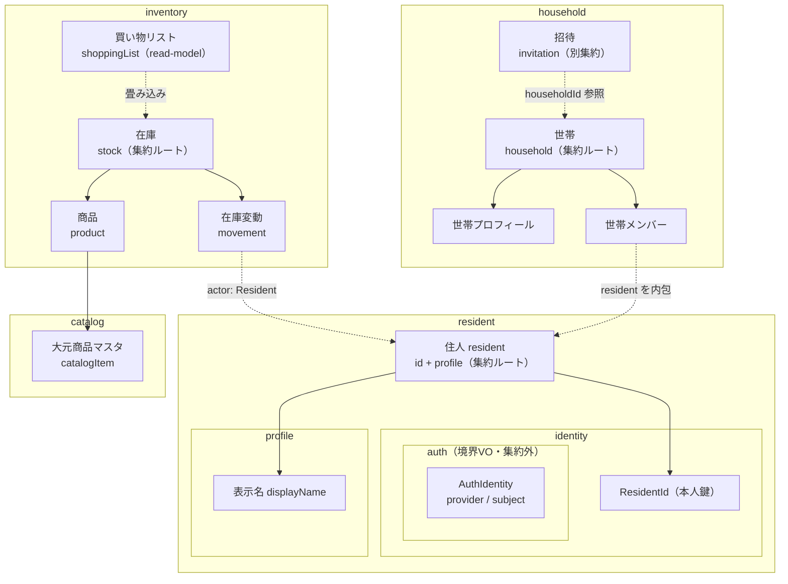
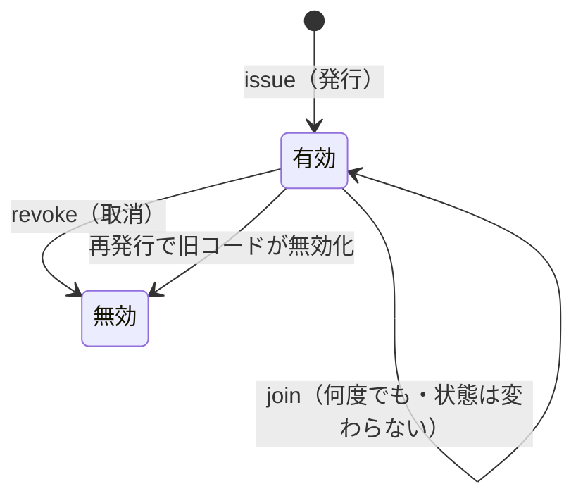
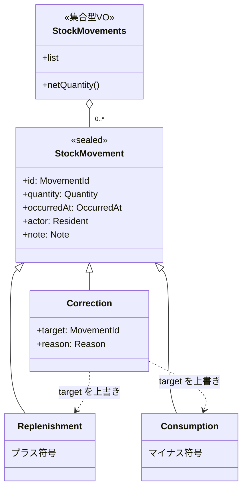
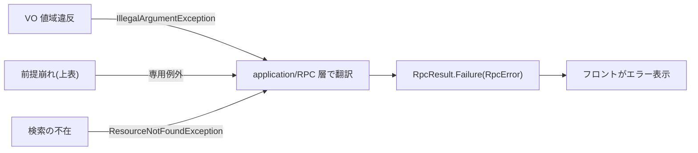

# 03. 詳細ドメインモデル

01 の概念モデル(A-3)と 02 のクラス図(B-4)を実装直前レベルまで詰める。**既存ドメインの確立済みパターンと記録された方針([[domain-refactor-policy-2026-05]] / `.claude/rules/domain-guideline.md`)を踏襲**し、設計(最終 landed 状態)に向けて拡張する。

## 確立済み方針(踏襲する)

- **`User` クラスは作らない**。利用者 =「**住人(resident コンテキスト)**」。集約ルートは `Resident(id: ResidentId, profile: Profile)`。本人鍵は `ResidentId`。
- **認証(`AuthIdentity`)はドメイン集約にしない**。認証バインディングに対して動くビジネスルールは無く、やることは「資格情報 → `Resident` を解決」の lookup のみ。これは Repository(`findByAuth`)の責務。`AuthIdentity` は登録/認証の**境界でのみ使う VO**として `resident/identity/auth` に置く(パッケージは内包・集約は持たない)。`Resident` は auth を一切保持しないので OIDC sub は外に漏れない。
- **append-only が前提**。表示名変更のような「更新」はドメイン操作ではなく新規 Insert(最新が現在状態)。`Resident`/`Profile` に `rename` 等の可変メソッドは持たせない。業務ルール(値域)は VO の `init { require(...) }` が持つ。
- **`DomainException` の sealed 階層は作らない**。VO の値域違反は `IllegalArgumentException`(IAE)。「ドメイン操作の前提が壊れる系」(在庫ありアーカイブ、最後の世帯主除外 等)のみ専用例外を定義し、application/RPC 層で RPC 例外に翻訳。
- **集合型 VO(ファーストクラスコレクション)は `val list: List<T>` を公開**。件数は `fun size()`。ドメイン固有操作(`owner()` / `activeMembers()` / `netQuantity()`)のみメソッド。
- **`@JvmInline value class` を sealed の variant にしない**(polymorphic deserialize 破壊の gotcha 回避)。
- domain = wire-format(`@Serializable`)前提。**値は原則 NotNull**(不在は例外 or sealed 型で表現、nullable 戻り値/フィールドは作らない)。
- **「画面で要る」「DB 永続化で要る」でモデルしない**。画面都合は presentation の Request/Response(腐敗防止層)で吸収し以降の層へは多値引数で渡す。DB とドメインがずれるなら infrastructure に entity を用意して集約へマッピングする。`id` も「DB で要る」ではなく**ビジネスロジック上必要か**で判断する。

---

## ドメインモデリング方針(区分・区分使用・判定/状況)

ビジネスルールは集約メソッドに埋め込まず、**区分 / 区分使用 / 判定・状況クラス**へ外出しする(masuda「現場で役立つシステム設計の原則」スタイル)。集約は薄く保ち、区分/判定を呼ぶ。命名は英語、不変・`@Serializable`・例外の規約は維持する。

- **区分(enum with behavior)**: 取りうる状態を enum で表し、状態は静的 `judge(...)` / `of(...)` ファクトリで**算出**する(可否フラグ等を enum に持たせる)。**区分名・値は日本語**(ユビキタス言語)、構造型(集約/VO/ID)は英語。例: `在庫状態.of(current, minimum)`(参照実装の `DelayStatus.level()` / `ItemLoanability.貸出可能かどうか()` に対応)。
- **区分使用(rule table)**: 「区分 → ルール/上限/許可」の対応を Map 表として `object` に外出しする(条件表)。表自体は永続化しない(`@Serializable` 不要)。例: `RolePermissions`(`世帯での役割 → 世帯での操作` 表。参照実装の `RestrictionOfQuantityMap`)。
- **判定/状況クラス**: 複数モデルを合成して区分を返す専用クラス(参照実装の `LoanStatus` / `Restriction`)。
- **共存ルール**: UI 向けの**可否照会は区分を返す**メソッド、状態を変える**コマンドは前提崩れ時に例外**を throw(区分で `when` 分岐して翻訳)。これで error-handling 規約(前提崩れ=例外)と区分判定は両立する。

---

## 主要モデルの分解(全体像)

境界付けられたコンテキスト([01 の A-3](01-sudo-modeling.md))で束ねたパッケージ関連図。属性は各節で詳述する。



> 認証(`AuthIdentity`)は `resident/identity/auth` に **型として置く**が集約は持たない(境界 VO)。`Resident` は `id` と `profile`(表示名)だけ。世帯メンバー・在庫変動が参照するのは `Resident`(= id + 表示)のみで、認証は載らない(脱退後も履歴解決でき、OIDC sub は漏れない)。

---

## 住人(resident)コンテキスト

`User` 集約は作らない。**住人(resident)** を最上位コンテキストとし、集約ルート `Resident` は `id` と `profile` のみを持つ意図的に薄い集約(同一性 + 表示が責務。リッチさは Household/Stock 側)。認証は集約に入れない。

```kotlin
// resident/identity
@Serializable @JvmInline
value class ResidentId(private val value: Uuid) {
    internal operator fun invoke(): Uuid = value
    override fun toString(): String = value.toString()
    companion object { fun create(): ResidentId = ResidentId(Uuid.uuidv7()) }
}

// resident/identity/auth — 登録/認証の境界専用 VO。集約は持たない
@Serializable
enum class AuthProvider { ZITADEL }

@Serializable @JvmInline
value class AuthSubject(private val value: String) {
    init { require(value.isNotBlank()) { "AuthSubject must not be blank" } }
    internal operator fun invoke(): String = value
    override fun toString(): String = value
}

@Serializable
data class AuthIdentity(val provider: AuthProvider, val subject: AuthSubject)

// resident/profile — 表示属性の塊(将来アイコン等もここ)。id は持たない
@Serializable @JvmInline
value class DisplayName(private val value: String) {
    init {
        val trimmed = value.trim()
        require(trimmed.isNotEmpty() && trimmed.length <= 100) {
            "DisplayName must be 1..100 chars after trim: $value"
        }
    }
    internal operator fun invoke(): String = value.trim()
    override fun toString(): String = value.trim()
}

@Serializable
data class Profile(val displayName: DisplayName)

// resident — 集約ルート
@Serializable
data class Resident(val id: ResidentId, val profile: Profile)
```

| パッケージ | 型 | 役割 / 制約 |
|---|---|---|
| `resident` | `Resident` | 集約ルート。`id: ResidentId` + `profile: Profile`。世帯メンバー/履歴の操作者として公開されるのはこれ(認証なし) |
| `resident/profile` | `Profile` | 表示属性の塊。`displayName` のみ(id 不要) |
| `resident/profile` | `DisplayName` | value class(String)、trim 後 非空・**最大 100 文字**(既存踏襲) |
| `resident/identity` | `ResidentId` | value class(`Uuid` v7)。本人鍵。`create()` で採番 |
| `resident/identity/auth` | `AuthIdentity` | data class(`AuthProvider` + `AuthSubject`)。OIDC 資格情報。**境界 VO**(登録/認証時のみ)、集約に保持しない |
| `resident/identity/auth` | `AuthProvider` / `AuthSubject` | enum(現状 `ZITADEL`)/ value class(非空) |

> **登録(UC2)・表示名変更**: いずれも append-only Insert。presentation が多値引数で application に渡し Insert するだけ(リネーム前後の遷移はドメインで気にしない=最新 Insert が現在状態)。初回登録時は `ResidentId.create()` で採番、以降の表示名変更は確立済みの `ResidentId` に対し新しい `Profile` を Insert(認可済み session の `ResidentId` を使う)。
> **認証(P5)**: `residentRepository.findByAuth(authIdentity): Resident`。infra が「`AuthIdentity` → `ResidentId`」のバインディングを entity で持ち、`Resident` にマッピングして返す。初回ログイン(未登録 sub)は不在 → 表示名登録フローへ。

---

## 共通 VO

複数コンテキストで使う VO。値域は既存スケール(`DisplayName`=100 / `HouseholdName`=30 / `CatalogItemName`=60)に合わせる。ID 型規約([domain-guideline](../../../../.claude/rules/domain-guideline.md))に従い、集約ルートの ID は `Uuid`(検証なし)、履歴 fact の ID は `Long`(非負)。

| VO | 型 / 値域 | 用途 |
|---|---|---|
| `ResidentId` / `HouseholdId` / `ProductId` / `CatalogItemId` / `StockId` | `value class(Uuid)`、`create()`=uuidv7、検証なし | 集約ルートの本人鍵 |
| `MovementId` | `value class(Long)`、`init` で非負強制 | 在庫変動 fact の identity(訂正の `target` 用) |
| `OccurredAt` | `value class(Instant)`、`now()` ファクトリ(`Clock.System.now()`) | 在庫変動の発生時刻(movement `occurredAt`) |
| `Quantity` | `value class(Int)`、`> 0` | 補充/消費/訂正の数量(符号は movement 種別が持つ) |
| `Note` | `value class(String)`、trim 後 最大 255(空許容=メモ無し) | 在庫変動メモ |
| `Reason` | `value class(String)`、trim 後 非空・最大 255 | 訂正理由(必須) |
| `ImageRef` | `value class(String)`、非空 | 画像ストレージキー |

> `id` を集約に持たせるのは「ビジネスロジック上の同一性が必要だから」。`Resident`/`Household`/`Stock`/`Product`/`CatalogItem` は世帯横断で参照・突合される実体なので ID を持つ。`Profile` は `Resident` 内の表示属性に過ぎないため ID を持たない。

---

## Household 集約

集約は `(id, profile, members)` のみ(**招待は別集約 `Invitation`**)。認可は `RolePermissions`(区分使用)、最後の世帯主判定は `世帯主変更可否`(区分)に委ねる薄い集約。

```kotlin
data class Household(val id: HouseholdId, val profile: Profile, val members: Members) {

    companion object {
        fun create(name: HouseholdName, owner: Resident): Household   // 創設 世帯主 1 名
    }

    fun rename(name: HouseholdName, by: ResidentId): Household
        // RolePermissions.allows(members.roleOf(by), 世帯管理) 違反 → OwnerRequiredException
    fun join(resident: Resident, grantedRole: 世帯での役割): Household
        // member 追加のみ。「どの世帯か/コード有効か」は別集約 Invitation を application が解決済み
    fun changeRole(target: ResidentId, role: 世帯での役割, by: ResidentId): Household
        // 認可違反 → OwnerRequiredException、世帯主変更可否.on(members, target) 不可 → LastOwnerException
    fun removeMember(target: ResidentId, by: ResidentId): Household   // 認可 + 世帯主変更可否
    fun leave(by: ResidentId): Household                              // 本人。世帯主変更可否で最後の世帯主退出を拒否
}
```

- `Profile(name: HouseholdName)` — 世帯の表示文脈(将来のアイコン等)。`household` パッケージ。住人の `Profile` と同名だが**パッケージが別なので衝突しない**。
- `HouseholdName` — value class(String)、trim 後 非空・最大 30 文字。
- `HouseholdMember(resident: Resident, role: 世帯での役割)` — **active のみ**。`Resident`(id + 表示)を内包(認証は載らない)。
- `Members(val list)` — `owner(): Resident` / `activeMembers(): List<Resident>` / `contains(ResidentId): Boolean` / `roleOf(ResidentId): 世帯での役割`(非メンバーは `ResourceNotFoundException`)/ `size(): Int`。不変条件: **世帯主を 1 人以上含む**ため `owner()` は **非 null**。認可は集約が `roleOf(by)` を引いて `RolePermissions.allows(...)` で判定。
- `rename/changeRole/removeMember/leave` の actor/target は `ResidentId`(コマンド引数として「誰が/誰を」を指定)。
- **脱退/除外の表現**: 退会は append-only な revocation fact として永続化(`household_membership_revocations`)。domain は active のみ読み込む(Repository が revoked を除外)。

### 役割と権限(区分 + 区分使用)

役割は区分 `世帯での役割`、権限の有無は **区分使用(Map ルール表)** `RolePermissions` に外出しする(区分は日本語、構造型は英語)。集約や application はこの表を引いて認可する(`canXxx()` を集約に散らさない)。

```kotlin
// 区分
enum class 世帯での役割 { 世帯主, メンバー, 閲覧者 }
enum class 世帯での操作 { 在庫編集, マスタ管理, 世帯管理 }

// 区分使用: 役割 → 許可される操作の表(永続化しない rule table)
object RolePermissions {
    private val table: Map<世帯での役割, Set<世帯での操作>> = mapOf(
        世帯での役割.世帯主  to 世帯での操作.entries.toSet(),
        世帯での役割.メンバー to setOf(世帯での操作.在庫編集),
        世帯での役割.閲覧者  to emptySet(),
    )
    fun allows(役割: 世帯での役割, 操作: 世帯での操作): Boolean = table.getValue(役割).contains(操作)
}
```

権限の割り当て: 世帯主=全操作 / メンバー=在庫編集(補充/消費/採用/訂正/手動買い物)/ 閲覧者=なし。

### 最後の世帯主の判定(区分)

降格・除外・退出で「最後の世帯主が居なくなる」かを区分で判定。集約は区分を見て `LastOwnerException` を throw する。

```kotlin
enum class 世帯主変更可否(val allowed: Boolean) {
    可能(true),
    最後の世帯主(false);   // target を世帯主から外す/退出させると世帯主が 0 人になる

    companion object {
        fun on(members: Members, target: ResidentId): 世帯主変更可否
    }
}
```

### Invitation(別集約・コードで join 解決)

招待は **`Household` とは別の集約**。世帯に属し(`householdId`)、`code` で「どの世帯への参加か」を解決する。**1 コード → 複数参加可。世帯主が再発行/取消するまで有効(有効期限なし)**。状態は区分 `招待コード有効性`(有効/無効)。



```kotlin
// household/invitation — 別集約。発行/取消は append-only。findByCode で解決
data class Invitation(
    private val householdId: HouseholdId,
    val code: InvitationCode,
    val grantedRole: 世帯での役割,
    val 有効性: 招待コード有効性,
) {
    fun usable(): Boolean = 有効性 == 招待コード有効性.有効
    internal fun householdId(): HouseholdId = householdId
}

// 区分
enum class 招待コード有効性 { 有効, 無効 }
```

- `InvitationCode` — value class(String)、6 文字・英数字(曖昧字 `0/O/1/I` 除外)。
- 世帯あたり有効な招待は 0..1。**再発行**は新コードを `有効` で作り、旧コードを `無効` 化(append-only)。**取消**は `無効` 化。有効期限・単回使用・「使用済」状態は持たない。
- **join フロー(application)**: `InvitationRepository.findByCode(code)` → `Invitation`(不在/`!usable()` → `InvitationInvalidException`)→ `householdRepository.findById(it.householdId())` → `household.join(resident, it.grantedRole)`。
- **発行/取消フロー(application Scenario)**: 世帯主認可のため `Household` を load して `RolePermissions.allows(.., 世帯管理)` を確認 → `InvitationRegisterRepository` で発行/取消。

---

## 商品定義 / 在庫の分解(#5「Product が大きい」への答え)

責務を 3 つに分ける(既存の Product/Stock 分割を踏襲し拡張):

### CatalogItem(商品の素性・全世帯共有)

プロパティを概念で小分けする(`content`=内容、`barcode`=JAN 連携、`origin`=仕入元)。サブパッケージ `catalog/item` `catalog/content` `catalog/barcode` `catalog/origin`。

```kotlin
// catalog/item
data class CatalogItem(
    val id: CatalogItemId,
    val content: CatalogContent,   // 名前 + 推奨単位
    val barcode: Barcode,
    val origin: 仕入元,
)

// catalog/content
data class CatalogContent(val name: CatalogItemName, val defaultUnit: CatalogItemUnit)

// catalog/barcode — 任意 JAN(nullable を使わない)
sealed interface Barcode { object Unlinked; data class Linked(val jan: Jan) }

// catalog/origin — 区分(大元マスタ=CURATED / 外部取得=楽天・Yahoo キャッシュ / 世帯独自=CUSTOM)
enum class 仕入元 { 大元マスタ, 外部取得, 世帯独自 }
```

- `CatalogItemName` — 非空・最大 60 文字。`CatalogItemUnit` — 非空・最大 10 文字。`content.defaultUnit` は採用画面の**推奨単位**。
- `Jan` — value class(String)、13 桁数字 + EAN-13 チェックディジット検証。
- 名前/単位は現在値。リビジョン履歴は Repository が hydrate(`catalog_item_revisions` 継続)。
- 外部 API 取得結果は `origin=外部取得` の CatalogItem として保存(2 回目以降は再利用)。

### Product(世帯の採用)

世帯固有の在庫設定(`setting`)・画像・状態を小分け。サブパッケージ `product/item` `product/setting` `product/image`。

```kotlin
// product/item
data class Product(
    val id: ProductId,
    val catalogItem: CatalogItem,
    val setting: StockingPolicy,   // 世帯固有: 単位 + 最低在庫
    val image: ProductImage,
    val status: 商品状態,
)

// product/setting
data class StockingPolicy(val unit: ProductUnit, val minimumStock: MinimumStock)

// product/image
sealed interface ProductImage { object None; data class Stored(val ref: ImageRef) }

// product — 区分(archived: Boolean を区分化)
enum class 商品状態 { 採用中, アーカイブ済 }
```

- `ProductUnit` — 世帯固有の数える単位(非空・最大 10 文字)。採用時に選択、`CatalogContent.defaultUnit` がデフォルト。プリセット(個・本・袋・パック・箱・ロール・缶・枚・セット)は**フロントの選択肢**で、ドメインは自由文字列 VO。
- `MinimumStock` — `>= 0`。`isBelow(qty)` / `shortage(qty)` を持つ(既存踏襲)。
- 単位・最低在庫・画像・状態の編集は `世帯での操作.マスタ管理`(認可は application 層)。

### Stock 集約(在庫操作のルート)

集約は薄く、在庫状態・買い物要否・アーカイブ可否は区分(`在庫状態`/`買い物要否`/`アーカイブ可否`)へ外出しする。

```kotlin
data class Stock(val product: Product, val movements: StockMovements, val manualWanted: Boolean) {
    fun currentQuantity(): Int = movements.netQuantity()
    fun status(): 在庫状態 = 在庫状態.of(currentQuantity(), product.setting.minimumStock)
    fun shoppingNeed(): 買い物要否 = 買い物要否.judge(status(), manualWanted)
    fun onShoppingList(): Boolean = shoppingNeed().買い物リスト対象

    fun replenish(qty, at, actor: Resident, note): Stock   // manualWanted=false に戻す
    fun consume(qty, at, actor: Resident, note): Stock      // 数量不足 → InsufficientStockException
    fun correct(target: MovementId, correctedQty, reason, actor: Resident, at): Stock  // append-only 訂正(下記)
    fun want(): Stock / fun unwant(): Stock
    fun archive(): Stock      // アーカイブ可否.of(currentQuantity()) が不可 → CannotArchiveWithStockException
    fun unarchive(): Stock
}

// 在庫状態(区分)
enum class 在庫状態 { 在庫切れ, 残りわずか, 十分;
    companion object {
        fun of(current: Int, minimum: MinimumStock): 在庫状態 = when {
            current <= 0             -> 在庫切れ
            minimum.isBelow(current) -> 残りわずか   // current <= min
            else                     -> 十分
        }
    }
}

// 買い物要否(区分)
enum class 買い物要否(val 買い物リスト対象: Boolean) {
    在庫不足(true),   // status != 十分
    手動希望(true),   // 在庫は足りるが手動で希望
    不要(false);
    companion object {
        fun judge(status: 在庫状態, manualWanted: Boolean): 買い物要否 = when {
            status != 在庫状態.十分 -> 在庫不足
            manualWanted          -> 手動希望
            else                  -> 不要
        }
    }
}

// アーカイブ可否(区分)
enum class アーカイブ可否(val archivable: Boolean) {
    可能(true),
    在庫あり(false);   // 在庫 != 0
    companion object {
        fun of(currentQuantity: Int): アーカイブ可否 =
            if (currentQuantity == 0) 可能 else 在庫あり
    }
}
```

- `manualWanted` = 手動で買い物リストに入れた状態(在庫が十分でも)。補充/アーカイブで false。
  - > **append-only 整合の注記(P2 で詰める)**: 厳密には `manualWanted` も want/unwant の fact の畳み込みであるべき(boolean を上書きしない)。本節は read-model 定義に集中し、fact 化の詳細は P2(inventory)で確定する。
- 重複採用防止(JAN): application の採用サービスが `catalogItem.barcode` が `Linked(jan)` のとき、同一世帯に同一 JAN の Product が無いか検査(あれば `DuplicateJanException`)。`Unlinked` は対象外。同名アーカイブ品は複製せず復元。

---

## StockMovement と数量畳み込み

`StockMovement` は append-only な在庫変動の事実。**訂正を record 単位で行うため identity(`MovementId`)を持つ**(従来は不要だったが訂正機能の追加で必要)。`actor` は住人の集約 `Resident`(id + 表示)を埋め込み、脱退後も履歴解決でき認証は漏れない。

> 原則7「fact クラスは domain から消える」との関係: `StockMovement` は **訂正が過去 record を `target` 参照する behavior** を持つため、例外的に `Stock` 集約が `StockMovements` を保持して `netQuantity()` を畳み込む(domain-guideline の `Stock` 実例どおり)。単なる履歴閲覧は別 read model。



### 畳み込み規則(`netQuantity`)

1. 基底 movement の符号: `Replenishment=+quantity`, `Consumption=-quantity`。
2. `Correction(target=T, quantity=c)` は **基底 movement T の量を c に差し替える**(符号は T の種別を継承)。同一 T への訂正が複数なら最新(`occurredAt` 最大)を採用。
3. `netQuantity = Σ_{基底 m} signed(m, 補正後quantity(m))`。Correction 自身は直接加算しない。
4. 訂正で総量が負になる場合は `correct(...)` 時に `InsufficientStockException` で拒否。


> 例(パターン4): 補充2 +(消費1→訂正で2)= +2 − 2 = 0。元の Consumption movement は残し、訂正で量だけ差し替える。

---

## ShoppingList(買い物リスト)— 派生 read-model

**買い物リストは永続集約を持たない派生ビュー**。DB は append-only で、買い物リストは在庫(movement の畳み込み)から**算出**される(`software-architecture.md` のパッケージ例 `stock/` = `Stock` 集約 / `StockMovement` fact / `ShoppingList` read-model の 3 概念)。

```kotlin
// inventory/stock/shopping — 永続化しない read-model
@Serializable
data class ShoppingList(val list: List<Stock>) {
    fun size(): Int = list.size
    fun autoItems(): ShoppingList    // = list.filter { it.shoppingNeed() == 買い物要否.在庫不足 }
    fun manualItems(): ShoppingList  // = list.filter { it.shoppingNeed() == 買い物要否.手動希望 }
}
```

- メンバーシップは `Stock.onShoppingList()`(= `shoppingNeed().買い物リスト対象`)の純粋関数。Repository が世帯の `Stocks` から `onShoppingList()` で絞って hydrate する。
- 永続「買い物リスト」テーブルは作らない。手動追加品は `Stock.manualWanted`(将来 fact 化)で表現。

---

## ドメイン例外(IAE 原則・専用例外は前提崩れ系のみ)

- **VO 値域違反 → `IllegalArgumentException`**(`require(...)`)。sealed 階層は作らない。
- **ドメイン操作の前提崩れ → 専用例外**(意味が IAE で歪む箇所のみ):

| 例外 | 発生 |
|---|---|
| `ResourceNotFoundException` | 検索の不在(既存) |
| `InsufficientStockException` | 消費/訂正で在庫が負 |
| `CannotArchiveWithStockException` | 在庫 != 0 でアーカイブ |
| `DuplicateJanException` | 同一世帯に同一 JAN を再採用 |
| `InvitationInvalidException` | 招待コードが無効/不在(`!usable()`) |
| `OwnerRequiredException` | 世帯主限定操作を非世帯主が実行 |
| `LastOwnerException` | 最後の世帯主を降格/除外/退出 |



---

## CatalogItem(大元マスタ)の外部取得連携

- `CatalogLookupService.lookup(jan)`(application): `CatalogItemRepository.findByJan` →(不在なら)`ExternalProductGateway.fetch(jan)` → 取得できれば `origin=EXTERNAL` の `CatalogItem` を生成・保存 → 返す。どこにも無ければ「不在」(手入力フォールバック)。
- `ExternalProductGateway`(infrastructure): 楽天 → Yahoo の順に試行。結果 `ExternalProductInfo(name, defaultUnit, source)`。
- 採用時、外部/マスタの `defaultUnit` を推奨単位として初期表示。世帯側 `Product.unit` で上書き可。
