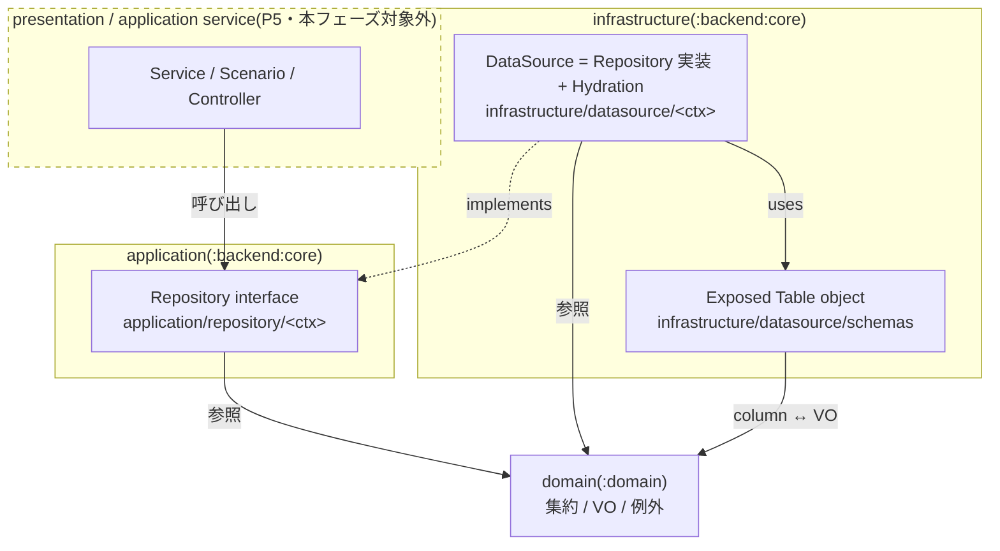
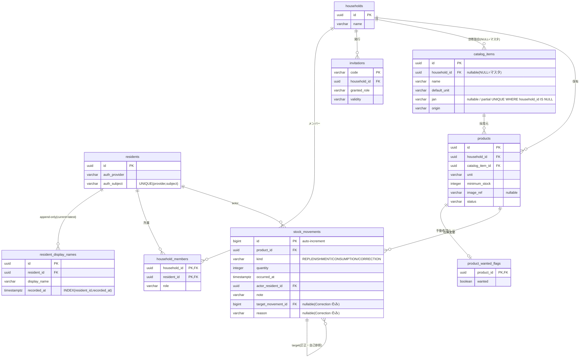
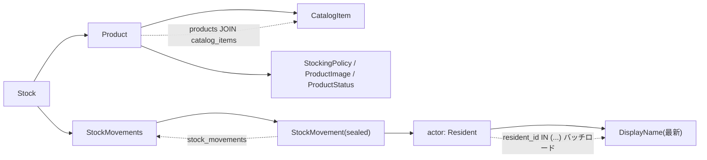

# P4: backend infra + migration 設計

`:backend:core` の infrastructure(Exposed テーブル定義 + DataSource 実装)と application 層 Repository interface、および DB マイグレーション(flyway SQL)を整備する。フルリプレイス ロードマップ P4。

- 起点設計: `docs/superpowers/specs/2026-05-31-mindstock-full-replace-design/`(00-03)
- 準拠ルール: `.claude/rules/software-architecture.md` / `error-handling.md` / `one-class-per-file.md` / `immutable-construction.md` / `testing.md`
- 前段: P1 domain(resident/household)、P2 domain(catalog/inventory)、P3 `:rpc`(service interface + DTO)

## スコープ

### 含む

- `infrastructure/datasource/schemas/` の Exposed テーブル定義(`@Table` object)
- マイグレーション(flyway 形式の versioned SQL、greenfield `V1__init`)
- `application/repository/<ctx>/` の Repository interface(Reader / Writer 分離)
- `infrastructure/datasource/<ctx>/` の DataSource 実装(Repository 実装)+ `<Aggregate>Hydration.kt`
- `kotlin.uuid.Uuid` ↔ value class、`kotlin.time.Instant` ↔ Exposed カラム型の変換層

### 含まない(後続フェーズ)

- Service / Scenario(P5)
- presentation(Controller / RpcError 翻訳)、認証(P5)
- Ktor 起動時の Hikari / Exposed `Database` / flyway `migrate` / DI 配線(P5)
- **Repository / infrastructure のテスト**。P5 の Service テストで結合テストとして吸収する(全層でテストするコストを避けるユーザ判断)

### P4 の検証方法

テストを書かない代わりに以下で担保する:

- `./gradlew :backend:core:build` がコンパイル緑
- `./gradlew :backend:core:generateMigrations` が postgres:18 testcontainer に対して DDL を diff し、`V1__init` SQL を生成できる(= テーブル定義が実 postgres で妥当)
- 生成 SQL を目視レビューしてから commit

## レイヤと依存方向(software-architecture 準拠)

- application(Repository interface)は infrastructure / presentation に依存しない(`implements` は infrastructure → application の片方向。図の点線矢印)。domain は全層から参照される。
- DataSource 実装内では `transaction {}` を書かない(境界は P5 の `tx()` / Ktor plugin が管理)。
- Repository interface 側で例外 throw を規約化しない(契約だけを示す)。

### パッケージ配置

| 種別 | パッケージ | 命名 |
|---|---|---|
| Table 定義 | `net.brightroom.mindstock.infrastructure.datasource.schemas` | `<Table名>Table`(複数形 snake → object) |
| Repository interface(読) | `net.brightroom.mindstock.application.repository.<ctx>` | `<Ctx>Repository` |
| Repository interface(書) | 同上 | `<Ctx>RegisterRepository` |
| DataSource 実装 | `net.brightroom.mindstock.infrastructure.datasource.<ctx>` | `<Ctx>DataSource` / `<Ctx>RegisterDataSource` |
| Hydration | 同 `<ctx>` パッケージ | `<Aggregate>Hydration.kt`(internal `ResultRow.to<Aggregate>()`) |

`<ctx>` = `resident` / `household` / `invitation` / `catalog` / `product` / `stock`。

**build.gradle 変更**: `exposed { migrations { tablesPackage } }` を現行 `...infrastructure.datasource` から `net.brightroom.mindstock.infrastructure.datasource.schemas` に更新する。

## 型マッピングの原則

- **ID(`ResidentId`/`HouseholdId`/`ProductId`/`CatalogItemId`)** は `kotlin.uuid.Uuid` を内包。Exposed 1.3.0 の `Table.uuid(name): Column<kotlin.uuid.Uuid>`(`UuidColumnType` がネイティブ対応)をそのまま使う。java.util.UUID 変換は不要。`table.id eq id()`(value class の internal `invoke(): Uuid`)で書く。
- **`MovementId` は `Long`**(UUID ではない)。`stock_movements.id` は **auto-increment `bigint`**、`MovementIdentity.Persisted(id)` = その行 PK。`target_movement_id` は nullable `bigint` self-FK。INSERT は `insertAndGetId`(long)で読み戻す。
- **enum(`HouseholdMemberRole`/`ProductStatus`/`InvitationValidity`/`CatalogOrigin`/`AuthProvider`)** は `.name`(日本語含む)を `varchar` 保存(Exposed `enumerationByName`)。
- **正規化済 VO(String 系)** は `varchar(MAX_LENGTH)`。長さは各 VO の `MAX_LENGTH` に一致させる(DisplayName 100 / HouseholdName 30 / CatalogItemName 60 / CatalogItemUnit 10 / ProductUnit 10 / Reason 255 / Note 255 / Jan 13 / AuthSubject は非空 `varchar(255)`)。
- **`Quantity`/`MinimumStock`** は `integer`。
- **`OccurredAt` / `recorded_at`(`kotlin.time.Instant`)** は `timestamp with time zone`。**変換層が必要**(下記 要解決)。
- **`Barcode`(sealed)** はテーブルでは `jan varchar(13)` nullable に潰す。null = `Unlinked` / 値あり = `Linked(Jan)`。hydration で sealed に復元。
- **`ProductImage`(sealed)** は `image_ref` nullable。null = `None` / 値あり = `Stored(ImageRef)`。
- **`StockMovement`(sealed)** は単一テーブル + `kind` 判別列(下記)。

## テーブルスキーマ(V1 greenfield)

全テーブルにマルチテナント scoping のため、集約に存在しなくても必要な箇所に `household_id` 列を持たせる。

### resident コンテキスト

`residents`
| col | type | constraint |
|---|---|---|
| `id` | uuid | PK |
| `auth_provider` | varchar | NOT NULL |
| `auth_subject` | varchar(255) | NOT NULL |
| — | — | UNIQUE(`auth_provider`, `auth_subject`) |

`resident_display_names`(append-only。current = 最新行)
| col | type | constraint |
|---|---|---|
| `id` | uuid | PK |
| `resident_id` | uuid | NOT NULL, FK→`residents.id` |
| `display_name` | varchar(100) | NOT NULL |
| `recorded_at` | timestamptz | NOT NULL |
| — | — | INDEX(`resident_id`, `recorded_at`) |

- `Resident` = (`id`, `Profile(DisplayName)`)。hydration は `residents` + 当該 resident の `recorded_at` 最新 `resident_display_names` を JOIN(latest-per-group)。
- `rename` は `resident_display_names` への INSERT(UPDATE しない)。

### household コンテキスト

`households`
| col | type | constraint |
|---|---|---|
| `id` | uuid | PK |
| `name` | varchar(30) | NOT NULL |

`household_members`
| col | type | constraint |
|---|---|---|
| `household_id` | uuid | NOT NULL, FK→`households.id` |
| `resident_id` | uuid | NOT NULL, FK→`residents.id` |
| `role` | varchar | NOT NULL |
| — | — | PK(`household_id`, `resident_id`) / INDEX(`resident_id`) |

- `Household` = (`id`, `Profile(name)`, `Members`)。`HouseholdMember` は `Resident` を内包 → hydration は `household_members` JOIN `residents` JOIN 最新 `resident_display_names`。
- `HouseholdRegisterRepository.store(household)` は `households` upsert + `household_members` の全再構成(該当 household の members を delete → insert)。member の resident 自体は別途 resident 側で永続済の前提(join は既存 resident を追加)。

### invitation コンテキスト(別集約)

`invitations`
| col | type | constraint |
|---|---|---|
| `code` | varchar(6) | PK |
| `household_id` | uuid | NOT NULL, FK→`households.id` |
| `granted_role` | varchar | NOT NULL |
| `validity` | varchar | NOT NULL |
| — | — | INDEX(`household_id`) |

- `Invitation` = (`householdId`, `code`, `grantedRole`, `validity`)。`code` が join 解決キー。
- `store` は upsert(issue = insert / revoke = `validity` 更新)。1 コード→複数参加・期限なし・有効/無効のみ(招待仕様変更 2026-06-01)。

### catalog コンテキスト

`catalog_items`
| col | type | constraint |
|---|---|---|
| `id` | uuid | PK |
| `household_id` | uuid | **nullable**, FK→`households.id` |
| `name` | varchar(60) | NOT NULL |
| `default_unit` | varchar(10) | NOT NULL |
| `jan` | varchar(13) | **nullable** |
| `origin` | varchar | NOT NULL |
| — | — | partial UNIQUE(`jan`) WHERE `household_id IS NULL` / INDEX(`household_id`) |

- `household_id IS NULL` = マスタ(`origin=マスタ`) / 値あり = 世帯独自(`origin=世帯独自`)。`origin` 列は hydration 直読み用に併存。
- JAN 一意性は**マスタ内のみ**(partial unique)。世帯独自は `Barcode.Unlinked` 想定で JAN 制約なし。
- 重複検出は P5 service の事前 `findByJan` チェックで `DuplicateJanException`。partial unique は最終防壁(race 時は raw 伝播 = Internal)。

### product コンテキスト

`products`
| col | type | constraint |
|---|---|---|
| `id` | uuid | PK |
| `household_id` | uuid | NOT NULL, FK→`households.id` |
| `catalog_item_id` | uuid | NOT NULL, FK→`catalog_items.id` |
| `unit` | varchar(10) | NOT NULL |
| `minimum_stock` | integer | NOT NULL |
| `image_ref` | varchar | **nullable** |
| `status` | varchar | NOT NULL |
| — | — | INDEX(`household_id`) |

`product_wanted_flags`(manualWanted = read-model 合成入力。Product 集約に hydrate しない)
| col | type | constraint |
|---|---|---|
| `product_id` | uuid | PK, FK→`products.id` |
| `wanted` | boolean | NOT NULL |

- `Product` = (`id`, `CatalogItem`, `StockingPolicy(unit, minimumStock)`, `ProductImage`, `ProductStatus`)。hydration は `products` JOIN `catalog_items`。
- `setWanted(productId, wanted)` は `product_wanted_flags` upsert。`ShoppingList`(派生 read-model)は P5 で `products` + 在庫不足 + `product_wanted_flags` を合成。

### stock コンテキスト

stocks テーブルは**作らない**。`Stock` は StockId を持たず `ProductId` で特定される(`Stock = Product + StockMovements`)。在庫は product が adopt された時点で暗黙に存在し、`currentQuantity` は movements の畳み込みで算出する。

`stock_movements`(append-only。sealed `StockMovement` を単一テーブルに集約)
| col | type | constraint |
|---|---|---|
| `id` | bigint | PK, auto-increment |
| `product_id` | uuid | NOT NULL, FK→`products.id` |
| `kind` | varchar | NOT NULL(`REPLENISHMENT` / `CONSUMPTION` / `CORRECTION`) |
| `quantity` | integer | NOT NULL(>0) |
| `occurred_at` | timestamptz | NOT NULL |
| `actor_resident_id` | uuid | NOT NULL, FK→`residents.id` |
| `note` | varchar(255) | NOT NULL(空文字可) |
| `target_movement_id` | bigint | **nullable**, FK→`stock_movements.id`(Correction のみ) |
| `reason` | varchar(255) | **nullable**(Correction のみ) |
| — | — | INDEX(`product_id`, `occurred_at`) |

- `kind` 判別: `Replenishment` / `Consumption` / `Correction`。`Correction` のみ `target_movement_id` / `reason` を使う。
- `MovementIdentity.Persisted(id)` = 行 `id`(bigint)。`appendMovement` は INSERT 後に id を読み戻して `Persisted` で hydrate。
- `StockMovement.actor` は full `Resident`(現在値)→ `actor_resident_id` FK + hydration。`listByHousehold` / activity 用途では actor の **resident バッチロード**(`resident_id IN (...)`)で N+1 を回避。

## Repository interface(RPC surface から導出 / YAGNI)

P3 の RPC メソッドが将来呼ぶものだけを定義する。引数・戻り値は VO / 集約 / FCC のみ(primitive / raw List を公開しない)。単一値は non-null、不在は実装が `ResourceNotFoundException`、一覧は空 FCC。

| context | Reader `<Ctx>Repository` | Writer `<Ctx>RegisterRepository` |
|---|---|---|
| resident | `findByAuth(AuthIdentity): Resident`、`findById(ResidentId): Resident` | `register(authIdentity, displayName): Resident`、`appendDisplayName(ResidentId, DisplayName): Resident` |
| household | `findById(HouseholdId): Household`、`listByResident(ResidentId): Households` | `store(Household): Household` |
| invitation | `findByCode(InvitationCode): Invitation` | `store(Invitation): Invitation` |
| catalog | `search(query, limit): CatalogItems`、`findByJan(Jan): CatalogItem`、`findById(CatalogItemId): CatalogItem` | `store(CatalogItem): CatalogItem` |
| product | `findById(ProductId): Product`、`listByHousehold(HouseholdId): Products`、`listArchivedByHousehold(HouseholdId): Products` | `store(Product, HouseholdId): Product`、`setWanted(ProductId, Boolean)` |
| stock | `findByProduct(ProductId): Stock`、`listByHousehold(HouseholdId): Stocks`、`historyOf(ProductId): StockMovements` | `appendMovement(ProductId, StockMovement): StockMovement` |

注:
- `search` の `query: String` / `limit: Int` は CatalogRpcService の primitive 引数をそのまま受ける(検索条件は VO 化されていない)。戻りは `CatalogItems` FCC。
- catalog の write は `addCustom`(世帯独自 CatalogItem + Product 同時作成)経由。`CatalogRegisterRepository` を独立させ、P5 の ProductRegisterService が `CatalogRegisterRepository` と `ProductRegisterRepository` を順に orchestrate する。
- `activity(householdId)` 用の専用メソッドは作らない。`StockRepository.listByHousehold`(product + movements を含む `Stocks`)で足り、`ActivityFeed` 組み立ては P5。
- `store(Product, householdId)` は adopt / addCustom / 各 change / archive すべての永続を担う(read-back で domain object 返却)。

## DataSource 実装(infrastructure)

- INSERT 後は read-back(`insertAndGetId` + hydration)で domain object を返す(software-architecture 準拠)。
- 行が無い単一値取得は `ResourceNotFoundException` を throw(message に何が無いか)。
- 一覧は空でも空 FCC を返す(throw / null 禁止)。
- **想定外の Exposed/JDBC エラー(接続断・デッドロック・想定外制約違反)はラップせず raw 伝播**。infrastructure の例外翻訳は「不在 → `ResourceNotFoundException`」のみ。想定外は P5 Controller の catch-all が `RpcError.Internal` に翻訳する(error-handling の素通し哲学と一致)。
- Hydration は `<Aggregate>Hydration.kt` の internal extension に集約(`ResultRow.to<Aggregate>()`)。深い object graph(Stock→Product→CatalogItem、movement→actor Resident)は JOIN + バッチロードで組む。

`Stock` の hydration object graph(最も深い例):

`activity` / `listByHousehold` では movement ごとに actor を引くと N+1 になるため、`actor_resident_id` を集めて `residents`(+ 最新 `resident_display_names`)を一括ロードする。

## 変換層

- **Uuid**: Exposed `uuid()` が `kotlin.uuid.Uuid` を返すため変換不要。value class の internal `invoke(): Uuid` で列値と相互変換。
- **Instant(要解決)**: `OccurredAt` / `recorded_at` は `kotlin.time.Instant`。`exposed-kotlin-datetime`(1.3.0)が `kotlin.time.Instant` をそのまま扱えるか、`kotlinx.datetime.Instant` 経由の変換が要るかを **plan のタスク 0 で確定**(`timestampWithTimeZone` 列 + 必要なら変換 helper を 1 箇所に置く)。

## マイグレーション生成フロー

1. `infrastructure/datasource/schemas/` にテーブル定義を書く
2. `./gradlew :backend:core:generateMigrations`(exposed plugin が postgres:18 testcontainer にテーブル定義を diff)
3. 生成された flyway SQL(`src/main/resources/db/migration/V1__init.sql` 相当)を目視レビュー
4. commit

greenfield(`backend/core` は空)のため初回は全スキーマを 1 ファイル `V1__init` に生成する。増分 diff 機構は組まない。flyway での実 DB 適用は P5(起動配線)。

## 要解決(plan で詰める)

- `kotlin.time.Instant` ↔ Exposed カラム型の具体変換(上記)。
- `generateMigrations` タスクの生成物パス・ファイル名規約(`V1__init.sql`)と、複数 table をまたぐ FK 順序が 1 ファイルに正しく出るかの確認。
- `household_members` の全再構成(delete→insert)が `store` の妥当な実装か、差分更新が要るか(P5 の利用パターン次第。P4 は全再構成で実装)。
- `catalog_items` の **partial UNIQUE(jan) WHERE household_id IS NULL** を Exposed DSL で表現できるか(`uniqueIndex` の `filterCondition`)。生成 SQL に partial index が出ない場合は `V1__init` に raw SQL で追記する。

## 関連

- spec(起点): `docs/superpowers/specs/2026-05-31-mindstock-full-replace-design/`(00-03)
- rule: `software-architecture.md` / `error-handling.md` / `one-class-per-file.md` / `testing.md`
- 前段プラン: `docs/superpowers/plans/2026-06-01-p3-rpc-service-and-dto.md`
