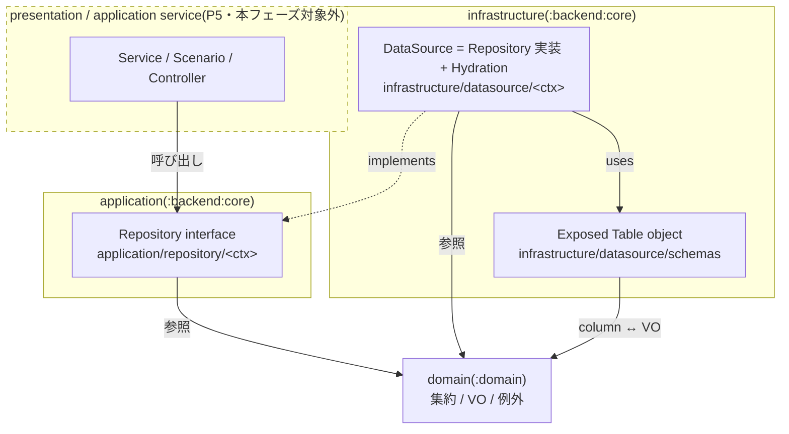
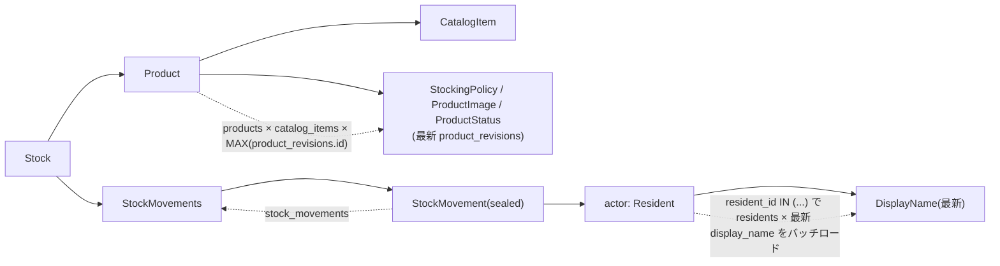

# P4: backend infra + migration 設計

`:backend:core` の infrastructure(Exposed テーブル定義 + DataSource 実装)と application 層 Repository interface、および DB マイグレーション(flyway SQL)を整備する。フルリプレイス ロードマップ P4。

- 起点設計: `docs/superpowers/specs/2026-05-31-mindstock-full-replace-design/`(00-03)
- 準拠ルール: `.claude/rules/software-architecture.md` / `error-handling.md` / `one-class-per-file.md` / `immutable-construction.md` / `testing.md`
- 前段: P1 domain(resident/household)、P2 domain(catalog/inventory)、P3 `:rpc`(service interface + DTO)

## スコープ

### 含む

- `infrastructure/datasource/schemas/` の Exposed テーブル定義(`@Table` object)
- マイグレーション(flyway 形式の versioned SQL、greenfield `V1__init`)
- `application/repository/<ctx>/` の Repository interface(Reader / Writer 分離)
- `infrastructure/datasource/<ctx>/` の DataSource 実装(Repository 実装)+ `<Aggregate>Hydration.kt`
- `kotlin.uuid.Uuid` ↔ value class、`kotlin.time.Instant` ↔ Exposed カラム型の変換層

### 含まない(後続フェーズ)

- Service / Scenario(P5)
- presentation(Controller / RpcError 翻訳)、認証(P5)
- Ktor 起動時の Hikari / Exposed `Database` / flyway `migrate` / DI 配線(P5)
- **Repository / infrastructure のテスト**。P5 の Service テストで結合テストとして吸収する(全層でテストするコストを避けるユーザ判断)

### P4 の検証方法

テストを書かない代わりに以下で担保する:

- `./gradlew :backend:core:build` がコンパイル緑
- `./gradlew :backend:core:generateMigrations` が postgres:18 testcontainer に対して DDL を diff し、`V1__init` SQL を生成できる(= テーブル定義が実 postgres で妥当)
- 生成 SQL を目視レビューしてから commit

> リスク注記: append-only モデルの「latest-per-group hydration」と「tombstone フィルタ」は silent bug が出やすい箇所で、P4 にテストが無いと P5 の Service テストまで実挙動が検証されない。P5 では該当ロジックを優先的に結合テストで突く。

## レイヤと依存方向(software-architecture 準拠)

- application(Repository interface)は infrastructure / presentation に依存しない(`implements` は infrastructure → application の片方向。図の点線矢印)。domain は全層から参照される。
- DataSource 実装内では `transaction {}` を書かない(境界は P5 の `tx()` / Ktor plugin が管理)。
- Repository interface 側で例外 throw を規約化しない(契約だけを示す)。

### パッケージ配置

| 種別 | パッケージ | 命名 |
|---|---|---|
| Table 定義 | `net.brightroom.mindstock.infrastructure.datasource.schemas` | `<Table名>Table`(snake table → object) |
| Repository interface(読) | `net.brightroom.mindstock.application.repository.<ctx>` | `<Ctx>Repository` |
| Repository interface(書) | 同上 | `<Ctx>RegisterRepository` |
| DataSource 実装 | `net.brightroom.mindstock.infrastructure.datasource.<ctx>` | `<Ctx>DataSource` / `<Ctx>RegisterDataSource` |
| Hydration | 同 `<ctx>` パッケージ | `<Aggregate>Hydration.kt`(internal `ResultRow.to<Aggregate>()`) |

`<ctx>` = `resident` / `household` / `invitation` / `catalog` / `product` / `stock`。

**build.gradle 変更**: `exposed { migrations { tablesPackage } }` を現行 `...infrastructure.datasource` から `net.brightroom.mindstock.infrastructure.datasource.schemas` に更新する。

## 永続モデルの原則: append-only

集約ルートのテーブルは**識別子(+ 不変な素性・関連)だけ**を持ち、**変化するもの**は履歴/イベントテーブルへ分離する。UPDATE / DELETE は使わない。

- **insert-once 識別子行**: `residents` / `households` / `catalog_items` / `products` / `invitations`。一度だけ INSERT。
- **append-only 履歴(current = latest)**: 表示名・世帯名・招待有効性・商品設定スナップショット・手動希望・在庫変動。変更は新しい行の INSERT。
- **current 値の決定は履歴行の bigint auto-increment `id` の最大値(`MAX(id)` per group)で行う**。`recorded_at` は表示/監査用で、latest 判定には使わない(`StockMovements.netQuantity()` が抱える「同一 Instant 衝突」前提を全 hydration に持ち込まないため)。
- **削除は tombstone イベント**。世帯メンバーの退出/除外は DELETE せず `除外` ステータスのイベントを append。current メンバーは「(household, resident)ごとの最新イベントで `status=所属`」のものだけ。

> 集約は不変再構築(`copy()` 禁止)だが、それは domain の話。永続層は domain command に対応する **append メソッド** で「変化分を 1 行追記」する(whole-aggregate な `store` は append-only と相性が悪く、差分検出が必要になり破綻するため採らない)。

## 型マッピングの原則

- **集約ルート ID(`ResidentId`/`HouseholdId`/`ProductId`/`CatalogItemId`)** は `kotlin.uuid.Uuid` を内包。Exposed 1.3.0 の `Table.uuid(name): Column<kotlin.uuid.Uuid>`(`UuidColumnType` がネイティブ対応)をそのまま使う。java.util.UUID 変換は不要。`table.id eq id()`(value class の internal `invoke(): Uuid`)で書く。
- **履歴/イベント行の PK は `bigint` auto-increment**(`resident_display_names` / `household_names` / `household_membership_events` / `invitation_validity_events` / `product_revisions` / `product_wanted_events` / `stock_movements`)。重要な業務 id ではなく、追記順と latest 判定の単調キーとして使う。`MovementId`(`Long`)= `stock_movements.id`、`MovementIdentity.Persisted(id)` = その行 PK。`target_movement_id` は nullable `bigint` self-FK。
- **enum(`HouseholdMemberRole`/`ProductStatus`/`InvitationValidity`/`CatalogOrigin`/`AuthProvider`)** は `.name`(日本語含む)を `varchar` 保存(Exposed `enumerationByName`)。
- **正規化済 VO(String 系)** は `varchar(MAX_LENGTH)`。長さは各 VO の `MAX_LENGTH` に一致(DisplayName 100 / HouseholdName 30 / CatalogItemName 60 / CatalogItemUnit 10 / ProductUnit 10 / Reason 255 / Note 255 / Jan 13 / AuthSubject は非空 `varchar(255)`)。
- **`Quantity`/`MinimumStock`** は `integer`。
- **`OccurredAt` / `recorded_at`(`kotlin.time.Instant`)** は `timestamp with time zone`。**変換層が必要**(下記 要解決)。
- **`Barcode`(sealed)** は `jan varchar(13)` nullable に潰す。null = `Unlinked` / 値あり = `Linked(Jan)`。hydration で sealed に復元。
- **`ProductImage`(sealed)** は `image_ref` nullable。null = `None` / 値あり = `Stored(ImageRef)`。
- **`StockMovement`(sealed)** は単一テーブル + `kind` 判別列(下記)。

## テーブルスキーマ(V1 greenfield)

テナント scoping は **`products.household_id`** に置く(catalog は全世帯共有のため scoping を持たない)。

```mermaid
erDiagram
    residents ||--o{ resident_auth_identities : "認証手段(1:N)"
    residents ||--o{ resident_display_names : "表示名履歴"
    residents ||--o{ household_membership_events : "メンバー"
    residents ||--o{ stock_movements : "actor"
    households ||--o{ household_names : "世帯名履歴"
    households ||--o{ household_membership_events : "所属"
    households ||--o{ invitations : "発行"
    households ||--o{ products : "保有(scoping)"
    invitations ||--o{ invitation_validity_events : "有効性履歴"
    catalog_items ||--o{ products : "採用元(全世帯共有)"
    products ||--o{ product_revisions : "設定スナップショット"
    products ||--o{ product_wanted_events : "手動希望履歴"
    products ||--o{ stock_movements : "在庫変動"
    stock_movements ||--o{ stock_movements : "target(訂正・自己参照)"

    residents {
        uuid id PK
    }
    resident_auth_identities {
        bigint id PK "auto-increment"
        uuid resident_id FK
        varchar provider
        varchar subject "UNIQUE(provider,subject)"
    }
    resident_display_names {
        bigint id PK "auto-increment / current=MAX(id) per resident_id"
        uuid resident_id FK
        varchar display_name
        timestamptz recorded_at
    }
    households {
        uuid id PK
    }
    household_names {
        bigint id PK "auto-increment / current=MAX(id) per household_id"
        uuid household_id FK
        varchar name
        timestamptz recorded_at
    }
    household_membership_events {
        bigint id PK "auto-increment"
        uuid household_id FK
        uuid resident_id FK
        varchar role
        varchar status "所属 / 除外(tombstone)"
        timestamptz recorded_at
    }
    invitations {
        varchar code PK
        uuid household_id FK
        varchar granted_role "issue 時固定"
    }
    invitation_validity_events {
        bigint id PK "auto-increment / current=MAX(id) per code"
        varchar invitation_code FK
        varchar validity "有効 / 無効"
        timestamptz recorded_at
    }
    catalog_items {
        uuid id PK
        varchar name
        varchar default_unit
        varchar jan "nullable / UNIQUE(jan)"
        varchar origin "マスタ / 世帯独自"
    }
    products {
        uuid id PK
        uuid household_id FK "テナント scoping"
        uuid catalog_item_id FK
    }
    product_revisions {
        bigint id PK "auto-increment / current=MAX(id) per product_id"
        uuid product_id FK
        varchar unit
        integer minimum_stock
        varchar image_ref "nullable"
        varchar status
        timestamptz recorded_at
    }
    product_wanted_events {
        bigint id PK "auto-increment / current=MAX(id) per product_id"
        uuid product_id FK
        boolean wanted
        timestamptz recorded_at
    }
    stock_movements {
        bigint id PK "auto-increment(=MovementId)"
        uuid product_id FK
        varchar kind "REPLENISHMENT/CONSUMPTION/CORRECTION"
        integer quantity
        timestamptz occurred_at
        uuid actor_resident_id FK
        varchar note
        bigint target_movement_id FK "nullable(Correction のみ)"
        varchar reason "nullable(Correction のみ)"
    }
```

### resident コンテキスト

- `residents`(insert-once 識別子): `id` uuid PK。
- `resident_auth_identities`(認証手段。`id` で固定縛りせず 1:N 可能に分離 → 将来の別 auth/パスワード追加に耐える): `id` bigint PK, `resident_id` uuid FK→residents, `provider` varchar, `subject` varchar(255)。UNIQUE(`provider`, `subject`) / INDEX(`resident_id`)。現状は 1 resident 1 auth。
- `resident_display_names`(append-only): `id` bigint PK, `resident_id` uuid FK→residents, `display_name` varchar(100), `recorded_at` timestamptz。INDEX(`resident_id`, `id`)。current = `resident_id` ごとの `MAX(id)`。
- `Resident` = (`id`, `Profile(DisplayName)`)。hydration = `residents` + 最新 `resident_display_names`。`findByAuth` は `resident_auth_identities` を(`provider`,`subject`)で引いて resident に解決。
- `rename` / `registerDisplayName` は `resident_display_names` への INSERT(UPDATE しない)。

### household コンテキスト

- `households`(insert-once 識別子): `id` uuid PK。
- `household_names`(append-only): `id` bigint PK, `household_id` uuid FK→households, `name` varchar(30), `recorded_at` timestamptz。INDEX(`household_id`, `id`)。current = `household_id` ごとの `MAX(id)`。rename = INSERT。
- `household_membership_events`(append-only。メンバーの存在・role を兼ねる): `id` bigint PK, `household_id` uuid FK→households, `resident_id` uuid FK→residents, `role` varchar, `status` varchar(`所属`/`除外`), `recorded_at` timestamptz。INDEX(`household_id`, `resident_id`, `id`)。
  - current メンバー = (household, resident)ごとの最新イベントで `status=所属` のもの。`role` はその行の値。
  - join = `所属` + role を append / changeRole = `所属` + 新 role を append / leave・removeMember = `除外` を append(tombstone、DELETE しない。`role` 列はその時点の role を入れて NOT NULL を満たす)。
- `Household` = (`id`, `Profile(name)`, `Members`)。`HouseholdMember` は `Resident` を内包 → hydration = current メンバー × `residents` × 最新 display name。

### invitation コンテキスト(別集約)

- `invitations`(insert-once。`code`・`household_id`・`granted_role` は issue 時固定): `code` varchar(6) PK, `household_id` uuid FK→households, `granted_role` varchar。INDEX(`household_id`)。
- `invitation_validity_events`(append-only): `id` bigint PK, `invitation_code` varchar FK→invitations, `validity` varchar(`有効`/`無効`), `recorded_at` timestamptz。INDEX(`invitation_code`, `id`)。current = `code` ごとの `MAX(id)`。
  - issue = `有効` を append / revoke = `無効` を append。1 コード→複数参加・期限なし・有効/無効のみ(招待仕様変更 2026-06-01)。

### catalog コンテキスト(全世帯共有 master)

- `catalog_items`(global。**household_id を持たない**): `id` uuid PK, `name` varchar(60), `default_unit` varchar(10), `jan` varchar(13) nullable, `origin` varchar。UNIQUE(`jan`)(null は複数可、postgres 標準)。
  - 設計 03 L267「CatalogItem は全世帯共有」に準拠。`origin`(マスタ/世帯独自)は出所の区分で、どちらも全世帯から参照可能なグローバル catalog エントリ。content(name/unit)は現状 RPC に master 編集経路が無いため inline(変化しない=分離しない)。
  - 外部 API 取得品は `findByJan` 不在時に `origin=マスタ` で insert・再利用(設計 03 L499)。`jan` UNIQUE が再利用の一意性を担保。
  - **JAN 重複(`DuplicateJanException`)は catalog 制約ではなく P5 の Product 採用サービスで「同一世帯に同一 JAN の Product が無いか」を検査**(設計 03 L382)。catalog は重複検出の責務を持たない。

### product コンテキスト

- `products`(insert-once 識別子 + 不変関連。**テナント scoping の置き場**): `id` uuid PK, `household_id` uuid FK→households, `catalog_item_id` uuid FK→catalog_items。INDEX(`household_id`)。
- `product_revisions`(append-only。可変設定の全体スナップショット): `id` bigint PK, `product_id` uuid FK→products, `unit` varchar(10), `minimum_stock` integer, `image_ref` varchar nullable, `status` varchar, `recorded_at` timestamptz。INDEX(`product_id`, `id`)。current = `product_id` ごとの `MAX(id)`。
  - adopt/addCustom = 初回 revision を append / changeUnit・changeMinimum・changeImage・archive・unarchive = 変更後の `Product` 全状態を 1 行 append(Product 集約が完全状態を持つのでスナップショットで足りる)。
- `product_wanted_flags` は使わず `product_wanted_events`(append-only): `id` bigint PK, `product_id` uuid FK→products, `wanted` boolean, `recorded_at` timestamptz。INDEX(`product_id`, `id`)。current = `product_id` ごとの `MAX(id)`。setWanted = append。
- `Product` = (`id`, `CatalogItem`, `StockingPolicy`, `ProductImage`, `ProductStatus`)。hydration = `products` × `catalog_items` × 最新 `product_revisions`。manualWanted(read-model 合成入力)は `product_wanted_events` の current を P5 の `ShoppingList` 合成で使う(Product 集約には hydrate しない)。

### stock コンテキスト

stocks テーブルは**作らない**。`Stock` は StockId を持たず `ProductId` で特定(`Stock = Product + StockMovements`)。在庫は product adopt 時点で暗黙に存在し、`currentQuantity` は movements の畳み込みで算出。

- `stock_movements`(append-only fact。sealed `StockMovement` を単一テーブルに集約): `id` bigint PK(=`MovementId`), `product_id` uuid FK→products, `kind` varchar(`REPLENISHMENT`/`CONSUMPTION`/`CORRECTION`), `quantity` integer(>0), `occurred_at` timestamptz, `actor_resident_id` uuid FK→residents, `note` varchar(255)(空文字可), `target_movement_id` bigint nullable FK→stock_movements(Correction のみ), `reason` varchar(255) nullable(Correction のみ)。INDEX(`product_id`, `occurred_at`)。
  - `MovementIdentity.Persisted(id)` = 行 `id`。`appendMovement` は INSERT 後に id を読み戻して `Persisted` で hydrate。
  - `actor` は full `Resident`(現在値)→ `actor_resident_id` FK + hydration。history/activity 用途は actor の resident バッチロードで N+1 回避(下記)。
  - 訂正畳み込み(`netQuantity`)は domain ロジックをそのまま使用。`occurred_at` は domain の `OccurredAt`。

## Repository interface(RPC surface から導出 / YAGNI / append-only)

P3 の RPC メソッドが将来呼ぶものだけを定義。引数・戻り値は VO / 集約 / FCC のみ(primitive / raw List を公開しない)。単一値は non-null、不在は実装が `ResourceNotFoundException`、一覧は空 FCC。Writer は **domain command に対応する append/insert-once メソッド**(whole-aggregate な `store` は採らない)。

### Reader `<Ctx>Repository`

| context | メソッド | 用途(RPC) |
|---|---|---|
| resident | `findByAuth(AuthIdentity): Resident` / `findById(ResidentId): Resident` | me / 登録時 lookup / 他集約の actor・member hydration |
| household | `findById(HouseholdId): Household` / `listByResident(ResidentId): Households` | rename 等の対象取得 / list |
| invitation | `findByCode(InvitationCode): Invitation` | previewInvite / revokeInvite / join |
| catalog | `search(query: String, limit: Int): CatalogItems` / `findByJan(Jan): CatalogItem` / `findById(CatalogItemId): CatalogItem` | search / lookupByJan / adopt |
| product | `findById(ProductId): Product` / `listByHousehold(HouseholdId): Products` / `listArchivedByHousehold(HouseholdId): Products` | 各 change / list / listArchived |
| stock | `findByProduct(ProductId): Stock` / `listByHousehold(HouseholdId): Stocks` / `historyOf(ProductId): StockMovements` | replenish/consume/correct の対象 / list / history・activity 素材 |

### Writer `<Ctx>RegisterRepository`(append-only)

| context | メソッド | append 先 / domain command |
|---|---|---|
| resident | `registerResident(AuthIdentity, DisplayName): Resident` | residents + auth + 初回 display_name |
| | `appendDisplayName(ResidentId, DisplayName): Resident` | resident_display_names(registerDisplayName/rename) |
| household | `registerHousehold(Household): Household` | households + 初回 household_name + owner の `所属` membership event(create) |
| | `appendHouseholdName(HouseholdId, HouseholdName)` | household_names(rename) |
| | `joinMember(HouseholdId, Resident, HouseholdMemberRole)` | `所属` event(join) |
| | `changeMemberRole(HouseholdId, ResidentId, HouseholdMemberRole)` | `所属` + 新 role event(changeRole) |
| | `removeMember(HouseholdId, ResidentId)` | `除外` tombstone event(leave/removeMember) |
| invitation | `issue(Invitation): Invitation` | invitations + `有効` validity event |
| | `revoke(InvitationCode)` | `無効` validity event |
| catalog | `register(CatalogItem): CatalogItem` | catalog_items(addCustom 経由の世帯独自 / 外部取得品) |
| product | `register(Product, HouseholdId): Product` | products + 初回 product_revision(adopt/addCustom) |
| | `appendRevision(Product): Product` | product_revisions(changeUnit/changeMinimum/changeImage/archive/unarchive を Product スナップショットで append) |
| | `setWanted(ProductId, Boolean)` | product_wanted_events |
| stock | `appendMovement(ProductId, StockMovement): StockMovement` | stock_movements(replenish/consume/correct) |

注:
- catalog の write は `CatalogRegisterRepository.register` で独立。P5 の ProductRegisterService が `CatalogRegisterRepository`(世帯独自 catalog item)と `ProductRegisterRepository`(product)を順に orchestrate(addCustom)。
- `activity(householdId)` 用の専用 Reader は作らない。`StockRepository.listByHousehold`(product + movements を含む `Stocks`)で足り、`ActivityFeed` 組み立ては P5。
- `registerHousehold` / `joinMember` が受ける `Resident` 自体は resident 側で永続済の前提(membership event は resident_id を参照するだけ)。

## DataSource 実装(infrastructure)

- **latest-per-group は `MAX(id)` で引く**(`recorded_at` ではない)。各履歴テーブルは `(group_key, id)` の INDEX を張り、相関サブクエリまたは window で最新行を取る。
- **current メンバーシップは tombstone フィルタ**: (household, resident)ごと最新イベントを取り `status=所属` のみ採用。
- INSERT 後は read-back(`insertAndGetId` + hydration)で domain object を返す。
- 行が無い単一値取得は `ResourceNotFoundException` を throw(message に何が無いか)。一覧は空でも空 FCC。
- **想定外の Exposed/JDBC エラー(接続断・デッドロック・想定外制約違反)はラップせず raw 伝播**。infrastructure の例外翻訳は「不在 → `ResourceNotFoundException`」のみ。想定外は P5 Controller の catch-all が `RpcError.Internal` に翻訳(error-handling の素通し哲学と一致)。
- Hydration は `<Aggregate>Hydration.kt` の internal extension に集約(`ResultRow.to<Aggregate>()`)。

`Stock` の hydration object graph(最も深い例):

`activity` / `listByHousehold` では movement ごとに actor を引くと N+1 になるため、`actor_resident_id` を集めて `residents`(+ 最新 `resident_display_names`)を一括ロードする。

## 変換層

- **Uuid**: Exposed `uuid()` が `kotlin.uuid.Uuid` を返すため変換不要。value class の internal `invoke(): Uuid` で列値と相互変換。
- **Instant(要解決)**: `OccurredAt` / `recorded_at` は `kotlin.time.Instant`。`exposed-kotlin-datetime`(1.3.0)が `kotlin.time.Instant` をそのまま扱えるか、`kotlinx.datetime.Instant` 経由の変換が要るかを **plan のタスク 0 で確定**(`timestampWithTimeZone` 列 + 必要なら変換 helper を 1 箇所に置く)。

## マイグレーション生成フロー

1. `infrastructure/datasource/schemas/` にテーブル定義を書く
2. `./gradlew :backend:core:generateMigrations`(exposed plugin が postgres:18 testcontainer にテーブル定義を diff)
3. 生成された flyway SQL(`src/main/resources/db/migration/V1__init.sql` 相当)を目視レビュー
4. commit

greenfield(`backend/core` は空)のため初回は全スキーマを 1 ファイル `V1__init` に生成する。増分 diff 機構は組まない。flyway での実 DB 適用は P5(起動配線)。

## 要解決(plan で詰める)

- `kotlin.time.Instant` ↔ Exposed カラム型の具体変換(上記)。
- `generateMigrations` の生成物パス・ファイル名規約(`V1__init.sql`)と、FK 順序(self-FK の `stock_movements`、`products`→`catalog_items`/`households` 等)が 1 ファイルに正しく出るかの確認。
- latest-per-group(`MAX(id)`)の Exposed 実装手段(相関サブクエリ vs window 関数)と、一覧 hydration での N+1 回避(per-group 最新の一括取得)の具体形。

## 関連

- spec(起点): `docs/superpowers/specs/2026-05-31-mindstock-full-replace-design/`(00-03)
- rule: `software-architecture.md` / `error-handling.md` / `one-class-per-file.md` / `testing.md`
- 前段プラン: `docs/superpowers/plans/2026-06-01-p3-rpc-service-and-dto.md`
