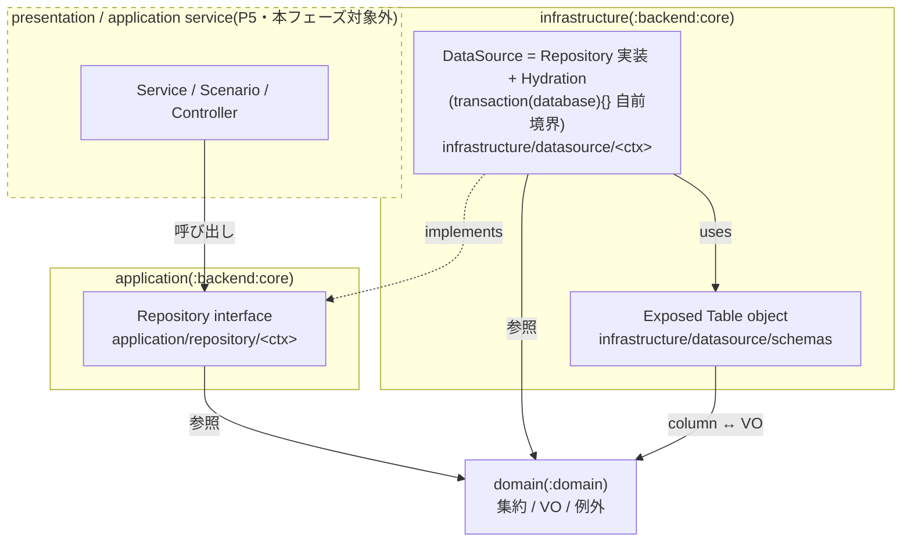
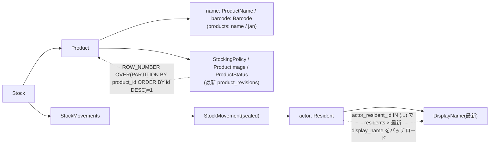

# P4: backend infra + migration 設計

> ✅ **改訂2(2026-06-03, PR #96 レビュー反映)**: 実装 PR レビュー(kukv)で以下の設計変更が確定し、コードは反映済み。本文の旧記述(timestamptz/`instantTz`、基底テーブル、`products.jan` nullable、書き込み系の戻り値、kind/status の文字列定数)より**こちらが優先**:
> 1. **日時は kotlinx-datetime `LocalDateTime`(TZ無)**。ドメイン `OccurredAt` も `LocalDateTime`、列は Exposed `datetime()`(SQL `TIMESTAMP`)。`kotlin.time.Instant`/timestamptz/`instantTz` は廃止(本文「型マッピング」「変換層」の Instant 記述は無効)。
> 2. **テーブル基底クラス廃止**。`AggregateRootTable`/`HistoryTable` は作らず各テーブルが `id`/`primaryKey` を直書き。
> 3. **判別子は schema パッケージの enum + `enumerationByName<E>`**。`kind`→`MovementKind`、membership `status`→`MembershipStatus`(永続専用 enum)。既存 enum 列も reified `enumerationByName<E>(name,len)` に統一。
> 4. **`products.jan`(nullable)を `product_barcodes` side-table 化**(行有無で Linked/Unlinked。`product_catalog_links` と同じ idiom)。`products` から jan 列を除去。
> 5. **書き込み系 Repository は原則 `Unit`**。戻り値を残すのは `registerResident`→Resident・`issue`→Invitation・`appendMovement`→StockMovement の 3 つだけ(サーバ採番の新規情報があるもの)。
> 6. **`search` は `(name: CatalogItemName, limit: Int)`**(プリミティブ `query: String` 廃止、:rpc も追従)。DataSource は LIKE メタ文字をエスケープ。`limit(1)` は PK/UNIQUE 取得では冗長なので除去。
>
> ✅ **改訂(2026-06-02)**: 保留要因だった P2 ドメイン改修(`Product` を catalog 非依存・自己完結に / `CatalogItem` を lookup 集約へ縮小)が main マージ済みのため、確定ドメインに合わせて本 spec を改訂した。主な反映: `products`/`catalog_items` から `default_unit` を撤廃、`Product` は `CatalogItem` を内包せず `name: ProductName` + `barcode: Barcode` を直持ち、`CatalogItemUnit`/`CatalogOrigin` 廃止、product register を採用/独自で 2 メソッドに分割(下記「revision decision」)。確定済みの基盤方針は不変: 最新行取得は Window 関数、DataSource は `transaction(){}` 自前境界、マイグレーションは additive。
>
> **revision decision(2026-06-02)**: `Product` が `CatalogItemId` を持たなくなったため、product の Writer を `registerAdopted(product, householdId, catalogItemId)` と `registerCustom(product, householdId)` の 2 本に分割した(旧 `register(Product, HouseholdId)` + nullable `catalogItemId` を回避。nullable 禁止原則・domain の `Product.adopt`/`Product.custom` 2 ファクトリ・RPC の `adopt`/`addCustom` 2 メソッドと対称)。採用は products 行 + 初回 revision + `product_catalog_links` を 1 トランザクションで張る。

`:backend:core` の infrastructure(Exposed テーブル定義 + DataSource 実装)と application 層 Repository interface、および DB マイグレーション(flyway SQL)を整備する。フルリプレイス ロードマップ P4。

- 起点設計: `docs/superpowers/specs/2026-05-31-mindstock-full-replace-design/`(00-03)
- 準拠ルール: `.claude/rules/software-architecture.md` / `error-handling.md` / `one-class-per-file.md` / `immutable-construction.md` / `testing.md`
- 前段: P1 domain(resident/household)、P2 domain(catalog/inventory)、P3 `:rpc`(service interface + DTO)

## スコープ

### 含む

- `infrastructure/datasource/schemas/` の Exposed テーブル定義(`@Table` object)
- マイグレーション(flyway 形式の versioned SQL、additive 運用)
- `application/repository/<ctx>/` の Repository interface(Reader / Writer 分離)
- `infrastructure/datasource/<ctx>/` の DataSource 実装(Repository 実装、`transaction(database){}` 自前境界)+ `<Aggregate>Hydration.kt`
- `kotlin.uuid.Uuid` ↔ value class、`kotlin.time.Instant` ↔ Exposed カラム型の変換層
- **ルール改訂**: `software-architecture.md` / `rpc-and-transactions.md`(+ 関連メモリ)の「DataSource 内で transaction を書かない / tx() ヘルパー / ExposedTransactionPlugin」記述を、本 spec の方針(DataSource 自前 transaction・plugin/tx 廃止)へ更新する

### 含まない(後続フェーズ)

- Service / Scenario(P5)
- presentation(Controller / RpcError 翻訳)、認証(P5)
- Ktor 起動時の Hikari / Exposed `Database` / flyway `migrate` / DI 配線(P5)
- **Repository / infrastructure のテスト**。P5 の Service テストで結合テストとして吸収する(全層でテストするコストを避けるユーザ判断)

### P4 の検証方法

テストを書かない代わりに以下で担保する:

- `./gradlew :backend:core:build` がコンパイル緑
- `./gradlew :backend:core:generateMigrations` が postgres:18 testcontainer に対して DDL を diff し、versioned SQL を生成できる(= テーブル定義が実 postgres で妥当)
- 生成 SQL を目視レビューしてから commit

> リスク注記: append-only モデルの「latest-per-group hydration」「tombstone フィルタ」「中間テーブルの有無による origin 導出」は silent bug が出やすい箇所で、P4 にテストが無いと P5 の Service テストまで実挙動が検証されない。P5 ではそこを優先的に結合テストで突く。

## レイヤと依存方向(software-architecture 準拠)

- application(Repository interface)は infrastructure / presentation に依存しない(`implements` は infrastructure → application の片方向。図の点線矢印)。domain は全層から参照される。
- **DataSource 実装は `transaction(database) { }` で自前にトランザクション境界を張る**(`tx()` ヘルパー / `ExposedTransactionPlugin` は廃止。取り回しの煩雑さ回避)。
- Repository interface 側で例外 throw を規約化しない(契約だけを示す)。

### パッケージ配置

| 種別 | パッケージ | 命名 |
|---|---|---|
| Table 定義 | `net.brightroom.mindstock.infrastructure.datasource.schemas` | `<Table名>Table`(snake table → object) |
| Repository interface(読) | `net.brightroom.mindstock.application.repository.<ctx>` | `<Ctx>Repository` |
| Repository interface(書) | 同上 | `<Ctx>RegisterRepository` |
| DataSource 実装 | `net.brightroom.mindstock.infrastructure.datasource.<ctx>` | `<Ctx>DataSource` / `<Ctx>RegisterDataSource` |
| Hydration | 同 `<ctx>` パッケージ | `<Aggregate>Hydration.kt`(internal `ResultRow.to<Aggregate>()`) |

`<ctx>` = `resident` / `household` / `invitation` / `catalog` / `product` / `stock`。

**build.gradle 変更**: `exposed { migrations { tablesPackage } }` を現行 `...infrastructure.datasource` から `net.brightroom.mindstock.infrastructure.datasource.schemas` に更新する。

## 永続モデルの原則: append-only + last-write-wins

集約ルートのテーブルは**識別子(+ 不変な素性・関連 + created_at)だけ**を持ち、**変化するもの**は履歴/イベントテーブルへ分離する。UPDATE / DELETE は使わない。

- **insert-once 識別子行**: `residents` / `households` / `catalog_items` / `products` / `invitations`。一度だけ INSERT。
- **append-only 履歴(current = latest)**: 表示名・世帯名・メンバーシップ・招待有効性・商品設定スナップショット・手動希望・在庫変動。変更は新しい行の INSERT。
- **current 値の取得は Window 関数**: `ROW_NUMBER() OVER (PARTITION BY <group> ORDER BY <id> DESC)` を計算し `= 1` の行を採る(1 テーブルスキャンで N+1 を避ける。soudai 氏「履歴テーブルから最新レコードを取得する」推奨手法)。Exposed v1 は `rowNumber().over().partitionBy(...).orderBy(...)` をサポート。**ORDER は単調増加の bigint `id`**(`recorded_at` ではない)で行い、同一時刻衝突の曖昧さを持ち込まない。
  - `DISTINCT ON` は postgres 専用で Exposed ネイティブ非対応のため不採用。専用 latest テーブルは最終手段で今は作らない。
- **削除は tombstone イベント**。世帯メンバーの退出/除外は DELETE せず `除外` ステータスのイベントを append。current メンバーは「(household, resident)ごとの最新イベントで `status=所属`」のものだけ。
- **last-write-wins**: 楽観ロックを置かず、append-only + 最新行採用で「後勝ち」を許容する。**唯一の例外は招待 `code` の衝突**(下記。乗っ取り防止のため後勝ちにせず再生成)。

> 集約は不変再構築(`copy()` 禁止)だが、それは domain の話。永続層は domain command に対応する **append/insert-once メソッド** で「変化分を 1 行追記」する(whole-aggregate な `store` は append-only と相性が悪く差分検出が必要になり破綻するため採らない)。

## 型マッピングの原則

- **集約ルート ID(`ResidentId`/`HouseholdId`/`ProductId`/`CatalogItemId`)** は `kotlin.uuid.Uuid` を内包。Exposed 1.3.0 の `Table.uuid(name): Column<kotlin.uuid.Uuid>`(`UuidColumnType` がネイティブ対応)をそのまま使う。java.util.UUID 変換は不要。
- **履歴/イベント行の PK は `bigint` auto-increment**(`resident_display_names` / `household_names` / `household_membership_events` / `invitation_validity_events` / `product_revisions` / `product_wanted_events` / `stock_movements`)。追記順 + Window の ORDER キー。`MovementId`(`Long`)= `stock_movements.id`、`MovementIdentity.Persisted(id)` = その行 PK。`target_movement_id` は nullable `bigint` self-FK。
- **enum(`HouseholdMemberRole`/`ProductStatus`/`InvitationValidity`/`AuthProvider`)** は `.name`(日本語含む)を `varchar` 保存(Exposed `enumerationByName`)。`CatalogOrigin` は**列として保存しない**(中間テーブルのリンク有無で導出)。
- **正規化済 VO(String 系)** は `varchar(MAX_LENGTH)`(DisplayName 100 / HouseholdName 30 / CatalogItemName 60 / ProductName 60 / ProductUnit 10 / Reason 255 / Note 255 / Jan 13 / AuthSubject 非空 `varchar(255)`)。`ProductName`(`products.name`)と `CatalogItemName`(`catalog_items.name`)は値域同一(非空・最大60)だが別 VO・別テーブル。`CatalogItemUnit` は P2 で廃止。
- **`Quantity`/`MinimumStock`** は `integer`。
- **`OccurredAt` / `recorded_at` / `created_at` / `linked_at`(`kotlin.time.Instant`)** は `timestamp with time zone`。**変換層が必要**(下記 要解決)。
- **`Barcode`(sealed)** は `jan varchar(13)` nullable に潰す。null = `Unlinked` / 値あり = `Linked(Jan)`。
- **`ProductImage`(sealed)** は `image_ref` nullable。null = `None` / 値あり = `Stored(ImageRef)`。
- **`StockMovement`(sealed)** は単一テーブル + `kind` 判別列。

## テーブルスキーマ

テナント scoping は **`products.household_id`** に置く(catalog は全世帯共有のキャッシュのため scoping を持たない)。

```mermaid
erDiagram
    residents ||--o{ resident_auth_identities : "認証手段(1:N)"
    residents ||--o{ resident_display_names : "表示名履歴"
    residents ||--o{ household_membership_events : "メンバー"
    residents ||--o{ stock_movements : "actor"
    households ||--o{ household_names : "世帯名履歴"
    households ||--o{ household_membership_events : "所属"
    households ||--o{ invitations : "発行"
    households ||--o{ products : "保有(scoping)"
    invitations ||--o{ invitation_validity_events : "有効性履歴"
    products ||--o| product_catalog_links : "由来(マスタ採用時のみ)"
    catalog_items ||--o{ product_catalog_links : "採用元キャッシュ"
    products ||--o{ product_revisions : "設定スナップショット"
    products ||--o{ product_wanted_events : "手動希望履歴"
    products ||--o{ stock_movements : "在庫変動"
    stock_movements ||--o{ stock_movements : "target(訂正・自己参照)"

    residents {
        uuid id PK
        timestamptz created_at
    }
    resident_auth_identities {
        bigint id PK "auto-increment"
        uuid resident_id FK
        varchar provider
        varchar subject "UNIQUE(provider,subject)"
        timestamptz linked_at
    }
    resident_display_names {
        bigint id PK "auto / current=ROW_NUMBER per resident_id"
        uuid resident_id FK
        varchar display_name
        timestamptz recorded_at
    }
    households {
        uuid id PK
        timestamptz created_at
    }
    household_names {
        bigint id PK "auto / current=ROW_NUMBER per household_id"
        uuid household_id FK
        varchar name
        timestamptz recorded_at
    }
    household_membership_events {
        bigint id PK "auto"
        uuid household_id FK
        uuid resident_id FK
        varchar role
        varchar status "所属 / 除外(tombstone)"
        timestamptz recorded_at
    }
    invitations {
        varchar code PK "グローバル一意・衝突時は再生成"
        uuid household_id FK
        varchar granted_role "issue 時固定"
    }
    invitation_validity_events {
        bigint id PK "auto / current=ROW_NUMBER per code"
        varchar invitation_code FK
        varchar validity "有効 / 無効"
        timestamptz recorded_at
    }
    catalog_items {
        uuid id PK
        varchar jan "NOT NULL / UNIQUE(barcode キャッシュ)"
        varchar name
        timestamptz created_at
    }
    products {
        uuid id PK
        uuid household_id FK "テナント scoping"
        varchar name "ProductName(採用時 catalog からコピー / 独自は手入力)"
        varchar jan "nullable = Barcode(Linked=値 / Unlinked=null。採用品も Linked)"
        timestamptz created_at
    }
    product_catalog_links {
        uuid product_id "PK,FK"
        uuid catalog_item_id FK
    }
    product_revisions {
        bigint id PK "auto / current=ROW_NUMBER per product_id"
        uuid product_id FK
        varchar unit
        integer minimum_stock
        varchar image_ref "nullable"
        varchar status
        timestamptz recorded_at
    }
    product_wanted_events {
        bigint id PK "auto / current=ROW_NUMBER per product_id"
        uuid product_id FK
        boolean wanted
        timestamptz recorded_at
    }
    stock_movements {
        bigint id PK "auto(=MovementId)"
        uuid product_id FK
        varchar kind "REPLENISHMENT/CONSUMPTION/CORRECTION"
        integer quantity
        timestamptz occurred_at
        uuid actor_resident_id FK
        varchar note
        bigint target_movement_id FK "nullable(Correction のみ)"
        varchar reason "nullable(Correction のみ)"
    }
```

### resident コンテキスト

- `residents`(insert-once): `id` uuid PK, `created_at` timestamptz。
- `resident_auth_identities`(認証手段。`id` で固定縛りせず 1:N に分離 → 将来の別 auth/パスワード追加に耐える): `id` bigint PK, `resident_id` uuid FK→residents, `provider` varchar, `subject` varchar(255), `linked_at` timestamptz。UNIQUE(`provider`, `subject`) / INDEX(`resident_id`)。現状 1 resident 1 auth。
- `resident_display_names`(append-only): `id` bigint PK, `resident_id` uuid FK→residents, `display_name` varchar(100), `recorded_at` timestamptz。INDEX(`resident_id`, `id`)。current = `resident_id` partition の最新。
- `Resident` = (`id`, `Profile(DisplayName)`)。hydration = `residents` + 最新 `resident_display_names`。`findByAuth` は `resident_auth_identities` を(`provider`,`subject`)で引いて resident に解決。`rename`/`registerDisplayName` = INSERT。

### household コンテキスト

- `households`(insert-once): `id` uuid PK, `created_at` timestamptz。
- `household_names`(append-only): `id` bigint PK, `household_id` uuid FK→households, `name` varchar(30), `recorded_at` timestamptz。INDEX(`household_id`, `id`)。current = partition 最新。rename = INSERT。
- `household_membership_events`(append-only。メンバーの存在・role を兼ねる): `id` bigint PK, `household_id` uuid FK→households, `resident_id` uuid FK→residents, `role` varchar, `status` varchar(`所属`/`除外`), `recorded_at` timestamptz。INDEX(`household_id`, `resident_id`, `id`)。
  - current メンバー = (household, resident)partition の最新で `status=所属`。join=`所属`+role を append / changeRole=`所属`+新 role を append / leave・removeMember=`除外`を append(DELETE しない。`role` 列はその時点の role を入れ NOT NULL を満たす)。
- `Household` = (`id`, `Profile(name)`, `Members`)。`HouseholdMember` は `Resident` 内包 → hydration = current メンバー × `residents` × 最新 display name。

### invitation コンテキスト(別集約)

招待は **DELETE しない**(append-only)。発行 = `invitations` 行 INSERT + `有効` event INSERT、失効 = `無効` event INSERT。`invitations` を消さないため `invitation_validity_events` の FK は孤児にならない。

- `invitations`(insert-once。`code`・`household_id`・`granted_role` は issue 時固定): `code` varchar(6) **PK(グローバル一意)**, `household_id` uuid FK→households, `granted_role` varchar。INDEX(`household_id`)。
  - `code` は世帯非依存のグローバル一意(`join(code)` が code だけで世帯を解決するため)。
  - **衝突対応**(last-write-wins の唯一の例外): 6 桁 × 32 字 ≈ 10.7 億通り。`issue()` の INSERT で PK 衝突(unique violation)を検知したら **code を再生成して最大 3 回リトライ**(他世帯の招待を乗っ取らないため後勝ちにしない)。アクティブ 10 万件でも衝突確率 ≈ 1e-4 で実質発火せず、遅延影響は無い。
- `invitation_validity_events`(append-only): `id` bigint PK, `invitation_code` varchar FK→invitations, `validity` varchar(`有効`/`無効`), `recorded_at` timestamptz。INDEX(`invitation_code`, `id`)。current = `code` partition 最新。1 コード→複数参加・期限なし・有効/無効のみ。

### catalog コンテキスト(全世帯共有 barcode キャッシュ)

- `catalog_items`(insert-once。**household_id も origin も持たない**。バーコード読み取り→API 検索結果の入れ物): `id` uuid PK, `jan` varchar(13) **NOT NULL / UNIQUE**, `name` varchar(60), `created_at` timestamptz。`CatalogItem` = (`id`, `Jan`, `CatalogItemName`)。
  - 役割は「毎回 API 検索が走らないようにするキャッシュ」。`findByJan` 不在時に外部 API 取得 → ここに保存し再利用(`jan` UNIQUE が再利用キー)。バーコード前提なので `jan` NOT NULL、`origin` 不要(世帯独自品はそもそもここに入れない)。`default_unit` は P2 で廃止(採用時の推奨単位という用途自体が消滅。単位は採用後 `StockingPolicy` で持つ)。
  - 世帯独自/バーコード無し/未ヒット品は **catalog_items に入れない**(重複・空 JAN で汚れるのを防ぐ)。

### product コンテキスト

世帯は **products だけ見れば在庫が完結する** 状態にする。catalog は採用時の参照キャッシュであり、product は自分の表示情報を持つ。

- `products`(insert-once 識別子 + 不変な素性。**テナント scoping の置き場**): `id` uuid PK, `household_id` uuid FK→households, `name` varchar(60), `jan` varchar(13) nullable, `created_at` timestamptz。INDEX(`household_id`)。
  - `name` は `ProductName`(catalog 非依存。①マスタ採用品は採用時に `catalog_items.name` をコピー、②世帯独自品は手入力)。`jan` は `Barcode` を潰したもの(null=`Unlinked` / 値=`Linked(Jan)`)。**採用品も `Barcode.Linked(catalog.jan)` を持つため `jan` が入る**(独自品のみが値を持つわけではない)。**`catalog_items.id` は products には持たない**(由来リンクは中間テーブル `product_catalog_links`)。
  - P2 改修で `Product` は `CatalogItem` を内包しなくなり、`default_unit` 列も撤廃した(単位は `product_revisions` の `StockingPolicy.unit` のみ)。
- `product_catalog_links`(マスタ採用品のみ存在する由来リンク): `product_id` uuid PK/FK→products, `catalog_item_id` uuid FK→catalog_items。INDEX(`catalog_item_id`)。
  - 用途: ① **採用済み判定**(JAN → `catalog_items` → `product_catalog_links` → 自世帯 `products` の有無)、② **利用世帯把握**(`catalog_item` → links → products → households)。
  - **行が無い products = 世帯独自**。`CatalogOrigin` はこのリンク有無で導出(マスタ=リンク有 / 世帯独自=リンク無)。
- `product_revisions`(append-only。可変設定の全体スナップショット): `id` bigint PK, `product_id` uuid FK→products, `unit` varchar(10), `minimum_stock` integer, `image_ref` varchar nullable, `status` varchar, `recorded_at` timestamptz。INDEX(`product_id`, `id`)。current = partition 最新。
  - adopt/addCustom=初回 revision append / changeUnit・changeMinimum・changeImage・archive・unarchive=変更後の `Product` 全状態を 1 行 append。`unit` は `StockingPolicy.unit`(`ProductUnit`)。
- `product_wanted_events`(append-only): `id` bigint PK, `product_id` uuid FK→products, `wanted` boolean, `recorded_at` timestamptz。INDEX(`product_id`, `id`)。current = partition 最新。setWanted=append。
- `Product` = (`id`, `ProductName name`, `Barcode barcode`, `StockingPolicy setting`, `ProductImage image`, `ProductStatus status`)。hydration = `products`(name → `ProductName` / jan → `Barcode`(null=Unlinked / 値=Linked))× 最新 `product_revisions`(unit/min/image/status)。`origin` はドメインに無い(P5 read-model が `product_catalog_links` 有無で導出)。`Product` は `CatalogItemId` を持たないため、由来 catalog の解決は不要(採用時のリンク張りは Writer の `registerAdopted` が引数で受ける)。manualWanted は `product_wanted_events` の current を P5 の `ShoppingList` 合成で使う(Product 集約には hydrate しない)。

### stock コンテキスト

stocks テーブルは**作らない**。`Stock` は StockId を持たず `ProductId` で特定(`Stock = Product + StockMovements`)。`currentQuantity` は movements の畳み込みで算出。

- `stock_movements`(append-only fact。sealed `StockMovement` を単一テーブルに集約): `id` bigint PK(=`MovementId`), `product_id` uuid FK→products, `kind` varchar(`REPLENISHMENT`/`CONSUMPTION`/`CORRECTION`), `quantity` integer(>0), `occurred_at` timestamptz, `actor_resident_id` uuid FK→residents, `note` varchar(255)(空文字可), `target_movement_id` bigint nullable FK→stock_movements(Correction のみ), `reason` varchar(255) nullable(Correction のみ)。INDEX(`product_id`, `occurred_at`)。
  - `MovementIdentity.Persisted(id)` = 行 `id`。`appendMovement` は INSERT 後に id を読み戻して `Persisted` で hydrate。history は全件返し、`netQuantity`(訂正畳み込み)は domain ロジックをそのまま使用。
  - `actor` は full `Resident`(現在値)→ `actor_resident_id` FK + hydration(下記バッチロード)。

## Repository interface(RPC surface から導出 / YAGNI / append-only)

P3 の RPC メソッドが将来呼ぶものだけを定義。引数・戻り値は VO / 集約 / FCC のみ。単一値は non-null、不在は実装が `ResourceNotFoundException`、一覧は空 FCC。Writer は **domain command に対応する append/insert-once メソッド**(whole-aggregate な `store` は採らない)。

### Reader `<Ctx>Repository`

| context | メソッド |
|---|---|
| resident | `findByAuth(AuthIdentity): Resident` / `findById(ResidentId): Resident` |
| household | `findById(HouseholdId): Household` / `listByResident(ResidentId): Households` |
| invitation | `findByCode(InvitationCode): Invitation` |
| catalog | `search(query: String, limit: Int): CatalogItems` / `findByJan(Jan): CatalogItem` / `findById(CatalogItemId): CatalogItem` |
| product | `findById(ProductId): Product` / `listByHousehold(HouseholdId): Products` / `listArchivedByHousehold(HouseholdId): Products` |
| stock | `findByProduct(ProductId): Stock` / `listByHousehold(HouseholdId): Stocks` / `historyOf(ProductId): StockMovements` |

### Writer `<Ctx>RegisterRepository`(append-only)

| context | メソッド | append 先 / domain command |
|---|---|---|
| resident | `registerResident(AuthIdentity, DisplayName): Resident` | residents + auth + 初回 display_name |
| | `appendDisplayName(ResidentId, DisplayName): Resident` | resident_display_names(registerDisplayName/rename) |
| household | `registerHousehold(Household): Household` | households + 初回 household_name + owner の `所属` event(create) |
| | `appendHouseholdName(HouseholdId, HouseholdName)` | household_names(rename) |
| | `joinMember(HouseholdId, Resident, HouseholdMemberRole)` | `所属` event(join) |
| | `changeMemberRole(HouseholdId, ResidentId, HouseholdMemberRole)` | `所属`+新 role event(changeRole) |
| | `removeMember(HouseholdId, ResidentId)` | `除外` tombstone event(leave/removeMember) |
| invitation | `issue(Invitation): Invitation` | invitations(衝突時 code 再生成リトライ)+ `有効` event |
| | `revoke(InvitationCode)` | `無効` event |
| catalog | `register(CatalogItem): CatalogItem` | catalog_items(外部 API 取得品の保存) |
| product | `registerAdopted(Product, HouseholdId, CatalogItemId): Product` | products + 初回 product_revision + product_catalog_links(マスタ採用) |
| | `registerCustom(Product, HouseholdId): Product` | products + 初回 product_revision(世帯独自。リンク無し) |
| | `appendRevision(Product): Product` | product_revisions(changeUnit/changeMinimum/changeImage/archive/unarchive を Product スナップショットで append) |
| | `setWanted(ProductId, Boolean)` | product_wanted_events |
| stock | `appendMovement(ProductId, StockMovement): StockMovement` | stock_movements(replenish/consume/correct) |

注:
- catalog の write は `CatalogRegisterRepository.register` で独立。P5 の ProductRegisterService が catalog 採用(`registerAdopted`)と独自追加(`registerCustom`)を振り分ける。
- `Product` が `CatalogItemId` を持たなくなったため、由来リンクは `registerAdopted` が `catalogItemId` を引数で受け、products + 初回 revision + `product_catalog_links` を 1 トランザクションで張る(P2 改修で解決済み・旧「Product 経由で catalog_item_id を知る」要解決は消滅)。`registerCustom` はリンクを張らない(= `product_catalog_links` 行が無い = 世帯独自)。
- 採用済み判定(同一世帯同一 JAN → `DuplicateJanException`)用の reader の要否・形は P5 着手時に確定(`catalog_items` × `product_catalog_links` × 自世帯 `products` で表現可能)。P4 では先取り実装しない。
- `activity(householdId)` 用の専用 Reader は作らない。`StockRepository.listByHousehold` で足り、`ActivityFeed` 組み立ては P5。

## DataSource 実装(infrastructure)

- 各メソッドは `transaction(database) { }` で自前境界(plugin/tx ヘルパー無し)。
- **latest-per-group は Window 関数**(`ROW_NUMBER() OVER (PARTITION BY <group> ORDER BY <id> DESC)` を `= 1` で絞る)。各履歴テーブルに `(group_key, id)` の INDEX を張る。一覧 hydration は partition 全体に 1 回の window で最新行を取り N+1 を避ける。`import org.jetbrains.exposed.v1.core.Function`(kotlin stdlib の `Function` と衝突回避)。
- **current メンバーシップは tombstone フィルタ**: (household, resident)partition 最新で `status=所属` のみ採用。
- INSERT 後は read-back(`insertAndGetId` + hydration)で domain object を返す。
- 行が無い単一値取得は `ResourceNotFoundException` を throw(message に何が無いか)。一覧は空でも空 FCC。
- **想定外の Exposed/JDBC エラーはラップせず raw 伝播**。infrastructure の例外翻訳は「不在 → `ResourceNotFoundException`」のみ。想定外は P5 Controller の catch-all が `RpcError.Internal` に翻訳。
- Hydration は `<Aggregate>Hydration.kt` の internal extension(`ResultRow.to<Aggregate>()`)。

`Stock` の hydration object graph(最も深い例):

`activity` / `listByHousehold` では movement ごとに actor を引くと N+1 になるため、`actor_resident_id` を集めて `residents`(+ 最新 `resident_display_names`)を一括ロードする。

## 変換層

- **Uuid**: Exposed `uuid()` が `kotlin.uuid.Uuid` を返すため変換不要。
- **Instant(要解決)**: `OccurredAt`/`recorded_at`/`created_at`/`linked_at` は `kotlin.time.Instant`。`exposed-kotlin-datetime`(1.3.0)が `kotlin.time.Instant` をそのまま扱えるか、`kotlinx.datetime.Instant` 経由の変換が要るかを **plan のタスク 0 で確定**。

## マイグレーション運用(additive)

1. `infrastructure/datasource/schemas/` にテーブル定義を書く/変更する
2. `./gradlew :backend:core:generateMigrations`(exposed plugin が postgres:18 testcontainer に現行スキーマと diff)
3. 生成された versioned SQL(`V1__init.sql` → 以降は `V2__*.sql` …)を目視レビュー
4. commit

**additive 運用**: テーブル追加・変更ごとに `V2`、`V3` … と積み上げる(flyway 標準・本番同等)。初回は `V1__init` に全スキーマ。squash はしない。flyway での実 DB 適用は P5(起動配線)。

## 要解決(plan で詰める)

> 旧「内包 `CatalogItem.id` の domain 小調整」「`register` が `catalog_item_id` を受け取る経路」は P2 改修で解消(`Product` は catalog 非依存・`registerAdopted` が `catalogItemId` を引数で受ける)。

- `kotlin.time.Instant` ↔ Exposed カラム型の具体変換。
- `generateMigrations` の生成物・ファイル名規約と FK 順序(self-FK `stock_movements`、`product_catalog_links`→`products`/`catalog_items`)が正しく出るかの確認。
- 採用済み判定用 reader の要否・形(P5 着手時)。
- ルール 2 本(software-architecture / rpc-and-transactions)+ 関連メモリの transaction 方針更新。

## 関連

- spec(起点): `docs/superpowers/specs/2026-05-31-mindstock-full-replace-design/`(00-03)
- rule: `software-architecture.md` / `error-handling.md` / `one-class-per-file.md` / `testing.md`
- 参考: soudai「履歴テーブルから最新レコードを取得する」(window 関数推奨)
- 前段プラン: `docs/superpowers/plans/2026-06-01-p3-rpc-service-and-dto.md`
