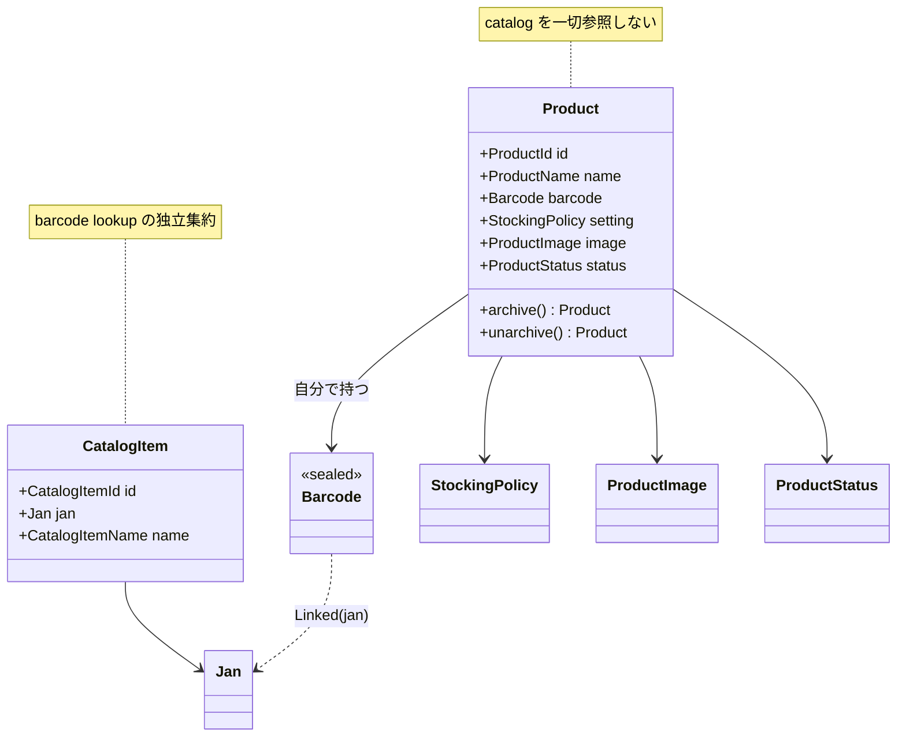

# P2 ドメイン改修: Product / CatalogItem 分離 設計

`Product` が `CatalogItem` を内包する現行モデルを解き、**`Product` を catalog 非依存・自己完結**にする。`CatalogItem` は barcode lookup 用の独立した軽量集約へ縮小する。P4(backend infra)で世帯独自品が hydrate できない問題が発端で、P4 の前段として先行実施する。

- 起点設計: `docs/superpowers/specs/2026-05-31-mindstock-full-replace-design/`(03 詳細ドメイン)
- 準拠ルール: `.claude/rules/domain-guideline.md` / `immutable-construction.md` / `one-class-per-file.md` / `error-handling.md` / `testing.md`
- 後段: `docs/superpowers/specs/2026-06-01-p4-backend-infra-migration-design.md`(本改修確定後に table 割りを改訂)

## なぜ改修するか

現行 `Product` は `CatalogItem(id, content(name, defaultUnit), barcode, origin)` を**丸ごと内包**(全 non-null)。一方 P4 のレビューで永続モデルが次のように固まった:

- `catalog_items` は**バーコード API 結果のキャッシュ**(jan 必須)。世帯独自品・バーコード無し品は catalog に入れない。
- `default_unit` は採用時には未定(後から管理者/バッチが決める任意の推奨値)で、そもそも撤廃。
- マスタ/世帯独自の区分はキャッシュへのリンク有無で導出。

この結果、**世帯独自品は `CatalogItemId` も `defaultUnit` も出所が無く**、現行ドメインに hydrate 不能になる。根本原因は `defaultUnit` が「採用時の推奨」でしかなく(採用後の単位は `StockingPolicy` にある)、`Product` が `CatalogItem` を内包していたこと自体の歪み。よって **Product を catalog から切り離す**。

## 改修後のモデル



### CatalogItem(lookup 集約へ縮小)

```kotlin
data class CatalogItem(
    val id: CatalogItemId,
    val jan: Jan,
    val name: CatalogItemName,
)
```

- バーコード API 結果のキャッシュ。**常に jan を持つ**ため `Jan` を直持ち(catalog に `Barcode.Unlinked` 概念は無い)。
- `search`/`lookupByJan` で参照。`lookupByJan` 不在時は外部 API 取得 → キャッシュ保存(P5)。
- **廃止**: `CatalogContent`(→ `name` 直持ち)、`CatalogItemUnit`(defaultUnit 用途消滅)、`CatalogOrigin`(origin は read-model 導出)。
- `CatalogItemName` は据え置き(catalog の名前。非空・最大60)。`CatalogItems` FCC は据え置き。

### Product(自己完結)

```kotlin
data class Product(
    val id: ProductId,
    val name: ProductName,
    val barcode: Barcode,
    val setting: StockingPolicy,
    val image: ProductImage,
    val status: ProductStatus,
) {
    fun archive(): Product = ...   // 据え置き
    fun unarchive(): Product = ...
    companion object {
        fun adopt(catalogItem: CatalogItem, unit: ProductUnit, minimumStock: MinimumStock): Product
        fun custom(name: ProductName, barcode: Barcode, unit: ProductUnit, minimumStock: MinimumStock): Product
    }
}
```

- **catalog への参照・origin を一切持たない。**
- `adopt`: catalog の `name`/`jan` をコピー(`name = ProductName(catalogItem.name())`、`barcode = Barcode.Linked(catalogItem.jan)`、`image = None`、`status = 採用中`)。`id = ProductId.create()`。
- `custom`: 独自品生成(catalog 行なし。`barcode` は `Unlinked` または手入力 `Linked(jan)`)。
- `archive`/`unarchive`/`StockingPolicy`/`ProductImage`/`ProductStatus` は現行据え置き。

### VO の新設・移設・廃止

| VO | 操作 | 詳細 |
|---|---|---|
| `ProductName` | **新設** | `inventory/product/` 配下。非空・最大60・trim(正規化 VO パターン: `private constructor` + `operator fun invoke(raw)` + `init{require(... && value==value.trim())}`)。catalog 非依存なので catalog の名前 VO は使わない |
| `Barcode` / `Jan` | **移設** | `model/catalog/barcode/` → 中立な位置。Product(barcode)と CatalogItem(jan)双方が使うため。移設先は plan で確定(`model/barcode/` 新設 or `inventory/product/barcode/`)。検証ロジック(EAN-13 チェックディジット)は不変 |
| `CatalogItemName` | 据え置き | catalog の name |
| `CatalogContent` | **廃止** | name は CatalogItem 直持ち、defaultUnit 廃止 |
| `CatalogItemUnit` | **廃止** | defaultUnit 用途消滅。DTO の単位入力は `ProductUnit` へ |
| `CatalogOrigin` | **廃止** | origin は P5 read-model がリンク有無から導出 |
| `ProductUnit` / `MinimumStock` / `StockingPolicy` / `ProductImage` / `ImageRef` / `ProductStatus` | 据え置き | |

### origin(マスタ / 世帯独自)

ドメインから除外。P5 の read-model が persistence の中間テーブル(`product_catalog_links`)の有無から導出する(マスタ=リンク有 / 世帯独自=リンク無)。現状 RPC に origin を返す消費者は無いため、ドメインに持たない(YAGNI)。

## RPC 波及(:rpc / P3 改修)

- `CatalogRpcService.search`/`lookupByJan`: `CatalogItem(id, jan, name)` を返す(実質維持。フィールド縮小のみ)。
- `AddCustomProductRequest`: `name: CatalogItemName → ProductName`、`unit: CatalogItemUnit → ProductUnit` に変更。
- `ProductRegisterRpcService.adopt`: `catalogItemId: CatalogItemId` 引数は維持。
- `Product` を返す/内包する型(`adopt`/`addCustom` の戻り、`list` の `Stocks`、`ActivityEntry` の Product)は構造変更 → **再コンパイル + `KrpcJson` round-trip テスト更新**。

## 影響範囲(plan のタスク分解材料)

- `:domain`
  - 改修: `catalog/item/CatalogItem.kt`、`inventory/product/Product.kt`
  - 新設: `inventory/product/ProductName.kt`
  - 移設: `catalog/barcode/{Barcode,Jan}.kt` → 中立パッケージ
  - 廃止: `catalog/content/{CatalogContent,CatalogItemUnit}.kt`、`catalog/origin/CatalogOrigin.kt`
  - テスト更新: `StockTest`・`ShoppingListTest`(`CatalogContent`/`CatalogItemUnit`/`Barcode` で Product を組み立てている箇所を新ファクトリ/フィールドに)、`CatalogItemUnitTest` 廃止、`JanTest` 移設追従、`ProductName` のバリデーションテスト新設(意味のあるテストのみ: 値域・trim)
  - 注: `ShoppingEntry` は `Stock` を内包し `product.catalogItem` を直接参照しないため production ロジック変更は無い(Product の組み立て箇所のみ追従)
- `:rpc`
  - `AddCustomProductRequest`(name/unit 型変更)、`CatalogRpcService`(import 追従)
  - round-trip テスト: `PayloadSerializationTest`・`ActivityFeedSerializationTest`(Barcode/Product を含むペイロード)を新構造へ
- 検証: `./gradlew :domain:build` と `:rpc:build` が全 KMP ターゲット緑

## 要解決(plan で詰める)

- `Barcode`/`Jan` の移設先パッケージ名(`model/barcode/` 新設 vs `inventory/product/barcode/`)。catalog と product 双方から参照される中立性を満たす位置。
- `ProductName` と `CatalogItemName` の値域は同一(非空・最大60)。共通化せず別 VO として重複定義する(catalog と product の独立性を優先。domain-guideline の VO 方針に従う)。

## 関連

- spec(起点): `docs/superpowers/specs/2026-05-31-mindstock-full-replace-design/03-domain-detail.md`
- 後段 spec: `docs/superpowers/specs/2026-06-01-p4-backend-infra-migration-design.md`
- rule: `domain-guideline.md` / `immutable-construction.md` / `one-class-per-file.md` / `testing.md`
