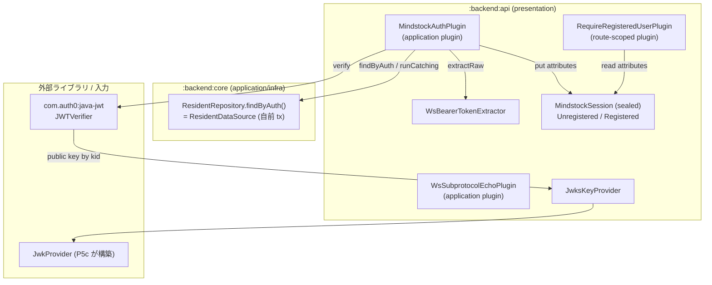
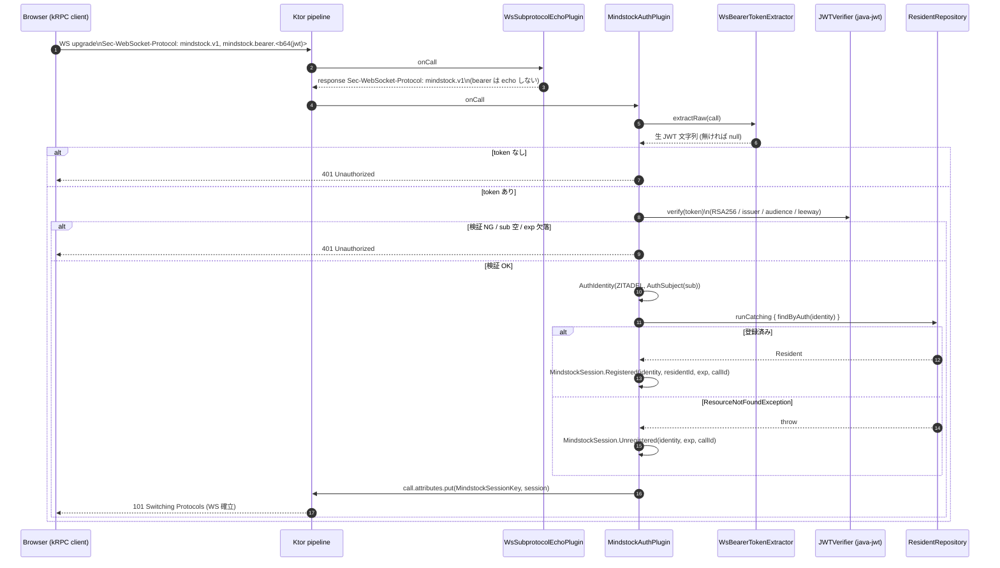
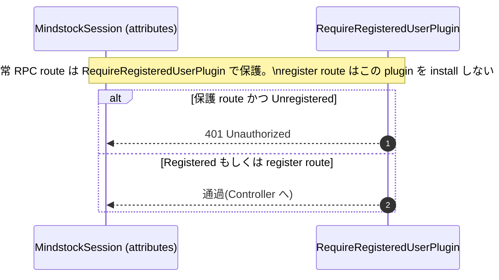

# P5b backend 認証(Zitadel OIDC / JWT 検証)設計

家庭在庫管理 SaaS「mindstock」フルリプレイス P5 のサブプロジェクト 2。`:backend:api` に **認証コンポーネント**(自作 Ktor plugin + `MindstockSession` + WS token 受け渡し)を新設し、Zitadel が発行する access_token(JWT)を JWKS で検証して接続単位のセッションを組み立てられる状態にする。

- 上位ロードマップ: P5 = backend application(P5a, main マージ済 PR #97)+ **認証(本書 P5b)** + presentation/配線(P5c)。`full-replace-2026-06` 参照。
- 前段の確定物: `:domain`(P1/P2)、`:rpc` 契約(P3)、`:backend:core` Repository + DataSource(P4)、application Service / Scenario(P5a)。
- 設計思想: できるだけシンプルに・複雑なことはしない。**フルリプレイス前にほぼ完成していた認証実装**(commit `11c9b31`「ktor-auth を撤去し自作 `MindstockAuthPlugin` に置換」)を土台に、新アーキ(`User` 廃止 → `Resident`、nullable 禁止、DataSource 自前 tx)へ最小改修で移植する。

## スコープ

### 含む

- `:backend:api` `configuration/auth/` に認証コンポーネント:
  - `MindstockSession`(sealed。接続単位 immutable な認証セッション)
  - `MindstockAuthPlugin`(JWT 検証 → session 組み立て → `call.attributes` 格納)
  - `JwksKeyProvider`(`JwkProvider` → java-jwt `RSAKeyProvider` 橋渡し)
  - `WsBearerTokenExtractor`(`Authorization` ヘッダ / `Sec-WebSocket-Protocol` から生 JWT 抽出)
  - `WsSubprotocolEchoPlugin`(受理サブプロトコルの echo。bearer は echo しない)
  - `RequireRegisteredUserPlugin`(route subtree 境界。未登録 session を 401)
- 上記の単体テスト(`testApplication` + テスト用 JWT 発行ヘルパー `TestKeyPair` / `TestJwks` / `TestJwtIssuer`)

### 含まない(別サブプロジェクト)

- yaml(`application.yaml`)からの issuer / audience / jwks-url 読み込み、`JwkProviderBuilder` の構築、plugin の install / Routing 配線、DI = **P5c**
- 各 RPC メッセージ単位の `session.exp` 再チェックガード(旧 `tx()`。`RpcError`/`RpcResult` 依存=presentation)= **P5c**
- presentation Controller(`@Rpc` 実装)・認可(role / 世帯メンバーシップ検査)= **P5c**
- frontend の OIDC クライアント(PKCE / redirect / token 保管 / refresh)= **P6**
- Zitadel の organization / role / group 取り込み、本番 Zitadel デプロイ(Secret / TLS)、認証の observability

### 完了の定義

`:backend:api` がコンパイル通り + 本書のすべての単体テストが green。**エンドツーエンドの通し認証(routing 配線込み)は P5c** であり、P5b の完了条件ではない。

## 原則の踏襲

- **層と依存方向**: 認証コンポーネントは presentation 層(`:backend:api`)。`MindstockSession` は `:domain` の VO(`AuthIdentity` / `ResidentId`)に依存してよいが、`:rpc`(`RpcError`/`RpcResult`)には依存しない(=`tx()` を P5b に含めない理由)。
- **nullable 戻り値禁止**: 「JWT 有効だが Resident 未登録」を nullable で表さず **sealed `MindstockSession`** で表現(ユーザ承認済)。cf. P2 の sealed `MovementIdentity`。
- **crypto 自前禁止**: JWT 検証は `com.auth0:java-jwt` の `JWT.require(...).build().verify()` 経由。
- **不在は例外**: `ResidentRepository.findByAuth` は未登録時 `ResourceNotFoundException` を throw。認証境界(presentation)で `runCatching` し「未登録」へ翻訳する。

## 全体構成

```text
backend/api/src/main/kotlin/net/brightroom/mindstock/configuration/auth/
  MindstockSession.kt          [新] sealed: Unregistered / Registered
  MindstockAuthPlugin.kt       [新] createApplicationPlugin。JWT 検証 + session 組み立て
  JwksKeyProvider.kt           [新] JwkProvider -> RSAKeyProvider 橋渡し
  WsBearerTokenExtractor.kt    [新] Authorization / Sec-WebSocket-Protocol から token 抽出
  WsSubprotocolEchoPlugin.kt   [新] mindstock.v1 のみ echo(bearer は echo しない)
  RequireRegisteredUserPlugin.kt [新] route subtree 境界。Unregistered を 401

backend/api/src/test/kotlin/net/brightroom/mindstock/
  configuration/auth/
    MindstockAuthPluginTest.kt
    WsBearerTokenExtractorTest.kt
    WsSubprotocolEchoPluginTest.kt
    RequireRegisteredUserPluginTest.kt
  e2e/auth/                    （テスト用 JWT 基盤。e2e 通しは P5c だが基盤は P5b で用意）
    TestKeyPair.kt             [新] テスト用 RSA 鍵ペア
    TestJwks.kt                [新] 鍵から JWKS JSON を生成し testApplication 内で host
    TestJwtIssuer.kt           [新] sub / aud / iss / exp 指定で JWT 発行
```

依存はすべて classpath 済(`libs.auth0.java.jwt` / `libs.auth0.jwks.rsa` / `ktorLib.server.websockets` / `ktorLib.client.websockets`)。**`build.gradle.kts` の変更は不要**。

## コンポーネント関連図



## シーケンス図

### WS handshake 時の認証(`MindstockAuthPlugin.onCall`)



### register 経路(未登録セッションの通過)



## 詳細設計

### `MindstockSession`(sealed)

接続単位で `MindstockAuthPlugin` が組み立て `call.attributes` に格納する immutable な認証セッション。

```kotlin
sealed interface MindstockSession {
    val identity: AuthIdentity   // JWT 検証成功時の AuthIdentity
    val exp: Instant             // JWT の expiresAt。P5c の per-message guard が比較する
    val callId: Uuid             // 接続単位のトレース ID(構造化ログ用)

    /** JWT 有効だが Resident 未登録。register route でのみ通過を許す。 */
    data class Unregistered(
        override val identity: AuthIdentity,
        override val exp: Instant,
        override val callId: Uuid,
    ) : MindstockSession

    /** 登録済み Resident。residentId を保持。 */
    data class Registered(
        override val identity: AuthIdentity,
        val residentId: ResidentId,
        override val exp: Instant,
        override val callId: Uuid,
    ) : MindstockSession
}

internal val MindstockSessionKey: AttributeKey<MindstockSession> =
    AttributeKey("net.brightroom.mindstock.MindstockSession")
```

旧 `userId: UserId?`(nullable)からの変更点: 2 状態を型で分離し nullable を排除。downstream(P5c Controller / guard)は `when (session)` で網羅する。

### `MindstockAuthConfig`(plugin 設定の入力)

P5c がここに具体値を流し込む。P5b では「入力として受け取る」契約のみ確定。

```kotlin
class MindstockAuthConfig {
    var jwkProvider: JwkProvider? = null          // P5c が JwkProviderBuilder で構築して渡す
    var issuer: String? = null                    // 例: http://localhost:8081
    var audience: String? = null                  // 例: mindstock-backend
    var residentRepository: ResidentRepository? = null
    var leewaySeconds: Long = 30                  // exp / nbf / iat の許容スキュー
}
```

旧 `MindstockAuthConfig` との差分: `userRepository` → `residentRepository`、**`database` を削除**(DataSource が自前 tx を持つため plugin 側 tx 不要)。

### `MindstockAuthPlugin`(`createApplicationPlugin`)

`init` ブロックで `MindstockAuthConfig` を `requireNotNull` 検証し `JWTVerifier` を 1 度だけ構築。`onCall` で毎接続検証する。

```kotlin
val MindstockAuthPlugin =
    createApplicationPlugin(name = "MindstockAuth", createConfiguration = ::MindstockAuthConfig) {
        val jwkProvider = requireNotNull(pluginConfig.jwkProvider) { "jwkProvider required" }
        val issuer = requireNotNull(pluginConfig.issuer) { "issuer required" }
        val audience = requireNotNull(pluginConfig.audience) { "audience required" }
        val residentRepository = requireNotNull(pluginConfig.residentRepository) { "residentRepository required" }
        val leewaySeconds = pluginConfig.leewaySeconds

        val verifier: JWTVerifier =
            JWT.require(Algorithm.RSA256(JwksKeyProvider(jwkProvider)))
                .withIssuer(issuer)
                .withAudience(audience)
                .acceptLeeway(leewaySeconds)
                .build()

        onCall { call ->
            val token = WsBearerTokenExtractor.extractRaw(call) ?: return@onCall call.respond(Unauthorized)
            val decoded = runCatching { verifier.verify(token) }.getOrNull() ?: return@onCall call.respond(Unauthorized)
            val sub = decoded.subject?.takeIf { it.isNotBlank() } ?: return@onCall call.respond(Unauthorized)
            val expDate = decoded.expiresAt ?: return@onCall call.respond(Unauthorized)
            val exp = Instant.fromEpochMilliseconds(expDate.time)
            val identity = AuthIdentity(AuthProvider.ZITADEL, AuthSubject(sub))
            val callId = Uuid.random()

            // findByAuth は blocking JDBC transaction。suspend 文脈から呼ぶため IO に逃がす。
            val resident = withContext(Dispatchers.IO) {
                runCatching { residentRepository.findByAuth(identity) }.getOrNull()
            }
            val session =
                if (resident != null) MindstockSession.Registered(identity, resident.id, exp, callId)
                else MindstockSession.Unregistered(identity, exp, callId)
            call.attributes.put(MindstockSessionKey, session)
        }
    }
```

主な変更点(旧 → 新):
- `userRepository.findByAuthIdentity(...)?.id`(plugin 内 `newSuspendedTransaction`)→ `residentRepository.findByAuth(identity)` を `withContext(Dispatchers.IO)` で包み `runCatching` で not-found を吸収。
- 戻り値を `MindstockSession`(nullable userId)から sealed 2 状態へ。
- `database` 依存を撤去。

> 設計判断: `findByAuth` は新 DataSource では blocking な `transaction(database)`(P4 方針)。Ktor の `onCall` は suspend なので、blocking 呼び出しを `Dispatchers.IO` に逃がしてイベントループを塞がない。

### セキュリティ不変条件(維持)

1. crypto 自前禁止 → java-jwt の `verify()` 経由
2. アルゴリズムは RSA256 固定(`JwksKeyProvider` 経由)
3. JWKS は cache + rate-limit 必須(入力 `JwkProvider` 側 = P5c が `JwkProviderBuilder.cached(...).rateLimited(...)` で構築)
4. `withIssuer` / `withAudience` を必ず指定
5. `acceptLeeway` を明示(既定 30s)
6. token を含む `Sec-WebSocket-Protocol`(bearer)は response header に echo しない(`WsSubprotocolEchoPlugin`)
7. backend は **access_token のみ**受理。Zitadel の access_token は JWT 形式で JWKS 検証可能。`id_token` は frontend 専用で backend に送らない
8. 検証失敗は理由を漏らさず一律 `401 Unauthorized`

### `JwksKeyProvider`

java-jwt の `Algorithm.RSA256(...)` が要求する `RSAKeyProvider` を、`auth0/jwk` の `JwkProvider` から橋渡しする。検証専用なので秘密鍵は返さない。旧実装をそのまま移植。

### `WsBearerTokenExtractor`

ブラウザの WebSocket API は `Authorization` ヘッダを設定できないため、`Sec-WebSocket-Protocol` のカスタムサブプロトコル `mindstock.bearer.<base64url(jwt)>` で token を運ぶ。テスト容易性と REST 互換のため `Authorization: Bearer <jwt>` も対応(優先)。旧実装をそのまま移植。

```text
抽出優先順位:
  1. Authorization: Bearer <jwt>            → <jwt>
  2. Sec-WebSocket-Protocol に mindstock.bearer.<b64url> → base64url decode した JWT
  3. どちらも無し                            → null
```

### `WsSubprotocolEchoPlugin`

WHATWG WebSocket 仕様上、client が `Sec-WebSocket-Protocol` を提示したら server は受理した subprotocol を 1 つ echo しないとブラウザが接続を fail させる。`mindstock.v1`(アプリ識別子)のみ echo し、`mindstock.bearer.*`(JWT 含む)は **echo しない**(token を response header / 中間 proxy のログに漏らさない)。kotlinx-rpc の `rpc(path)` builder が subprotocol 応答制御 API を公開しないため、本 plugin が `call.response.header` を上書きする。旧実装をそのまま移植。

### `RequireRegisteredUserPlugin`(`createRouteScopedPlugin`)

route subtree に install して「登録済み Resident しか通さない」境界を作る。`MindstockSession` を見て `Unregistered`(または未格納)なら 401。register route にはこの plugin を install しないことで未登録の通過を許す(配線は P5c)。

```kotlin
val RequireRegisteredUserPlugin =
    createRouteScopedPlugin(name = "RequireRegisteredUser") {
        onCall { call ->
            val session = call.attributes.getOrNull(MindstockSessionKey)
            if (session !is MindstockSession.Registered) call.respond(Unauthorized)
        }
    }
```

## WS 認証方式の比較(採用根拠)

ユーザ提示の参考記事群(Heroku / nykergoto / Zenn / Qiita)を踏まえた評価。**サブプロトコル方式を採用**(旧実装踏襲)。

| 方式 | 概要 | 評価 |
|---|---|---|
| **サブプロトコル(採用)** | `Sec-WebSocket-Protocol: mindstock.bearer.<b64(jwt)>` で運び handshake 時に 1 回検証 | ✅ ブラウザ WS が `Authorization` を付けられない制約を満たす / token が URL に出ない / kRPC の「1 接続 = 1 WS」モデルに最適(1 回検証で全 RPC を多重化)/ 追加エンドポイント不要。**シンプル要件に合致** |
| Query param | `wss://...?token=<jwt>` | ❌ access log / referrer / proxy に残る(Heroku 記事の主要警告)。不採用 |
| Ticket | HTTP で短命チケット発行 → WS は ticket で接続 | より安全(token 非露出・単回・短命)だが、専用エンドポイント + ticket ストアが必要で「複雑なことはしない」要件に反する。MVP では過剰 |
| First-message auth | WS 接続後、最初のメッセージで token 送信し検証 | kRPC は接続直後に RPC framing が始まるため割り込みが不自然。接続が一瞬未認証になる |

補足: handshake 時の 1 回検証では token の**接続中失効**を捕捉できない。これは各 RPC メッセージ単位で `session.exp` を再チェックするガード(旧 `tx()`)で補う。`RpcError` 依存のため **P5c** で実装する。P5b では `exp` を `MindstockSession` に保持するところまでを担保する。

## テスト設計(P5b 完了の定義)

`ktorLib.server.testHost` の `testApplication` で plugin を install し、テスト用 JWT を発行して検証する。

### テスト基盤(流用移植)

- `TestKeyPair`: suite 単位の RSA 鍵ペア(2048bit)
- `TestJwks`: 公開鍵から JWKS JSON を生成し、testApplication 内の `/test-jwks` で host。`JwkProviderBuilder(URL)` で plugin に渡す
- `TestJwtIssuer`: `sub` / `aud` / `iss` / `exp` / 署名鍵を指定して JWT を発行(正常 / 異常系を作り分け)

### `MindstockAuthPluginTest`

| ケース | 期待 |
|---|---|
| 有効 JWT + 登録済み sub | `MindstockSession.Registered`(residentId 一致) |
| 有効 JWT + 未登録 sub | `MindstockSession.Unregistered` |
| token なし | 401 |
| 不正署名(別鍵) | 401 |
| issuer 不一致 | 401 |
| audience 不一致 | 401 |
| exp 切れ(leeway 超過) | 401 |
| sub 空 / exp 欠落 | 401 |

`residentRepository` は mockk。`findByAuth` を「Resident 返却」/「`ResourceNotFoundException` throw」で出し分ける。session 検証用に、attributes を読んで応答する簡易テスト route を install する。

### `WsBearerTokenExtractorTest`

`Authorization: Bearer` 抽出 / `mindstock.bearer.<b64>` 抽出 / 両方なし → null / 不正 base64 → null / Authorization 優先。

### `WsSubprotocolEchoPluginTest`

`mindstock.v1` 提示 → response に `mindstock.v1` echo / `mindstock.bearer.*` は response に **現れない** / WS upgrade でない通常リクエストは素通し。

### `RequireRegisteredUserPluginTest`

`Registered` → 通過 / `Unregistered` → 401 / session 未格納 → 401。

## P5c への申し送り

- `JwkProviderBuilder(URL(jwksUrl)).cached(10, 1, HOURS).rateLimited(10, 1, MINUTES).build()` を構築し plugin config に渡す
- `application.yaml` の `external.auth.{issuer,audience,jwks-url}` 読み込み
- plugin の install 順(`WsSubprotocolEchoPlugin` → `MindstockAuthPlugin`)と Routing(register route は `RequireRegisteredUserPlugin` 非適用)
- per-message `session.exp` 再チェックガード `tx()`(`RpcError`/`RpcResult` 翻訳込み)
- Controller での `MindstockSession` 消費(`when` 網羅・`Registered.residentId` を Service へ)
